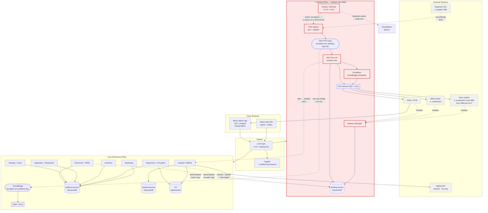
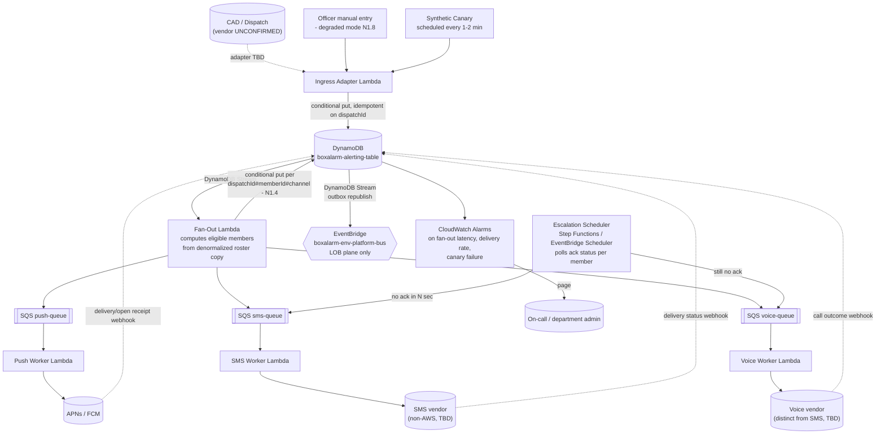
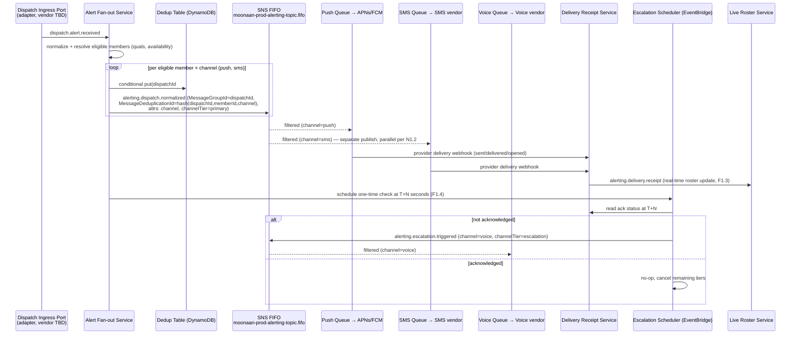
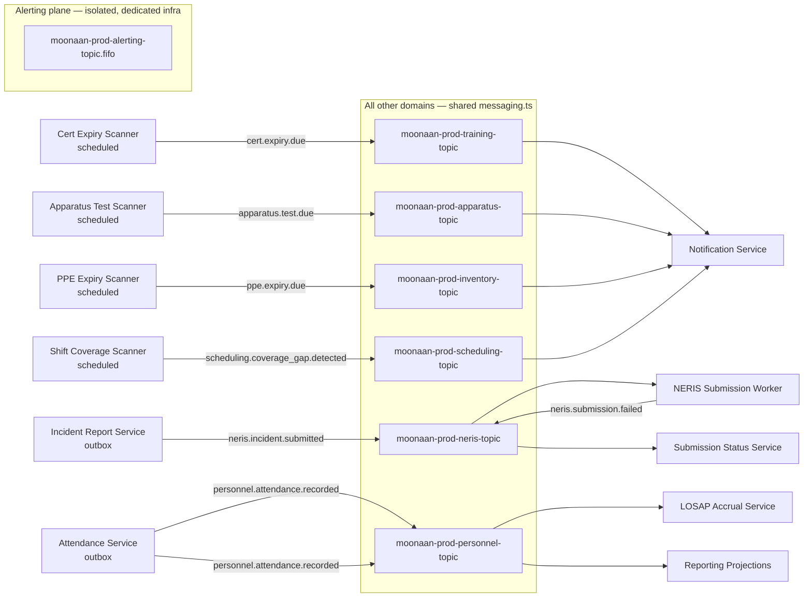
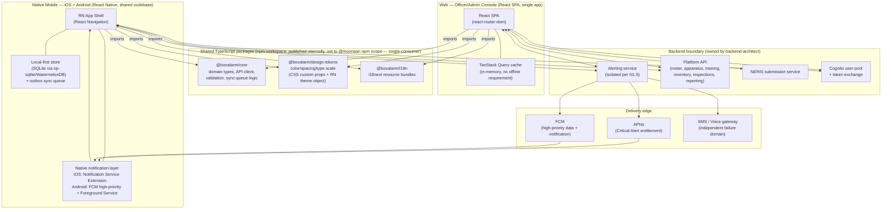

# Boxalarm — Architecture

## Requirements Summary

A fire-department operations platform replacing Chief360 for an all-volunteer department, spanning alerting/response, personnel with claimable duty shifts and LOSAP points, training and certifications, apparatus and equipment checks, inventory, inspections and pre-plans, NERIS incident reporting, and reporting/analytics. The defining requirement is life-safety alert delivery — the native mobile app replaces radio tone-out as the alerting path of record, so N1 demands no single point of failure, independent failure domains per channel, exactly-once delivery semantics, a continuous production canary, and a documented degraded mode. Incident reporting is NERIS-native (OAuth 2.0, WAF rate limits, mandatory User-Agent, U.S. data residency) with no NFIRS legacy model, following the retirement of NFIRS on 2026-01-31. Deployment is AWS serverless under a hard volunteer-municipal budget constraint, single-tenant with multi-tenant seams present in the data model from day one, explicitly excluding EMS/ePCR and therefore all PHI.

## Architecture Overview

The system is split into a **life-safety alerting plane** and a **line-of-business plane**. The separation is not stylistic: N1.5 and N1.7 require that no outage in reporting, training, inventory, or caching can degrade alert delivery. That isolation is enforced at every layer — a separate SNS FIFO topic, separate FIFO queues, a separate DynamoDB table, and denormalized copies of the roster and pre-plan data the alert path needs, so it never reads across a service boundary at dispatch time.



**Reading the diagram.** Solid arrows are synchronous or in-band flows; dashed arrows are asynchronous, replicated, or unconfirmed. The one-way bridge from the alerting bus to the domain bus is deliberate — alerting publishes outward so the rest of the platform can react, but nothing on the domain bus can reach into the alerting plane. Both external boxes marked ⚠ are unresolved dependencies tracked in Open Questions.

## Backend Services

# Backend Architecture — Fire Department Operations Platform

## 0. Governing decision: alerting is a separate failure domain from everything else

N1 (life-safety alerting) and N1.5 ("an outage in reporting, training, inventory, or *any* other module must never impair alerting") are the constraints that shape this entire document. The architecture is not nine equally-weighted microservices — it is **one isolated life-safety system (`alerting-service`)** plus **eight ordinary line-of-business services** that alerting depends on for reference data only *asynchronously and non-blockingly*. Every decision below that looks unusual (denormalized roster copies, no shared cache on the hot path, three separately-vendored channel workers) exists to hold that line.

**House-standard reconciliation.** Moonaan's default house ruling forbids third-party API gateways, explicitly naming AWS API Gateway. Requirements §8 pins "AWS serverless: Cognito, API Gateway/Lambda" as a hard, client-specified constraint. These are reconciled, not contradictory: API Gateway is used here purely as the platform's TLS-termination/routing ingress in front of Lambda (there is no ALB option in a pure-serverless topology), configured as a thin **HTTP API** (not REST API — cheaper, no usage-plan/API-key machinery). All OAuth2/JWT validation, rate limiting, and routing decisions remain application code: a custom Lambda authorizer this repo owns, not a Kong-style managed gateway product. No API management features (usage plans, request/response transformation, built-in throttling policies) are used.

---

## 1. Service architecture

### 1.1 Bounded contexts (10 services, 1 repo: `boxalarm-backend`)

| # | Service | Bounded context | Wave | Store |
|---|---|---|---|---|
| 1 | `alerting-service` | Dispatch ingress, fan-out, escalation, receipts, self-test, canary, alert audit log | 1 | own DynamoDB table, own SNS FIFO topic, own SQS FIFO queues + DLQs |
| 2 | `platform-service` | Cognito triggers, department config, Verified Permissions policy admin, cross-service audit log sink, data export | 1 | DynamoDB |
| 3 | `personnel-service` | Roster, quals, attendance, LOSAP points, availability, duty shifts, open-shift signup | 1 | DynamoDB |
| 4 | `apparatus-service` | Apparatus registry, check sheets, defects, OOS tracking, maintenance, SCBA, testing schedules, compartments | 2 | DynamoDB |
| 5 | `incident-service` | NERIS-native incident model, pre-population, guided completion, NERIS submission, submission status, search | 2 | DynamoDB |
| 6 | `training-service` | Certifications, expiry alerting, drills, training hours, transcripts | 3 | DynamoDB |
| 7 | `reporting-service` | Chief dashboard, LOSAP/ISO/grant reports, response-time analytics, CSV/PDF export | 3 | Purpose-built GSIs on `platform-service` (v1). **OpenSearch read model deferred** — see Data Model §1/§5 for the cost-floor rationale and the fast-follow trigger |
| 8 | `inspections-service` | Occupancy, pre-incident plans, inspection/violation tracking, hydrants, map retrieval | 4 | DynamoDB |
| 9 | `inventory-service` | Equipment/PPE registry, consumable stock, asset lifecycle | 4 | DynamoDB |
| 10 | `notification-service` | **Non-alert** member/officer notification: cert expiry (F3.2), defect routing to apparatus officer (F4.3), testing-due (F4.7), PPE expiry, reorder thresholds (F5.3), shift-coverage gaps. Notification preferences, in-app inbox, digest batching | 1 | `platform-service` table |

Each is a Lambda-per-route (or small route group) deployment unit under `src/services/<name>/`, packaged from the single `boxalarm-backend` repo per the house repo topology; `boxalarm-infrastructure` owns all Pulumi that wires them to API Gateway, DynamoDB, EventBridge, etc. Detailed DynamoDB single-table key design is deferred to `data-architect`.

> **`notification-service` (reconciled — CANONICAL).** The Events section routes `cert.expiry.due`, `apparatus.test.due`, `ppe.expiry.due`, `inventory.reorder.due` and `scheduling.coverage_gap.detected` to a "Notification Service" that previously existed in no service list. It is service 10 above. Its contract:
>
> - **Failure domain is the LOB plane, explicitly.** It shares **no** SQS queue, no Lambda concurrency reservation, no SNS topic, and **no provider account** with the alerting plane. A notification-service failure, or a flood of cert-expiry notices, cannot consume capacity the alert path depends on (N1.5). It consumes from `boxalarm-{env}-platform-bus`, never from the alerting FIFO topic.
> - **Channels:** APNs/FCM via a **separate, non-critical notification channel** in the same mobile app (distinct channel ID / not the Critical Alerts channel, so OS-level treatment differs and a routine cert reminder can never present as a dispatch), plus email. No SMS and no voice in v1 — those are reserved to the alerting plane to keep the cost and the failure domain separate.
> - **Entities** (on the `platform-service` table): `NOTIFICATION_PREFERENCE` (`sk = NOTIFPREF#{memberId}#{category}` — channel opt-ins and digest cadence per category) and `NOTIFICATION` (`sk = NOTIF#{memberId}#{ts}#{notificationId}` — the in-app inbox record, with `readAt`, TTL 180 days).
> - **Endpoints:** `GET /notifications` (inbox, paginated), `POST /notifications/{id}/read`, `GET /notifications/preferences`, `PUT /notifications/preferences`.
> - **Digest batching** is required, not optional: expiry scanners run daily and would otherwise emit one push per expiring item. Notifications are grouped per member per category per day.
> - **Test-matrix rows** are required for F3.2, F4.3, F4.7, F5.3 and shift-coverage delivery; the Testing section's matrix must add them.

> **Service-to-table mapping (reconciled).** The "Store" column above names each service's *logical* store; the physical layout is **three DynamoDB tables**, not ten. `alerting-service` and `incident-service` each own a dedicated table; the remaining eight services share the `platform-service` table. This is a deliberate, named deviation from the Moonaan one-table-per-service default, taken on two grounds: the eight sharing services form one operational lifecycle (general CRUD and configuration) with no independent scaling or availability requirement, and ten on-demand tables with their own GSIs raise the cost floor beyond what an unpaid volunteer department can carry. What the split *does* preserve is the isolation that matters — N1.5 and N1.7 require that no other module can degrade alerting, and a dedicated `alerting-service` table makes that true at the data layer, not merely at the application layer. See Data Model §1 and §5 for the full rationale and the resharding path. Service code boundaries remain ten regardless; only the physical tables are consolidated.

### 1.2 CAD/dispatch ingress — pluggable port, no adapter chosen

Requirements confirm CAD vendor, protocol, and even feed existence are **unconfirmed** (open question §12.1). `alerting-service` defines a `DispatchIngressPort` with a canonical internal event (`DispatchReceived`: incident type, address, cross-streets, units requested, dispatch narrative, external dispatch ID) that all adapters normalize into. Candidate adapters, none confirmed, all structurally equal to the port:

- **Webhook adapter** — CAD vendor POSTs to an API Gateway route; adapter Lambda validates/normalizes.
- **Polling adapter** — EventBridge Scheduler invokes a Lambda that pulls a vendor API/feed on an interval.
- **Store-and-forward adapter** (e.g. an email/SMS-to-alert gateway if that's the only existing feed) — a Lambda parses inbound email/SMS via SES/SNS.
- **Manual-entry adapter** — an authenticated officer enters a dispatch through the app; this doubles as the N1.8 documented degraded-mode fallback when no digital feed exists or the primary feed is down.

Whichever adapter ships, it only ever writes a `DispatchReceived` record — the fan-out/escalation/delivery core never branches on CAD vendor. **Open question, blocking**: which adapter(s) to build first depends entirely on resolving requirements §12.1.

### 1.3 Alerting pipeline (N1 detail)



**Design decisions driving this shape:**

- **Three independently vendored channel workers, three separate SQS queues, three separate DLQs.** Satisfies N1.2 (independent failure domains) directly — an outage in one vendor's API only stalls its own queue and its own DLQ, never the other two. Push uses APNs/FCM directly (unavoidable single vendor per platform, but Apple and Google are themselves independent of each other and of any SMS/voice vendor); SMS and voice must be two **different** commercial vendors (e.g., not the same provider for both) — left as an open question below, but the port/adapter shape means the vendor choice is a config change, not a redesign.
- **Idempotency at two layers.** The ingress adapter conditionally-puts on the CAD's own dispatch ID (dedupes a CAD retry or a duplicate feed message — this is exactly the Chief360 "duplicate message storm" defect class named in the requirements). The fan-out Lambda then conditionally-puts **per channel** before any provider send call.

> **Exactly-once key (reconciled — CANONICAL).** The enforced invariant is a DynamoDB conditional put on **`{dispatchId}#{memberId}#{channel}`** — per-channel granularity, not per-member. This note is the authority wherever a section says otherwise (`dispatchId#memberId` alone is **wrong** and must not be implemented).
>
> - **Item shape:** `sk = RECEIPT#{memberId}#{channel}`, `idempotencyKey = {dispatchId}#{memberId}#{channel}`, guarded by `attribute_not_exists(idempotencyKey)`.
> - **Why per-channel:** a member escalates push → SMS → voice. A per-member key cannot detect a duplicate *voice* send after a push send, and a single mutable item overwrites each channel's `sentAt`/`deliveredAt`/`failureReason` on every escalation — destroying exactly the per-channel evidence F1.3 and F1.11 call life-safety audit evidence, and the evidence base for the N1.9 cutover decision. One immutable item per channel attempt preserves it.
> - **F1.7 live roster** (one row per member, not per channel) is served by a member-level rollup item `sk = ROSTER#{memberId}` carrying `ackStatus`, `eta`, `assignedApparatusId`, denormalized `quals`, and `currentChannelTier`, updated on each receipt.
> - **Operation:** writes use `TransactWriteItems` or individual `PutItem` calls. **`BatchWriteItem` cannot carry a `ConditionExpression`** — any access pattern below specifying a conditional `BatchWriteItem` is an error; read it as `TransactWriteItems`.
> - **SNS/SQS FIFO `MessageDeduplicationId` is a transport-layer optimization only.** Its 5-minute window does not cover redelivery outside that window, so it is never the enforced guarantee — the DynamoDB conditional put is.
> - **`channelTier` is escalation-state bookkeeping ONLY — never a routing filter and never a dedup input. Routing is on `channel`.** Push and SMS share the tier `primary`; keying dedup on the tier makes their two publishes byte-identical, so SNS FIFO discards the SMS silently — no error, no DLQ, no receipt, and the N1.2 parallel guarantee is gone. Every dedup input keys on `channel` (`push`/`sms`/`voice`). **Regression test required:** one dispatch, one member, assert two distinct provider sends at T+0.

- **Escalation ladder (reconciled — CANONICAL): push and SMS fire in parallel at T+0; voice is the single escalation tier.** This is the correct reading of N1.2 — two independent failure domains hit simultaneously means a total outage at one vendor costs zero delay, whereas a sequential ladder makes every push failure cost the full escalation interval before SMS is even attempted. Channel tiers are therefore `primary` (push + SMS, T+0) and `escalation` (voice, T+N). Any section below showing SMS as the *first escalation* after push is superseded by this note. Default N = **75 seconds**, department-configurable per F9.3.
- **Roster read is denormalized, not a live call.** `personnel-service` publishes `RosterChanged`/`EligibilityChanged` events; `alerting-service` maintains its own eligibility snapshot in its own table. Fan-out never calls another service synchronously — a `personnel-service` outage cannot block or slow alert fan-out (N1.5). Snapshot staleness (a member added/removed mid-shift) is an accepted, documented tradeoff — the alternative (a live cross-service call on the alert hot path) reintroduces exactly the SPOF this pipeline exists to eliminate.

> **Alerting-plane isolation invariant (reconciled — CANONICAL, and it overrides every access pattern below).** No component of `alerting-service` performs a synchronous read or write against the `platform-service` or `incident-service` table, at fan-out time or at any other point on the alert hot path. Two entities in the Data Model must be read as living in the **`alerting-service` table**, not the platform table:
>
> | Entity | Key | Maintained by | Contents |
> |---|---|---|---|
> | `MEMBER_ELIGIBILITY_SNAPSHOT` | `pk = DEPT#{deptId}#ELIGIBILITY`, `sk = MEMBER#{memberId}` | Event-driven from `personnel.member.updated`, `personnel.eligibility.changed`, `personnel.availability.changed` | `memberId`, `active`, `quals[]`, `contactChannels[]`, `availabilityState`, `snapshotUpdatedAt` |
> | `PRE_PLAN_COPY` | `pk = DEPT#{deptId}#PREPLAN`, `sk = OCCUPANCY#{occupancyId}` | Event-driven from `inspections.preplan.updated`, `inspections.hydrant.updated` | Pre-plan summary, hazards, utility shutoffs, **nearest-hydrant refs resolved at copy time** (F1.8) |
>
> **Corrections this forces on the Data Model section:**
> - **Access pattern #11** ("eligible-members lookup for fan-out") must NOT issue against the platform table GSI3. It issues against `MEMBER_ELIGIBILITY_SNAPSHOT` in the alerting table. As written it made a platform-table throttle a direct cause of a missed page — the exact failure N1.5 and N1.7 forbid, and the reason the three-table split exists at all.
> - **Access pattern #37** (hydrant resolution on an alert) is likewise off the hot path — hydrant refs are resolved into `PRE_PLAN_COPY` when the copy is written, never looked up during fan-out.
> - **`AVAILABILITY_MARKOFF.affectsAlerting`** is **event-propagated into the snapshot**, not "read by alerting-service at fan-out time." Delete the cross-service-read annotation.
>
> **Enforced, not just documented:** the `alerting-service` execution roles hold **no IAM permission** to read or write the `platform-service` or `incident-service` tables. The isolation is an IAM boundary, so a future code change cannot quietly reintroduce the coupling — and Testing §1.2's chaos test (saturate a non-alert service, assert delivery still completes) becomes a test that can actually pass.
>
> **Staleness bound:** snapshot propagation target is < 30s p99 from the source mutation; a `snapshotUpdatedAt` older than 15 minutes raises a CloudWatch alarm, since a silently stale eligibility snapshot is itself an alerting defect.
- **No cache on the alerting hot path.** Valkey is a soft dependency by house standard (must fail open, must not gate readiness) — good for everything else, wrong tradeoff for a life-safety read. Eligibility reads come straight from the denormalized DynamoDB copy.
- **Self-test (F1.10) and the canary (N1.6) reuse the identical pipeline**, flagged `isTest: true` so they never fan out to real channels but exercise every hop — ingress → idempotency → fan-out → queue → worker → vendor sandbox/loopback → receipt. A canary that tests a parallel, simplified path is a canary that lies.
- **Escalation** is a Step Functions state machine (or EventBridge Scheduler one-shot timers per member) that waits N seconds (F9.3-configurable) after enqueue, checks the member's ack status in DynamoDB, and re-enqueues to the next channel if unacknowledged (F1.4).
- **Multi-AZ for free.** Lambda, DynamoDB, SQS, EventBridge, and Step Functions are all AWS-managed multi-AZ services — N2.3 (survive a single AZ failure) is satisfied by the choice of primitives, not by extra engineering.
- **N1.9 parallel run**: this pipeline runs *alongside* existing radio tone-out, not instead of it, until measured delivery data justifies cutover. No architectural implication beyond F1.11's audit log needing to support a delivery-rate comparison report against the tone-out baseline.

### 1.4 Cross-service integration (everything outside alerting)

> **Messaging transport (reconciled — CANONICAL).** The two planes use **two different transports**, deliberately, and this note is the authority wherever any section disagrees:
>
> | Plane | Transport | Why |
> |---|---|---|
> | **Alerting** | **SNS FIFO topic `boxalarm-{env}-alerting-topic.fifo` → SQS FIFO queues**, one per channel, each with its own DLQ | FIFO ordering plus `MessageDeduplicationId` is **load-bearing** for the N1.4 exactly-once guarantee. **EventBridge has no FIFO mode and cannot supply it.** There is no `boxalarm-alerting-bus`; alerting does not use EventBridge for fan-out. |
> | **Domain (LOB)** | **EventBridge bus `boxalarm-{env}-platform-bus`**, rule-routed to per-consumer SQS queues, each with its own DLQ | Content-based rule routing, cheap at this volume, one bus instead of six topics to operate. No ordering requirement exists on this plane. |
>
> **Crossing between planes** is one-way only: a `boxalarm-{env}-platform-bus` rule subscribes to a narrow allow-list of alerting events (`dispatch.alert.received`, `alerting.response.confirmed`) republished outward from the alerting plane, so the LOB plane can observe alerting but can never back-pressure or reach into it (N1.5, N1.7).
>
> **EventBridge Scheduler** is used within the alerting plane for one-time escalation timers only (not as a bus) — this is a scheduler, not a transport, and does not conflict with the FIFO decision.
>
> **Resource naming is `boxalarm-{env}-*` everywhere.** Any `moonaan-prod-*` resource name appearing in a diagram or table below is template boilerplate; read it as `boxalarm-{env}-*`. The six per-domain SNS topics (`*-training-topic`, `-apparatus-`, `-inventory-`, `-neris-`, `-scheduling-`, `-personnel-`) are **superseded** by `boxalarm-{env}-platform-bus` with one rule per event type; the consumer queues named alongside them remain correct.

> **Event naming (reconciled).** The Events section is the authority on event names and envelope shape, and its convention — lowercase dotted `<domain>.<entity>.<past-tense-verb>` — is canonical throughout this architecture. Where this Backend section used PascalCase shorthand, read it as the dotted name: `DispatchReceived` → `dispatch.alert.received`, `ResponseConfirmed` → `alerting.response.confirmed`, `MemberUpdated` → `personnel.member.updated`, `CertExpiring` → `cert.expiry.due`, `CheckCompleted` → `apparatus.check.completed`, `IncidentSubmitted` → `neris.incident.submitted`. Implementations MUST emit the dotted form; the PascalCase names appear nowhere in code, config, or EventBridge rule patterns.
- **Outbox pattern**, per house standard, for every write that must also raise an event: the write and an outbox row land in the same DynamoDB transaction; a DynamoDB Streams-triggered Lambda publishes the outbox row to EventBridge and marks it sent. Used by `incident-service` for NERIS submission, `personnel-service`/`training-service` for eligibility-affecting changes, and `platform-service` for the audit sink.
- **Pre-incident plans on an active alert (F6.2)** — `inspections-service` owns pre-plans; `alerting-service` needs them retrievable *from inside* an alert without a live call. Same pattern as roster: `inspections-service` publishes `PrePlanUpdated`; `alerting-service` keeps a denormalized copy keyed by address/occupancy ID, joined onto the alert record at fan-out time.
- **NERIS submission (F7.6-F7.10)** — `incident-service` outbox → submission worker Lambda → OAuth2 client-credentials token (cached until near expiry) → POST with mandatory `User-Agent` header and exponential backoff on 429 → status written back (`submitted`/`accepted`/`rejected`/`retrying`/`failed`) and surfaced to the UI (F7.7 — never silently dropped). Retries exhaust to a DLQ visible in the chief dashboard, not a swallowed error. Base URL, credentials, and `User-Agent` are all per-environment config (SSM/Secrets Manager) so dev traffic can never reach the NERIS production host by accident (N6.4). Schema-version awareness (F7.10): NERIS enumerations/schema are pulled from `github.com/ulfsri/neris-framework` into a versioned S3 config object refreshed on a schedule, not compiled into Lambda code — a schema update is a config publish, never a redeploy.
- **Reporting read model** — `reporting-service` has no primary data of its own. **In v1 it queries purpose-built GSIs on the `platform-service` table**; the OSI (OpenSearch Ingestion) → OpenSearch read model that the house standard would normally supply is **deferred on cost-floor grounds** (Data Model §1/§5). DynamoDB Streams are enabled on all three tables from day one specifically so the OSI pipeline can be added later without touching any write path. The intent — keeping F8's dashboards/ISO/LOSAP/grant reports off the transactional and alerting paths — is preserved in v1 by serving them from GSIs rather than from the primary access patterns.

---

## 2. API endpoints

Base path `/api/v1/{service}/...`, JSON camelCase, RFC 7807 errors with `traceId`, contract-first OpenAPI per service. Auth column: `Cognito` = end-user JWT via the shared Lambda authorizer; `Cognito(admin)` = authorizer plus a Verified Permissions check requiring chief/admin/officer role; `Vendor` = inbound webhook authenticated by vendor-specific signature/shared secret, not Cognito.

### alerting-service

| Method | Path | Description | Auth |
|---|---|---|---|
| POST | `/api/v1/alerting/ingress/{adapter}` | CAD/vendor dispatch ingress (adapter-specific payload) | Vendor |
| POST | `/api/v1/alerting/dispatches` | Manual dispatch entry (degraded-mode fallback, N1.8) | Cognito(admin) |
| GET | `/api/v1/alerting/dispatches/{dispatchId}` | Dispatch detail incl. normalized alert content (F1.8) | Cognito |
| GET | `/api/v1/alerting/dispatches/{dispatchId}/roster` | Live response roster: responding/ETA/quals/apparatus (F1.7) | Cognito |
| POST | `/api/v1/alerting/dispatches/{dispatchId}/responses` | Member response confirmation + ETA (F1.6) | Cognito |
| GET | `/api/v1/alerting/dispatches/{dispatchId}/receipts` | Per-member sent/delivered/opened receipts (F1.3) | Cognito(admin) |
| POST | `/api/v1/alerting/self-test` | Trigger a self-test alert to the calling member's own devices (F1.10) | Cognito |
| GET | `/api/v1/alerting/self-test/{testId}` | Self-test result | Cognito |
| POST | `/api/v1/alerting/receipts/push` | Push-provider delivery/open callback | Vendor |
| POST | `/api/v1/alerting/receipts/sms` | SMS delivery-status callback | Vendor |
| POST | `/api/v1/alerting/receipts/voice` | Voice call-outcome callback | Vendor |
| GET | `/api/v1/alerting/audit` | Alert delivery audit log, filterable/queryable (F1.11) | Cognito(admin) |
| GET | `/api/v1/alerting/canary/status` | Current canary health (N1.6, feeds N8.3 self-diagnosis) | Cognito(admin) |

### platform-service

| Method | Path | Description | Auth |
|---|---|---|---|
| GET | `/api/v1/platform/config` | Department configuration: apparatus, stations, ranks, point rules, checklists, alert rules (F9.3) | Cognito(admin) |
| PUT | `/api/v1/platform/config` | Update department configuration | Cognito(admin) |
| GET | `/api/v1/platform/audit` | Cross-service record-mutation audit log (F9.4) | Cognito(admin) |
| POST | `/api/v1/platform/export` | Request full data export job — accept-and-queue (F9.5) | Cognito(admin) |
| GET | `/api/v1/platform/export/{jobId}` | Export job status + download link | Cognito(admin) |
| GET | `/api/v1/platform/health/liveness` | Liveness | none |
| GET | `/api/v1/platform/health/readiness` | Readiness | none |

### personnel-service

| Method | Path | Description | Auth |
|---|---|---|---|
| GET | `/api/v1/personnel/members` | List roster (F2.1) | Cognito |
| POST | `/api/v1/personnel/members` | Create member | Cognito(admin) |
| GET | `/api/v1/personnel/members/{memberId}` | Member detail | Cognito |
| PUT | `/api/v1/personnel/members/{memberId}` | Update member / self-service profile (F2.6) | Cognito |
| PUT | `/api/v1/personnel/members/{memberId}/status` | Status change: active/probationary/LOA/retired | Cognito(admin) |
| GET | `/api/v1/personnel/members/{memberId}/quals` | Qualifications held (F2.2) | Cognito |
| PUT | `/api/v1/personnel/members/{memberId}/quals` | Update quals | Cognito(admin) |
| POST | `/api/v1/personnel/attendance` | Record attendance for call/drill/meeting/detail/standby (F2.3) | Cognito |
| GET | `/api/v1/personnel/members/{memberId}/losap` | LOSAP running point total (F2.4) | Cognito |
| GET | `/api/v1/personnel/losap/year-end` | Year-end LOSAP report | Cognito(admin) |
| POST | `/api/v1/personnel/members/{memberId}/availability` | Mark unavailable / return (F2.5) | Cognito |
| GET | `/api/v1/personnel/shifts` | List duty shifts (F2.8) | Cognito |
| POST | `/api/v1/personnel/shifts` | Define a shift with required positions/quals | Cognito(admin) |
| POST | `/api/v1/personnel/shifts/{shiftId}/claim` | Atomic open-shift claim, no double-booking (F2.9) | Cognito |
| POST | `/api/v1/personnel/shifts/{shiftId}/release` | Give back a claimed shift (F2.11) | Cognito |
| POST | `/api/v1/personnel/shifts/{shiftId}/swap` | Propose a swap, officer-approval gated | Cognito |
| GET | `/api/v1/personnel/shifts/coverage` | Coverage view: covered/short/qual-gapped (F2.10) | Cognito(admin) |

### apparatus-service

| Method | Path | Description | Auth |
|---|---|---|---|
| GET | `/api/v1/apparatus` | Apparatus registry (F4.1) | Cognito |
| GET | `/api/v1/apparatus/{unitId}` | Apparatus detail incl. in/out-of-service status | Cognito |
| GET | `/api/v1/apparatus/{unitId}/checklist` | Today's configurable check sheet (F4.2) | Cognito |
| POST | `/api/v1/apparatus/{unitId}/checks` | Submit completed check (glove-friendly, <90s target) | Cognito |
| POST | `/api/v1/apparatus/{unitId}/defects` | Report defect with photo, routed to apparatus officer (F4.3) | Cognito |
| PUT | `/api/v1/apparatus/{unitId}/service-status` | Out-of-service with reason/duration (F4.4) | Cognito(admin) |
| GET | `/api/v1/apparatus/{unitId}/maintenance` | Maintenance history + scheduled (F4.5) | Cognito |
| POST | `/api/v1/apparatus/{unitId}/scba` | SCBA record: unit/cylinder/flow test/hydro (F4.6) | Cognito |
| GET | `/api/v1/apparatus/testing-schedules` | Hose/ladder/pump/aerial due dates (F4.7) | Cognito |
| GET | `/api/v1/apparatus/{unitId}/inventory` | Compartment inventory (F4.8) | Cognito |
| GET | `/api/v1/apparatus/compliance` | Check compliance report (F4.9) | Cognito(admin) |

### incident-service

| Method | Path | Description | Auth |
|---|---|---|---|
| POST | `/api/v1/incidents` | Create incident, pre-populated from dispatch/roster (F7.2) | Cognito |
| GET | `/api/v1/incidents` | Search/history (F7.9) | Cognito |
| GET | `/api/v1/incidents/{incidentId}` | Incident detail (NERIS Core-native model, F7.1) | Cognito |
| PUT | `/api/v1/incidents/{incidentId}` | Guided completion, validated against NERIS enumerations pre-submit (F7.3) | Cognito |
| PUT | `/api/v1/incidents/{incidentId}/narrative` | Narrative capture (F7.4) | Cognito |
| PUT | `/api/v1/incidents/{incidentId}/response-times` | Unit assignment + response times (F7.5) | Cognito |
| PUT | `/api/v1/incidents/{incidentId}/exposures` | Exposure/responder-safety capture, Secondary schema (F7.8) | Cognito |
| POST | `/api/v1/incidents/{incidentId}/submit` | Submit to NERIS — accept-and-queue, 202 (F7.6) | Cognito(admin) |
| GET | `/api/v1/incidents/{incidentId}/submission` | Submission status: submitted/accepted/rejected/retrying/failed (F7.7) | Cognito |
| POST | `/api/v1/incidents/{incidentId}/submission/retry` | Manually retry a failed submission | Cognito(admin) |

### training-service

| Method | Path | Description | Auth |
|---|---|---|---|
| GET | `/api/v1/training/members/{memberId}/certifications` | Cert records (F3.1) | Cognito |
| POST | `/api/v1/training/members/{memberId}/certifications` | Add cert incl. attachment | Cognito(admin) |
| GET | `/api/v1/training/certifications/expiring` | Upcoming expirations, configurable lead time (F3.2) | Cognito(admin) |
| GET | `/api/v1/training/events` | Drill/training event schedule (F3.3) | Cognito |
| POST | `/api/v1/training/events/{eventId}/signup` | Sign up / record attendance | Cognito |
| GET | `/api/v1/training/hours` | Training hours by member/category/period (F3.4) | Cognito |
| GET | `/api/v1/training/reports/iso` | ISO-aligned training hour report (F3.5) | Cognito(admin) |
| GET | `/api/v1/training/members/{memberId}/transcript` | Exportable transcript (F3.6) | Cognito |

### reporting-service

| Method | Path | Description | Auth |
|---|---|---|---|
| GET | `/api/v1/reporting/dashboard` | Chief dashboard: staffing, response perf, OOS, expiring certs, NERIS compliance (F8.1) | Cognito(admin) |
| GET | `/api/v1/reporting/losap/year-end` | LOSAP year-end report (F8.2) | Cognito(admin) |
| GET | `/api/v1/reporting/iso` | ISO reporting support (F8.3) | Cognito(admin) |
| GET | `/api/v1/reporting/grants` | AFG/SAFER-style grant-support report (F8.4) | Cognito(admin) |
| GET | `/api/v1/reporting/response-times` | Turnout/travel/total analytics (F8.5) | Cognito(admin) |
| GET | `/api/v1/reporting/membership-trends` | Membership/attendance trends (F8.6) | Cognito(admin) |
| GET | `/api/v1/reporting/export` | CSV/PDF export, accept-and-queue for large ranges (F8.7) | Cognito(admin) |

### inspections-service

| Method | Path | Description | Auth |
|---|---|---|---|
| GET | `/api/v1/inspections/occupancies` | Occupancy records (F6.1) | Cognito |
| POST | `/api/v1/inspections/occupancies` | Create occupancy | Cognito(admin) |
| GET | `/api/v1/inspections/occupancies/{id}/pre-plan` | Pre-incident plan incl. attachments/diagrams/shutoffs (F6.2) | Cognito |
| PUT | `/api/v1/inspections/occupancies/{id}/pre-plan` | Update pre-plan | Cognito(admin) |
| GET | `/api/v1/inspections` | Inspection schedule/history (F6.3) | Cognito |
| POST | `/api/v1/inspections` | Record inspection + violations | Cognito |
| GET | `/api/v1/inspections/hydrants` | Hydrant records: location/size/flow/status (F6.4) | Cognito |
| PUT | `/api/v1/inspections/hydrants/{hydrantId}` | Update hydrant (flow test, OOS) | Cognito(admin) |
| POST | `/api/v1/inspections/field-capture` | Mobile field capture with photos, offline-sync-tolerant (F6.5) | Cognito |
| GET | `/api/v1/inspections/map` | Map-based retrieval (F6.6) | Cognito |

### inventory-service

| Method | Path | Description | Auth |
|---|---|---|---|
| GET | `/api/v1/inventory/equipment` | Equipment registry (F5.1) | Cognito |
| POST | `/api/v1/inventory/equipment` | Register equipment | Cognito(admin) |
| GET | `/api/v1/inventory/ppe/{memberId}` | PPE assignment, sizes, NFPA service-life expiry (F5.2) | Cognito |
| GET | `/api/v1/inventory/consumables` | Stock levels + reorder thresholds (F5.3) | Cognito |
| PUT | `/api/v1/inventory/equipment/{assetId}/lifecycle` | Acquisition/service/retirement transition (F5.4) | Cognito(admin) |

**Endpoint count: 65** across 9 services, plus 4 `notification-service` endpoints (see the `notification-service` note in §1.1) = **69 across 10 services**.

---

## 3. Tech stack

| Layer | Choice | Rationale |
|---|---|---|
| Language | TypeScript / Node.js LTS, all 10 services | House default; no AI/ML/LLM workload in this domain to justify Python. Confirmed Pulumi-supported. |
| Compute | AWS Lambda, arm64, multi-stage Alpine Docker build for anything needing a container image; zip for simple handlers | Pay-per-invocation — the only compute model that meets the "predominantly usage-based, run cost must be small" hard budget constraint for a volunteer department with bursty, dispatch-driven traffic. |
| Ingress | API Gateway HTTP API (not REST API) + custom Lambda authorizer | Cheapest AWS-native routing/TLS tier; JWT validation and rate limiting stay in app code per house ruling (§0). |
| Data | DynamoDB single-table per service (on-demand capacity) | Pinned by requirements §8; on-demand mode means zero idle cost between dispatches — critical for a department that may go hours between calls. Table design deferred to `data-architect`. |
| Search/reporting | **v1: DynamoDB GSIs** purpose-built per access pattern. **Deferred: OpenSearch via OSI pipeline from DynamoDB Streams** | The house read-model pattern is deferred, not rejected — AOSS carries a standing cost floor disproportionate to this department's volume (dozens of members, low hundreds of incidents/year) under the hard budget constraint. Streams are on from day one so OSI can be added without a write-path change. Fast-follow trigger in Data Model §1. |
| Messaging | **SNS FIFO (alerting) + EventBridge (1 LOB bus) + SQS** (per-channel FIFO queues + DLQs) + DynamoDB Streams | Outbox pattern backbone; SQS gives the alerting channels independent, individually-retryable, individually-alarmable queues. |
| Orchestration | Step Functions (or EventBridge Scheduler for simple timer cases) | Escalation ladder timing (F1.4) and NERIS submission retry/backoff need durable, observable state machines, not in-Lambda sleep loops. |
| Cache | ElastiCache Serverless (Valkey) — config/reference data and reporting aggregations only, never the alerting hot path | House standard; scoped narrowly because a cache is explicitly a soft dependency and the alerting read path cannot tolerate "soft." |
| IaC | Pulumi, `boxalarm-infrastructure` repo | Pinned by requirements §8 and house repo topology — `boxalarm-backend` carries no IaC. |
| Identity | Amazon Cognito user pool (single pool, per environment) | Pinned by requirements §8 and house auth standard. |
| Authorization | AWS Verified Permissions, Cedar policies | House standard; encodes F2.7's six roles and the F9.6 department-scoping tenancy seam as policy, not scattered `if` statements. |

**No messaging broker beyond AWS-native (no Kafka, no RabbitMQ, no third-party queue).** A self-hosted broker is a fixed idle cost and an ops burden this department's "no 24/7 staffed support" constraint (§8) cannot absorb; EventBridge/SQS/DynamoDB Streams are all pay-per-use and self-healing.

---

## 4. Cross-cutting concerns

### 4.1 Auth

- **Cognito** is the sole identity provider (native mobile app uses OAuth2 Authorization Code + PKCE, no client secret in the app binary).
- **Single product, single pool** — this is not shared Moonaan platform infrastructure, so the "pre-authentication token exchange" pattern for platform services does not apply here; every service validates the Cognito JWT directly.
- **Centralized validation**: one Lambda authorizer in front of API Gateway does all four required JWT checks (signature via JWKS/`kid`, audience — reading `client_id` on access tokens, not `aud`, per the Cognito access-token quirk — issuer, expiration) using `aws-jwt-verify`, so no service hand-rolls verification. It attaches the resolved principal (member ID, `cognito:groups`) to the request context for downstream Verified Permissions checks.
- **Authorization**: one Verified Permissions policy store per environment, Cognito user pool as its identity source. Runtime checks call `IsAuthorizedWithToken`; list endpoints (e.g. roster, dispatch lists) use `BatchIsAuthorizedWithToken`, never a per-item loop. Cedar policies encode the six roles (F2.7) and department scoping (F9.6) as principal/resource attributes. **Fail-secure**: a Verified Permissions outage returns 503, never a defaulted allow — this applies to every service *except* `alerting-service`'s core fan-out/escalation logic, which is a background pipeline with no per-request authorization decision on the hot path (only the query/admin endpoints in the table above go through the authorizer).
- **Vendor webhook endpoints** (CAD ingress, channel delivery receipts) authenticate by vendor-specific signature/shared secret, never by Cognito — they're machine-to-machine from outside the identity boundary.
- **NERIS auth** is separate and unrelated to Cognito: `incident-service` holds its own NERIS OAuth2 client-credentials grant, credentials in Secrets Manager per environment, token cached until near-expiry.
- **No MFA, anywhere, and sessions that never expire out from under a responder (N5.2).** The Cognito app client sets `MfaConfiguration: OFF` with no role-conditional MFA policy and no enrollment flow; refresh tokens are issued at Cognito's 3650-day ceiling and refreshed silently, so first sign-in is the only interactive one. There is likewise **no step-up re-authentication on any route**, including `POST /platform/export` and destructive admin actions — those are protected by a Cedar chief/admin role check alone. The authorizer therefore validates the same four JWT claims on every request and asserts nothing whatsoever about authentication strength or recency. Cross-Cutting → **Session and re-authentication policy** is canonical for token lifetimes and for the revocation-based controls that replace expiry. **F9.1's self-service, reliable credential recovery** is a Cognito hosted account-recovery flow (email/SMS-based) — the specific Chief360 failure being avoided is a UX/flow concern for the frontend domain, but the backend obligation is that recovery never depends on a human support step.

### 4.2 Configuration management

- Application config via environment variables injected at deploy time from AWS Secrets Manager (secrets) and SSM Parameter Store (non-secret config: department settings mirror, NERIS base URL per environment, feature flags), per house standard.
- Department-level configurable business rules (F9.3: point rules, checklists, alert-rule timing) live in `platform-service`'s DynamoDB table, not environment variables — they change at runtime without a deploy.
- Per-environment isolation (dev/qa/staging/prod, not every stage necessarily used by this single-department deployment) keeps NERIS dev vs. production strictly separated (N6.4) — different Secrets Manager entries, different SSM base-URL parameter, different `User-Agent` string per environment as NERIS requires.

### 4.3 Health checks

- Every service exposes `GET /health/liveness` and `GET /health/readiness` per house standard, wired into its ECS-equivalent (Lambda has no task definition, so readiness is checked via a scheduled synthetic invocation rather than an orchestrator probe — noted as a house-standard adaptation for a pure-Lambda service).
- Readiness covers **hard** dependencies only: DynamoDB for every service, plus **SNS/SQS for `alerting-service`** and **EventBridge for the LOB services** (the alerting plane does not use EventBridge as a transport). Valkey is a soft dependency and never flips readiness, per the caching skill's graceful-degradation rule.
- `alerting-service` additionally exposes the **N1.6 continuous synthetic canary** (§1.3) as its primary health signal — a canary that completes a real fan-out/receipt round-trip is a stronger readiness proof than a liveness ping, and it's what feeds N8.3 ("a department admin can diagnose 'why didn't I get the page' without vendor support").

### 4.4 Logging, tracing, metrics

- Structured JSON logs to stdout, every entry carrying `correlationId` and `service`, per house standard; W3C `traceparent`/`tracestate` propagated on every inter-service call and included in RFC 7807 error responses as `traceId`.
- AWS X-Ray active tracing on every Lambda, correlated per `{dispatchId}#{memberId}#{channel}`. **X-Ray is a diagnostic aid, not the audit trail** — its retention is measured in days, whereas F1.11's delivery evidence must survive as the basis for the N1.9 cutover decision and any post-incident review. The durable record is the immutable per-channel `DELIVERY_RECEIPT` items, archived to S3 with Object Lock (see Data Protection above). Tracing answers "why was this slow"; the receipts answer "was this delivered."
- CloudWatch Metrics + Alarms: alerting-specific alarms (fan-out p99 latency vs. the 5s N1.1 target, per-channel delivery-failure rate, canary failure) are **P0 operational tooling** per N8.2 and page a human directly — they are not folded into a general-purpose dashboard alongside, say, inventory reorder alerts, because that would let a life-safety alarm get lost in low-priority noise.
- No PII in logs (member names, addresses beyond what's operationally required on an alert payload) per house standard; F9.4's audit-of-mutations requirement is satisfied by the outbox-driven `AuditEvent` stream into `platform-service`, queryable per N8.3 without vendor support.

---

## 5. Open questions / unconfirmed dependencies

1. **CAD/dispatch ingress mechanism (requirements §12.1, blocking).** No vendor, protocol, or even confirmed digital feed exists. `alerting-service` is designed against the `DispatchIngressPort` abstraction specifically so this can resolve later without a redesign — but no adapter can be built until this is answered, and N1's "no SPOF between dispatch ingress and member device" cannot be fully evaluated until the actual ingress mechanism (and its own failure modes) is known.
2. **SMS and voice vendor selection, unconfirmed.** N1.2 requires push/SMS/voice to share no vendor, network path, or AZ. No vendor has been named in requirements or by the user for either channel. Recommendation in this document (two distinct commercial vendors, one for SMS, one for voice) is a structural placeholder, not a procurement decision — needs department/budget sign-off given the hard cost constraint.
3. **Apple Critical Alerts entitlement (requirements §12.7).** Backend push-worker design assumes this is granted; who applies to Apple and the timeline are unconfirmed and could gate N3.2.
4. **Chief360 data migration scope (requirements §12.4).** Whether any existing data needs a one-time import job (and into which service(s)) is unknown; no migration tooling is designed here pending that answer.
5. **Mutual aid / cross-department visibility (requirements §12.5).** F9.6 gives the data model a tenancy seam, but no cross-department read/share API is designed — out of scope until this is confirmed as in-scope.
6. **Station alerting hardware (requirements §12.6).** If existing station alerting (tone boards, physical annunciators) must be driven or preserved, that's an additional adapter/output channel on the alerting pipeline not currently modeled.
7. **NERIS Integration Partner account provisioning (requirements §2.2, §12).** Vendor path requires applying through NERIS's Integration Partner Program for Client ID/Secret and a compatibility check before production submission (N6.2) — this is a business/legal step, not an engineering one, but blocks `incident-service` going live against NERIS production.
8. **State of Connecticut reporting beyond NERIS (requirements §12.2) and CT LOSAP statutory point rules (requirements §12.3).** Both affect `reporting-service` and `personnel-service` respectively; not designed against pending answers.

## Assumptions made in this section

- NERIS is the only confirmed external API; no other government or vendor API is assumed to exist.
- No AI/LLM workload exists in the backend domain as scoped — Python is not recommended for any of the 10 services.
- Single department at launch (per requirements §11.5); multi-tenancy is a data-model seam only (F9.6), not a live multi-department feature.
- "Independent vendor" for SMS and voice means two different commercial providers from each other and from the push channel's Apple/Google dependency — not that AWS-native services (Lambda, SQS, EventBridge) themselves must be avoided, since those are the shared substrate every AWS-serverless design already accepts as a dependency.

## Data Model

# Data Architecture

## 1. Summary recommendation

Three DynamoDB tables, one per bounded-context service, on-demand capacity, PITR on, no OpenSearch in v1.

| Table (service) | Owns | Why isolated |
|---|---|---|
| `alerting-service` | Dispatch alerts, per-member delivery receipts, escalation events, self-test runs, canary runs | N1.5 requires the alerting path to degrade **independently** of every other module. A shared table means a hot write storm or a schema mistake anywhere else in the product can throttle or corrupt the one workload that is life-safety critical. Separate table = separate blast radius, separate throughput budget, separate on-call story. |
| `incident-service` | NERIS incidents, secondary/exposure records, submission-attempt log, schema-version registry | F7.10 (schema-version independence) and F7 compliance obligations are a distinct lifecycle from day-to-day roster/apparatus data, and NERIS submission retry/backoff is its own operational concern. |
| `platform-service` | Members, quals, certs, LOSAP, shifts/attendance, training, apparatus, checklists/defects, SCBA/testing, inventory/PPE, occupancies/pre-plans/hydrants/inspections, department config, audit log | Everything else. Low, bursty, human-paced traffic (a person tapping a phone), naturally single-table per Moonaan convention. |

**No OpenSearch / CQRS in v1.** AOSS NextGen serverless carries a real cost floor (minimum indexing + search OCUs, roughly comparable to a small EC2 fleet running 24/7) that is disproportionate to this department's data volume — dozens of members, low hundreds of incidents/year, low thousands of hydrants/occupancies/checks. Every read access pattern in this document (search, "expiring soon," map lookup, audit-by-member) is served by DynamoDB GSIs designed directly from the access pattern, at on-demand-only cost. **Fast-follow trigger for CQRS:** adopt DynamoDB Streams → OSI → AOSS NextGen when either (a) a second department goes live and cross-department incident/hydrant search is required (F9.6 multi-tenant seam activating for real), or (b) incident volume or full-text narrative search needs exceed what a GSI + FilterExpression over a few-thousand-item partition can serve interactively. This is a genuine architecture decision under the hard budget constraint (§8 of requirements), not an oversight — see §7.

**Caching.** ElastiCache Serverless Valkey for department config, NERIS schema-version reference data, and chief-dashboard aggregations only — never for alert delivery state, which must always read the source of truth (N1: a stale cache must never be the reason an officer thinks a member got the page). See §6.

## 2. Data model diagram

```mermaid
erDiagram
    DEPARTMENT ||--o{ MEMBER : employs
    DEPARTMENT ||--o{ APPARATUS : owns
    DEPARTMENT ||--o{ OCCUPANCY : jurisdiction
    DEPARTMENT ||--o{ HYDRANT : jurisdiction
    DEPARTMENT ||--o{ DUTY_SHIFT : schedules

    MEMBER ||--o{ MEMBER_QUALIFICATION : holds
    MEMBER ||--o{ CERTIFICATION : holds
    CERTIFICATION ||--o{ MEMBER_QUALIFICATION : "grants currency of"
    MEMBER ||--o{ PPE_ASSIGNMENT : issued
    MEMBER ||--o{ LOSAP_POINT_ENTRY : accrues
    MEMBER ||--o{ ATTENDANCE_RECORD : logs
    MEMBER ||--o{ AVAILABILITY_MARKOFF : declares
    MEMBER ||--o{ SHIFT_POSITION : claims
    MEMBER ||--o{ TRAINING_ATTENDANCE : attends
    MEMBER ||--o{ DELIVERY_RECEIPT : receives
    MEMBER ||--o{ SELF_TEST_RUN : runs

    DUTY_SHIFT ||--o{ SHIFT_POSITION : contains
    SHIFT_POSITION ||--o{ SHIFT_SWAP_REQUEST : "subject of"

    TRAINING_EVENT ||--o{ TRAINING_ATTENDANCE : records

    APPARATUS ||--o{ CHECKLIST_RUN : "checked via"
    CHECKLIST_TEMPLATE ||--o{ CHECKLIST_RUN : instantiates
    CHECKLIST_RUN ||--o{ DEFECT : reports
    APPARATUS ||--o{ DEFECT : "found on"
    APPARATUS ||--o{ OUT_OF_SERVICE_RECORD : logs
    APPARATUS ||--o{ MAINTENANCE_RECORD : logs
    APPARATUS ||--o{ SCBA_RECORD : carries
    APPARATUS ||--o{ APPARATUS_TEST_RECORD : "tested via"
    APPARATUS ||--o{ COMPARTMENT_ITEM : stocks
    APPARATUS ||--o{ EQUIPMENT_ASSET : assigned

    OCCUPANCY ||--o{ PRE_PLAN : has
    OCCUPANCY ||--o{ INSPECTION_RECORD : undergoes

    DISPATCH_ALERT ||--o{ DELIVERY_RECEIPT : "fans out to"
    DISPATCH_ALERT ||--o{ ESCALATION_EVENT : triggers
    DISPATCH_ALERT }o--|| INCIDENT : "becomes (shared NERIS ID)"
    DISPATCH_ALERT }o--o{ HYDRANT : references
    DISPATCH_ALERT }o--o{ PRE_PLAN : references

    INCIDENT ||--o{ INCIDENT_SECONDARY : "carries (exposure/safety)"
    INCIDENT ||--o{ INCIDENT_RESPONSE_UNIT : records
    INCIDENT ||--o{ NERIS_SUBMISSION_ATTEMPT : logs
    INCIDENT }o--|| SCHEMA_VERSION : "validated against"

    AUDIT_LOG_ENTRY }o--|| MEMBER : "actor"
```



Cross-service references (`DISPATCH_ALERT`↔`INCIDENT`, `DISPATCH_ALERT`↔`HYDRANT`/`PRE_PLAN`) are **ID references only** — resolved by the app via independent `GetItem`/`Query` calls against each service's own table, never a cross-table join. This is what keeps N1.5's isolation real: `incident-service` or `platform-service` being down does not block a `alerting-service` write or an alert fan-out; the alert simply carries the hydrant/pre-plan IDs and the client fetches them best-effort.

## 3. Entity definitions

Key format follows the Moonaan convention (`ENTITY_TYPE#value`, `pk`/`sk`/`gsiNpk`/`gsiNsk`). `{deptId}` is present in every table PK from day one per F9.6, even though only one department exists in operation — this is the tenancy seam.

### 3.1 `alerting-service` table

Streams: **on** (feeds a future OSI pipeline if CQRS is adopted later; not consumed by anything in v1). PITR: on. Capacity: on-demand.

#### DISPATCH_ALERT

| Attribute | Type | Description | Example |
|---|---|---|---|
| `pk` | String | `DEPT#{deptId}#DISPATCH#{dispatchId}` | `DEPT#NICHOLS#DISPATCH#NICHOLS-4471-1798000000` |
| `sk` | String | `METADATA` | `METADATA` |
| `entityType` | String | Discriminator | `DISPATCH_ALERT` |
| `dispatchId` | String | NERIS-format ID: deptId+dispatchNumber+epochSeconds | `NICHOLS-4471-1798000000` |
| `deptId` | String | Department scope | `NICHOLS` |
| `sourceSystem` | String | `CAD` \| `MANUAL` \| `SELF_TEST` | `CAD` |
| `incidentType` | String | Raw dispatch type from CAD | `STRUCTURE_FIRE` |
| `address` | String | Street address | `123 Main St` |
| `crossStreets` | String | | `Main & Elm` |
| `latitude` / `longitude` | Number | | `41.2429` / `-73.2007` |
| `mapLink` | String | Generated deep link | `https://maps...` |
| `narrative` | String | Dispatch narrative text | `Smoke showing, 2nd floor` |
| `hydrantRefs` | List\<String\> | Hydrant IDs (platform-service) | `["HYD-0231"]` |
| `prePlanRefs` | List\<String\> | Pre-plan IDs (platform-service) | `["PP-0044"]` |
| `dispatchedAt` | Number (epoch) | | `1798000000` |
| `fanOutStartedAt` | Number (epoch) | For N1.1 SLO measurement | `1798000002` |
| `eligibleMemberCount` | Number | Snapshot at fan-out time | `34` |
| `idempotencyKey` | String | Dedup key from CAD feed, unique | `cad-msg-88213` |
| `createdAt` | Number (epoch) | | `1798000000` |
| `gsi2pk` | String | `DEPT#{deptId}` | `DEPT#NICHOLS` |
| `gsi2sk` | String | `DISPATCH#{dispatchedAt}` | `DISPATCH#1798000000` |

#### DELIVERY_RECEIPT

Life-safety audit evidence for F1.3/F1.11. Collocated in the same item collection as its `DISPATCH_ALERT` so an officer's live roster view (F1.7) is a single `Query` on `pk`.

**One immutable item per member per channel attempt.** A per-member item mutated across escalation would overwrite each channel's `sentAt`/`deliveredAt`/`failureReason` — destroying the per-channel evidence F1.3 and F1.11 exist to preserve, and the basis for the N1.9 cutover decision. Writes use `TransactWriteItems` or individual `PutItem`; **never `BatchWriteItem`, which cannot carry a `ConditionExpression`.**

| Attribute | Type | Description | Example |
|---|---|---|---|
| `pk` | String | `DEPT#{deptId}#DISPATCH#{dispatchId}` | `DEPT#NICHOLS#DISPATCH#NICHOLS-4471-1798000000` |
| `sk` | String | `RECEIPT#{memberId}#{channel}` | `RECEIPT#MBR-0012#PUSH` |
| `entityType` | String | | `DELIVERY_RECEIPT` |
| `dispatchId` | String | | `NICHOLS-4471-1798000000` |
| `memberId` | String | | `MBR-0012` |
| `deptId` | String | | `NICHOLS` |
| `channel` | String | `PUSH` \| `SMS` \| `VOICE` — **this attempt's channel; immutable** | `PUSH` |
| `channelTier` | String | `primary` (push, sms) \| `escalation` (voice). **Escalation-state bookkeeping only — never a routing filter, never a dedup input. Routing and dedup both key on `channel`** | `primary` |
| `sentAt` | Number (epoch) | This channel's send | `1798000003` |
| `deliveredAt` | Number (epoch, nullable) | | `1798000004` |
| `openedAt` | Number (epoch, nullable) | | `1798000009` |
| `failureReason` | String (nullable) | | `APNS_TIMEOUT` |
| `idempotencyKey` | String | `{dispatchId}#{memberId}#{channel}` — conditional-put guard for F1.5/N1.4 exactly-once, `attribute_not_exists` | `NICHOLS-4471-1798000000#MBR-0012#PUSH` |
| `gsi1pk` | String | `MEMBER#{memberId}` | `MEMBER#MBR-0012` |
| `gsi1sk` | String | `RECEIPT#{sentAt}#{dispatchId}` | `RECEIPT#1798000003#NICHOLS-4471-1798000000` |
| `ttl` | Number | See §3.4 retention | *(none — no expiry, see below)* |

#### DISPATCH_ROSTER_ENTRY

The member-level rollup serving F1.7 (live response roster — one row per member, not per channel). Updated on each receipt and each ack; collocated with `DISPATCH_ALERT` and `DELIVERY_RECEIPT` under the same `pk`.

| Attribute | Type | Description | Example |
|---|---|---|---|
| `pk` | String | `DEPT#{deptId}#DISPATCH#{dispatchId}` | `DEPT#NICHOLS#DISPATCH#NICHOLS-4471-1798000000` |
| `sk` | String | `ROSTER#{memberId}` | `ROSTER#MBR-0012` |
| `entityType` | String | | `DISPATCH_ROSTER_ENTRY` |
| `memberId` | String | | `MBR-0012` |
| `quals` | List(String) | **Denormalized from `MEMBER_ELIGIBILITY_SNAPSHOT` at fan-out** — F1.7 returns quals with no cross-service read (N1.5) | `["INTERIOR","DRIVER_OP"]` |
| `ackStatus` | String | `NONE`\|`RESPONDING`\|`NOT_RESPONDING`\|`DIRECT_TO_SCENE` | `RESPONDING` |
| `ackAt` | Number (epoch, nullable) | | `1798000012` |
| `eta` | Number (minutes, nullable) | | `6` |
| `assignedApparatusId` | String (nullable) | | `APP-ENGINE-2` |
| `currentChannelTier` | String | Highest tier attempted so far | `primary` |
| `escalationLevel` | Number | 0 = primary tier only | `1` |

#### MEMBER_ELIGIBILITY_SNAPSHOT

Denormalized eligibility copy owned by `alerting-service` (C-2 isolation invariant). Maintained by `personnel.member.updated`, `personnel.eligibility.changed`, `personnel.availability.changed`. **Fan-out reads this, never the `platform-service` table.**

| Attribute | Type | Description | Example |
|---|---|---|---|
| `pk` | String | `DEPT#{deptId}#ELIGIBILITY` | `DEPT#NICHOLS#ELIGIBILITY` |
| `sk` | String | `MEMBER#{memberId}` | `MEMBER#MBR-0012` |
| `entityType` | String | | `MEMBER_ELIGIBILITY_SNAPSHOT` |
| `active` | Boolean | | `true` |
| `quals` | List(String) | | `["INTERIOR","DRIVER_OP"]` |
| `contactChannels` | List(Map) | Push tokens, phone numbers per channel | `[{"channel":"PUSH","token":"..."}]` |
| `availabilityState` | String | `AVAILABLE`\|`MARKED_OFF`\|`LOA` — **event-propagated, never read cross-service at fan-out** | `AVAILABLE` |
| `snapshotUpdatedAt` | Number (epoch) | Staleness alarm at 15 min; propagation target < 30s p99 | `1798000000` |

#### PRE_PLAN_COPY

Denormalized pre-plan copy owned by `alerting-service` (F1.8, F6.2). Maintained by `inspections.preplan.updated` and `inspections.hydrant.updated`. **Hydrant references are resolved at copy-write time, never looked up during fan-out.**

| Attribute | Type | Description | Example |
|---|---|---|---|
| `pk` | String | `DEPT#{deptId}#PREPLAN` | `DEPT#NICHOLS#PREPLAN` |
| `sk` | String | `OCCUPANCY#{occupancyId}` | `OCCUPANCY#OCC-0231` |
| `entityType` | String | | `PRE_PLAN_COPY` |
| `summary` | String | Pre-plan summary text | |
| `hazards` | List(String) | | `["LPG_TANK_REAR"]` |
| `utilityShutoffs` | List(Map) | | |
| `nearestHydrants` | List(Map) | Resolved at copy time — id, location, size, flow | |
| `snapshotUpdatedAt` | Number (epoch) | | `1798000000` |

#### ESCALATION_EVENT

| Attribute | Type | Description | Example |
|---|---|---|---|
| `pk` | String | `DEPT#{deptId}#DISPATCH#{dispatchId}` | same partition as above |
| `sk` | String | `ESCALATION#{memberId}#{escalatedAt}` | `ESCALATION#MBR-0012#1798000030` |
| `entityType` | String | | `ESCALATION_EVENT` |
| `memberId` | String | | `MBR-0012` |
| `fromChannel` / `toChannel` | String | | `PUSH` / `SMS` |
| `escalatedAt` | Number (epoch) | | `1798000030` |
| `reason` | String | `NO_ACK_TIMEOUT` | `NO_ACK_TIMEOUT` |

#### SELF_TEST_RUN (F1.10)

| Attribute | Type | Description | Example |
|---|---|---|---|
| `pk` | String | `DEPT#{deptId}#MEMBER#{memberId}` | `DEPT#NICHOLS#MEMBER#MBR-0012` |
| `sk` | String | `SELFTEST#{runAt}` | `SELFTEST#1798100000` |
| `entityType` | String | | `SELF_TEST_RUN` |
| `runAt` | Number (epoch) | | `1798100000` |
| `channelsTested` | List\<String\> | | `["PUSH","SMS"]` |
| `channelResults` | Map | per-channel pass/fail + latency | `{"PUSH":{"ok":true,"ms":1200}}` |
| `overallResult` | String | `PASS`\|`FAIL` | `PASS` |
| `ttl` | Number (epoch) | 1 year — operational diagnostic, not audit evidence | |

#### CANARY_RUN (N1.6)

| Attribute | Type | Description | Example |
|---|---|---|---|
| `pk` | String | `DEPT#{deptId}#CANARY#{YYYY-MM-DD}` | `DEPT#NICHOLS#CANARY#2026-09-03` |
| `sk` | String | `RUN#{ranAt}` | `RUN#1798100060` |
| `entityType` | String | | `CANARY_RUN` |
| `ranAt` | Number (epoch) | | `1798100060` |
| `result` | String | `PASS`\|`FAIL` | `PASS` |
| `latencyMs` | Number | End-to-end synthetic fan-out latency | `4200` |
| `channelResults` | Map | | `{"PUSH":"ok","SMS":"ok","VOICE":"ok"}` |
| `alertedOnCall` | Boolean | Whether N1.6 escalation fired | `false` |
| `ttl` | Number (epoch) | 90 days | |

Date-bucketed PK (one partition per day) both bounds item-collection size and gives real cardinality (365 partitions/year) despite a single department — satisfies the high-cardinality PK rule without an artificial shard suffix.

### 3.2 `incident-service` table

Streams: **on** (future CQRS trigger). PITR: on.

**Schema-version strategy (F7.10):** NERIS Core/Secondary field data is stored as an opaque, versioned document (`corePayload`, `secondaryPayload`) rather than exploded into individual DynamoDB attributes. Each incident carries its own `nerisSchemaVersion`. When NERIS ships a new schema version, only the validation/mapping code and the `SCHEMA_VERSION` reference item change — the DynamoDB table (a schemaless document store at the attribute level) requires **no migration and no redeploy**; existing incidents keep validating against the version they were written under.

#### INCIDENT (NERIS Core)

| Attribute | Type | Description | Example |
|---|---|---|---|
| `pk` | String | `DEPT#{deptId}#INCIDENT#{incidentId}` | `DEPT#NICHOLS#INCIDENT#NICHOLS-4471-1798000000` |
| `sk` | String | `METADATA` | `METADATA` |
| `entityType` | String | | `INCIDENT` |
| `incidentId` | String | NERIS ID = deptId+dispatchNumber+epochSeconds; **same value as the originating `dispatchId`** | `NICHOLS-4471-1798000000` |
| `deptId` | String | | `NICHOLS` |
| `dispatchNumber` | String | | `4471` |
| `epochSeconds` | Number | | `1798000000` |
| `nerisSchemaVersion` | String | | `2026.2` |
| `corePayload` | Map (JSON) | Full NERIS Core schema document for this version | `{...}` |
| `incidentType` | String | Denormalized for list/search without deserializing payload | `STRUCTURE_FIRE` |
| `address` | String | Denormalized | `123 Main St` |
| `latitude` / `longitude` | Number | Denormalized | |
| `alarmAt` / `dispatchAt` / `arrivedAt` / `clearedAt` | Number (epoch) | Denormalized timestamps for GSI/reporting | |
| `narrative` | String | | |
| `status` | String | `DRAFT`\|`VALIDATED`\|`SUBMITTED`\|`ACCEPTED`\|`REJECTED` | `SUBMITTED` |
| `sourceDispatchId` | String | FK to alerting-service `DISPATCH_ALERT` (cross-service ID ref) | `NICHOLS-4471-1798000000` |
| `createdBy` | String (memberId) | | `MBR-0034` |
| `createdAt` / `updatedAt` | Number (epoch) | | |
| `gsi1pk` | String | `DEPT#{deptId}` | `DEPT#NICHOLS` |
| `gsi1sk` | String | `INCIDENT#{alarmAt}` | `INCIDENT#1798000000` |

#### INCIDENT_SECONDARY (F7.8 exposure/responder safety)

| Attribute | Type | Description | Example |
|---|---|---|---|
| `pk` | String | `DEPT#{deptId}#INCIDENT#{incidentId}` | same partition as INCIDENT |
| `sk` | String | `SECONDARY#{secondaryType}` | `SECONDARY#EXPOSURE` |
| `entityType` | String | | `INCIDENT_SECONDARY` |
| `secondaryType` | String | NERIS Secondary schema module name | `EXPOSURE` |
| `nerisSchemaVersion` | String | | `2026.2` |
| `payload` | Map (JSON) | Secondary schema document | `{...}` |
| `affectedMemberIds` | List\<String\> | | `["MBR-0012"]` |

#### INCIDENT_RESPONSE_UNIT (F7.5)

| Attribute | Type | Description | Example |
|---|---|---|---|
| `pk` | String | `DEPT#{deptId}#INCIDENT#{incidentId}` | |
| `sk` | String | `RESPONSE#{apparatusId or memberId}` | `RESPONSE#APP-ENGINE-2` |
| `entityType` | String | | `INCIDENT_RESPONSE_UNIT` |
| `unitType` | String | `APPARATUS`\|`MEMBER` | `APPARATUS` |
| `unitId` | String | | `APP-ENGINE-2` |
| `dispatchedAt` / `enRouteAt` / `arrivedAt` / `clearedAt` | Number (epoch) | Response-time capture | |
| `assignedPositions` | List\<String\> | Members riding | `["MBR-0012","MBR-0034"]` |

#### NERIS_SUBMISSION_ATTEMPT (F7.6/F7.7)

Append-only log — never overwritten, so a retried submission preserves full history.

| Attribute | Type | Description | Example |
|---|---|---|---|
| `pk` | String | `DEPT#{deptId}#INCIDENT#{incidentId}` | |
| `sk` | String | `SUBMISSION#{attemptedAt}` | `SUBMISSION#1798003600` |
| `entityType` | String | | `NERIS_SUBMISSION_ATTEMPT` |
| `attemptedAt` | Number (epoch) | | |
| `httpStatus` | Number | | `429` |
| `outcome` | String | `SUCCESS`\|`RATE_LIMITED`\|`VALIDATION_ERROR`\|`SERVER_ERROR` | `RATE_LIMITED` |
| `errorDetail` | String (nullable) | | `Retry-After: 30` |
| `retryCount` | Number | | `2` |
| `nerisEnvironment` | String | `DEV`\|`PROD` — never PROD before N6.2 check passes | `PROD` |

#### SCHEMA_VERSION (reference data — cached in Valkey, see §6)

| Attribute | Type | Description | Example |
|---|---|---|---|
| `pk` | String | `SCHEMA_VERSION` | `SCHEMA_VERSION` |
| `sk` | String | `NERIS#{version}` | `NERIS#2026.2` |
| `entityType` | String | | `SCHEMA_VERSION` |
| `version` | String | | `2026.2` |
| `status` | String | `ACTIVE`\|`DEPRECATED` | `ACTIVE` |
| `coreSchemaS3Key` | String | Pinned copy of the published XLSX/YAML from `ulfsri/neris-framework` | `neris-schemas/2026.2/core.yaml` |
| `secondarySchemaS3Key` | String | | `neris-schemas/2026.2/secondary.yaml` |
| `effectiveFrom` | Number (epoch) | | |

### 3.3 `platform-service` table

Streams: **on** (future CQRS trigger; also feeds F2.12 shift→LOSAP and F3.7 cert→qual side effects if those move to event-driven propagation — see `eventing-architect` cross-reference in §5). PITR: on.

Generic GSI roles used throughout this table:

- **GSI1 — "my records"**: `gsi1pk = MEMBER#{memberId}`, `gsi1sk = {entityType}#{sortValue}`. Serves every member-scoped self-service read (my quals, my certs, my PPE, my shifts, my training hours, my LOSAP ledger, my attendance).
- **GSI2 — "due within window"**: `gsi2pk = DEPT#{deptId}#DUE#{entityType}#{YYYY-MM}`, `gsi2sk = {dueDate}#{entityId}`. Month-bucketed so a "what's expiring in the next N days" query touches at most 2 partitions, regardless of department size. Serves cert expiry (F3.2), PPE expiry (F5.2), SCBA/apparatus test due dates (F4.7), inspection due dates (F6.3), hydrant flow-test due (F6.4).
- **GSI3 — "department lists / geo / audit-by-entity"**: `gsi3pk = DEPT#{deptId}#{entityType}[#GEO#{geohash5}|#ADDR#{normalizedAddress}]`, `gsi3sk = {sortValue}#{entityId}`. Serves apparatus/occupancy/hydrant/defect/checklist-run lists, map-based retrieval (F6.6) via 5-character-geohash prefix bucketing, address lookup from an active alert (F1.8), and "audit trail for this record" (F9.4).

**Accepted low-cardinality tradeoff:** GSI3's non-geo, non-audit partitions (e.g. `DEPT#NICHOLS#APPARATUS`) are low-cardinality by the strict rule — one partition per department per entity type. This is deliberate: apparatus/occupancy/hydrant/defect counts for a single volunteer department are bounded in the low thousands and write frequency is human-paced (a person filling out a form), so a single partition never approaches on-demand's per-partition throughput ceiling. **Ceiling and upgrade path:** if a second department's data is pooled into cross-department lists (mutual aid, open question 5) or any one entity type exceeds roughly 50k items for a department, shard the partition with a suffix (e.g., `#SHARD#{n}` or the geohash pattern already used for hydrants/occupancies) rather than redesigning the GSI.

#### MEMBER (F2.1)

| Attribute | Type | Description | Example |
|---|---|---|---|
| `pk` | String | `DEPT#{deptId}#MEMBER#{memberId}` | `DEPT#NICHOLS#MEMBER#MBR-0012` |
| `sk` | String | `METADATA` | `METADATA` |
| `entityType` | String | | `MEMBER` |
| `memberId` | String | | `MBR-0012` |
| `deptId` | String | | `NICHOLS` |
| `firstName` / `lastName` | String | | `Jamie` / `Rios` |
| `phone` / `email` | String | | |
| `status` | String | `ACTIVE`\|`PROBATIONARY`\|`LOA`\|`RETIRED` | `ACTIVE` |
| `joinDate` | String (ISO date) | | `2019-05-01` |
| `rank` | String | | `FIREFIGHTER` |
| `agencyId` | String | | `NFD-0012` |
| `roles` | List\<String\> | `MEMBER`\|`OFFICER`\|`TRAINING`\|`APPARATUS`\|`ADMIN`\|`CHIEF` | `["MEMBER"]` |
| `createdAt` / `updatedAt` | Number (epoch) | | |

#### MEMBER_QUALIFICATION (F2.2, F3.7)

| Attribute | Type | Description | Example |
|---|---|---|---|
| `pk` | String | `DEPT#{deptId}#MEMBER#{memberId}` | |
| `sk` | String | `QUAL#{qualCode}` | `QUAL#INTERIOR` |
| `entityType` | String | | `MEMBER_QUALIFICATION` |
| `qualCode` | String | `INTERIOR`\|`DRIVER_OPERATOR`\|`OFFICER`\|... (department-configured) | `INTERIOR` |
| `grantedByCertId` | String (nullable) | FK to CERTIFICATION establishing currency | `CERT-0091` |
| `currentlyEligible` | Boolean | Derived: false if the granting cert is expired | `true` |
| `gsi1pk` / `gsi1sk` | String | `MEMBER#{memberId}` / `MEMBER_QUALIFICATION#{qualCode}` | |

#### CERTIFICATION (F3.1)

| Attribute | Type | Description | Example |
|---|---|---|---|
| `pk` | String | `DEPT#{deptId}#MEMBER#{memberId}` | |
| `sk` | String | `CERT#{certId}` | `CERT-0091` |
| `entityType` | String | | `CERTIFICATION` |
| `certId` | String | | `CERT-0091` |
| `certType` | String | | `FF1` |
| `issueDate` / `expiryDate` | String (ISO date) | | `2024-01-10` / `2027-01-10` |
| `issuingAuthority` | String | | `CT DESPP` |
| `attachmentS3Key` | String (nullable) | See §7 S3 conventions | `NICHOLS/cert/CERT-0091/card.pdf` |
| `status` | String | `CURRENT`\|`EXPIRED`\|`REVOKED` | `CURRENT` |
| `gsi1pk` / `gsi1sk` | String | `MEMBER#{memberId}` / `CERTIFICATION#{expiryDate}` | |
| `gsi2pk` / `gsi2sk` | String | `DEPT#{deptId}#DUE#CERTIFICATION#{YYYY-MM}` / `{expiryDate}#{certId}` | `DEPT#NICHOLS#DUE#CERTIFICATION#2027-01` / `2027-01-10#CERT-0091` |

#### ATTENDANCE_RECORD (F2.3)

| Attribute | Type | Description | Example |
|---|---|---|---|
| `pk` | String | `DEPT#{deptId}#MEMBER#{memberId}` | |
| `sk` | String | `ATTENDANCE#{occurredAt}` | `ATTENDANCE#1798000500` |
| `entityType` | String | | `ATTENDANCE_RECORD` |
| `activityType` | String | `CALL`\|`DRILL`\|`MEETING`\|`WORK_DETAIL`\|`STANDBY` | `CALL` |
| `refId` | String (nullable) | dispatchId/trainingEventId/shiftId this attendance is tied to | `NICHOLS-4471-1798000000` |
| `occurredAt` | Number (epoch) | | |
| `hours` | Number | | `2.5` |
| `losapPointsAwarded` | Number | | `1` |
| `gsi1pk` / `gsi1sk` | String | `MEMBER#{memberId}` / `ATTENDANCE_RECORD#{occurredAt}` | |

#### LOSAP_POINT_ENTRY (F2.4)

| Attribute | Type | Description | Example |
|---|---|---|---|
| `pk` | String | `DEPT#{deptId}#MEMBER#{memberId}` | |
| `sk` | String | `LOSAP#{year}#{entryId}` | `LOSAP#2026#LP-0812` |
| `entityType` | String | | `LOSAP_POINT_ENTRY` |
| `year` | Number | | `2026` |
| `activityType` | String | | `CALL` |
| `points` | Number | | `1` |
| `sourceRefId` | String | attendance/shift/training record that generated this entry | `ATT-0812` |
| `ruleVersionId` | String | Points-per-activity rule in effect (F2.4 configurable) | `RULE-2026` |
| `gsi1pk` / `gsi1sk` | String | `MEMBER#{memberId}` / `LOSAP_POINT_ENTRY#{year}` | |

#### AVAILABILITY_MARKOFF (F2.5)

| Attribute | Type | Description | Example |
|---|---|---|---|
| `pk` | String | `DEPT#{deptId}#MEMBER#{memberId}` | |
| `sk` | String | `MARKOFF#{startAt}` | `MARKOFF#1798200000` |
| `entityType` | String | | `AVAILABILITY_MARKOFF` |
| `startAt` / `endAt` | Number (epoch) | | |
| `reason` | String (nullable) | | `Vacation` |
| `affectsAlerting` | Boolean | Read by alerting-service at fan-out time (cross-service, ID-ref read) | `true` |

#### DUTY_SHIFT (F2.8)

| Attribute | Type | Description | Example |
|---|---|---|---|
| `pk` | String | `DEPT#{deptId}#SHIFT#{shiftId}` | `DEPT#NICHOLS#SHIFT#SHIFT-0511` |
| `sk` | String | `METADATA` | `METADATA` |
| `entityType` | String | | `DUTY_SHIFT` |
| `startAt` / `endAt` | Number (epoch) | | |
| `stationId` | String | | `STATION-1` |
| `status` | String | `OPEN`\|`PARTIALLY_FILLED`\|`FULL`\|`CANCELLED` | `PARTIALLY_FILLED` |
| `gsi3pk` / `gsi3sk` | String | `DEPT#{deptId}#DUTY_SHIFT` / `{startAt}` | |

#### SHIFT_POSITION (F2.8, F2.9 — atomic claim)

| Attribute | Type | Description | Example |
|---|---|---|---|
| `pk` | String | `DEPT#{deptId}#SHIFT#{shiftId}` | same partition as DUTY_SHIFT |
| `sk` | String | `POSITION#{positionCode}` | `POSITION#DRIVER` |
| `entityType` | String | | `SHIFT_POSITION` |
| `positionCode` | String | | `DRIVER` |
| `requiredQual` | String (nullable) | | `DRIVER_OPERATOR` |
| `claimedByMemberId` | String (nullable) | **Absent until claimed** — claim is `UpdateItem` with `ConditionExpression attribute_not_exists(claimedByMemberId)`, giving atomic no-double-booking without a lock table or transaction | `MBR-0012` |
| `claimedAt` | Number (epoch, nullable) | | |
| `gsi1pk` / `gsi1sk` | String (set on claim) | `MEMBER#{memberId}` / `SHIFT_POSITION#{shift.startAt}` | |

#### SHIFT_SWAP_REQUEST (F2.11)

| Attribute | Type | Description | Example |
|---|---|---|---|
| `pk` | String | `DEPT#{deptId}#SHIFT#{shiftId}` | |
| `sk` | String | `SWAP#{requestedAt}` | `SWAP#1798210000` |
| `entityType` | String | | `SHIFT_SWAP_REQUEST` |
| `positionCode` | String | | `DRIVER` |
| `fromMemberId` / `toMemberId` | String | | |
| `status` | String | `PENDING`\|`APPROVED`\|`DENIED` | `PENDING` |
| `requiresOfficerApproval` | Boolean | Per F2.11 configurable | `true` |

#### TRAINING_EVENT (F3.3)

| Attribute | Type | Description | Example |
|---|---|---|---|
| `pk` | String | `DEPT#{deptId}#TRAINING_EVENT#{eventId}` | `DEPT#NICHOLS#TRAINING_EVENT#TE-0090` |
| `sk` | String | `METADATA` | `METADATA` |
| `entityType` | String | | `TRAINING_EVENT` |
| `title` / `category` | String | | `Ladders 101` / `LADDER_OPS` |
| `startAt` / `endAt` | Number (epoch) | | |
| `gsi3pk` / `gsi3sk` | String | `DEPT#{deptId}#TRAINING_EVENT` / `{startAt}` | |

#### TRAINING_ATTENDANCE (F3.4)

| Attribute | Type | Description | Example |
|---|---|---|---|
| `pk` | String | `DEPT#{deptId}#TRAINING_EVENT#{eventId}` | |
| `sk` | String | `ATTENDEE#{memberId}` | `ATTENDEE#MBR-0012` |
| `entityType` | String | | `TRAINING_ATTENDANCE` |
| `hours` | Number | | `3` |
| `category` | String | Denormalized from event, for ISO reporting rollups (F3.5) | `LADDER_OPS` |
| `gsi1pk` / `gsi1sk` | String | `MEMBER#{memberId}` / `TRAINING_ATTENDANCE#{eventStartAt}` | |

#### APPARATUS (F4.1)

| Attribute | Type | Description | Example |
|---|---|---|---|
| `pk` | String | `DEPT#{deptId}#APPARATUS#{apparatusId}` | `DEPT#NICHOLS#APPARATUS#APP-ENGINE-2` |
| `sk` | String | `METADATA` | `METADATA` |
| `entityType` | String | | `APPARATUS` |
| `unitId` | String | | `ENGINE-2` |
| `type` | String | `ENGINE`\|`LADDER`\|`TANKER`\|`RESCUE`\|... | `ENGINE` |
| `status` | String | `IN_SERVICE`\|`OUT_OF_SERVICE` | `IN_SERVICE` |
| `gsi3pk` / `gsi3sk` | String | `DEPT#{deptId}#APPARATUS` / `{unitId}` | |

#### CHECKLIST_TEMPLATE (F4.2, F9.3)

| Attribute | Type | Description | Example |
|---|---|---|---|
| `pk` | String | `DEPT#{deptId}#CHECKLIST_TEMPLATE#{templateId}` | `DEPT#NICHOLS#CHECKLIST_TEMPLATE#CT-01` |
| `sk` | String | `METADATA` | `METADATA` |
| `entityType` | String | | `CHECKLIST_TEMPLATE` |
| `name` | String | | `Engine daily check` |
| `applicableApparatusIds` | List\<String\> | | `["APP-ENGINE-2"]` |
| `items` | List\<Map\> | `{code, label, requiresPhoto}` | |

#### CHECKLIST_RUN (F4.2, F4.9)

| Attribute | Type | Description | Example |
|---|---|---|---|
| `pk` | String | `DEPT#{deptId}#APPARATUS#{apparatusId}` | |
| `sk` | String | `CHECK#{completedAt}` | `CHECK#1798050000` |
| `entityType` | String | | `CHECKLIST_RUN` |
| `templateId` | String | | `CT-01` |
| `completedBy` | String (memberId) | | `MBR-0012` |
| `completedAt` | Number (epoch) | | |
| `durationSeconds` | Number | Feeds N4.2 (<90s) monitoring | `74` |
| `itemResults` | List\<Map\> | `{code, pass, note}` | |
| `defectIds` | List\<String\> | | `["DEF-0033"]` |
| `capturedOffline` | Boolean | N3.4 | `true` |
| `syncedAt` | Number (epoch, nullable) | | |
| `gsi3pk` / `gsi3sk` | String | `DEPT#{deptId}#CHECKLIST_RUN` / `{completedAt}` | |

#### DEFECT (F4.3)

| Attribute | Type | Description | Example |
|---|---|---|---|
| `pk` | String | `DEPT#{deptId}#APPARATUS#{apparatusId}` | |
| `sk` | String | `DEFECT#{defectId}` | `DEFECT-0033` |
| `entityType` | String | | `DEFECT` |
| `description` | String | | `Low tire pressure, rear axle` |
| `photoS3Key` | String (nullable) | | `NICHOLS/defect/DEF-0033/photo.jpg` |
| `severity` | String | `MINOR`\|`MAJOR`\|`OUT_OF_SERVICE` | `MAJOR` |
| `status` | String | `OPEN`\|`RESOLVED` | `OPEN` |
| `reportedBy` | String (memberId) | | |
| `reportedAt` | Number (epoch) | | |
| `resolvedAt` / `resolvedBy` | (nullable) | | |
| `gsi3pk` / `gsi3sk` | String | `DEPT#{deptId}#DEFECT` / `{status}#{reportedAt}` | `DEPT#NICHOLS#DEFECT` / `OPEN#1798050000` |

#### OUT_OF_SERVICE_RECORD (F4.4)

| Attribute | Type | Description | Example |
|---|---|---|---|
| `pk` | String | `DEPT#{deptId}#APPARATUS#{apparatusId}` | |
| `sk` | String | `OOS#{startAt}` | `OOS#1798051000` |
| `entityType` | String | | `OUT_OF_SERVICE_RECORD` |
| `reason` | String | | `Brake repair` |
| `startAt` / `endAt` (nullable) | Number (epoch) | | |

#### MAINTENANCE_RECORD (F4.5)

| Attribute | Type | Description | Example |
|---|---|---|---|
| `pk` | String | `DEPT#{deptId}#APPARATUS#{apparatusId}` | |
| `sk` | String | `MAINT#{performedAt}` | `MAINT#1798052000` |
| `entityType` | String | | `MAINTENANCE_RECORD` |
| `description` / `vendor` / `cost` | String/Number | | |
| `scheduledNextAt` | Number (epoch, nullable) | | |

#### SCBA_RECORD (F4.6)

| Attribute | Type | Description | Example |
|---|---|---|---|
| `pk` | String | `DEPT#{deptId}#SCBA#{scbaUnitId}` | `DEPT#NICHOLS#SCBA#SCBA-014` |
| `sk` | String | `METADATA` \| `TEST#{testDate}` | `TEST#2026-06-01` |
| `entityType` | String | `SCBA_RECORD` \| `SCBA_TEST` | |
| `cylinderId` | String | | `CYL-0891` |
| `flowTestDate` / `hydroTestDate` | String (ISO date) | | |
| `nextFlowTestDue` / `nextHydroTestDue` | String (ISO date) | | |
| `gsi2pk` / `gsi2sk` | String | `DEPT#{deptId}#DUE#SCBA_TEST#{YYYY-MM}` / `{dueDate}#{scbaUnitId}` | |

#### APPARATUS_TEST_RECORD (F4.7 — hose/ladder/pump/aerial)

| Attribute | Type | Description | Example |
|---|---|---|---|
| `pk` | String | `DEPT#{deptId}#APPARATUS#{apparatusId}` | |
| `sk` | String | `TEST#{testType}#{testDate}` | `TEST#HOSE#2026-05-01` |
| `entityType` | String | | `APPARATUS_TEST_RECORD` |
| `testType` | String | `HOSE`\|`LADDER`\|`PUMP`\|`AERIAL` | `HOSE` |
| `result` | String | `PASS`\|`FAIL` | `PASS` |
| `nextDueDate` | String (ISO date) | | `2027-05-01` |
| `gsi2pk` / `gsi2sk` | String | `DEPT#{deptId}#DUE#APPARATUS_TEST#{YYYY-MM}` / `{nextDueDate}#{apparatusId}#{testType}` | |

#### COMPARTMENT_ITEM (F4.8)

| Attribute | Type | Description | Example |
|---|---|---|---|
| `pk` | String | `DEPT#{deptId}#APPARATUS#{apparatusId}` | |
| `sk` | String | `COMPARTMENT_ITEM#{itemId}` | `COMPARTMENT_ITEM#CI-021` |
| `entityType` | String | | `COMPARTMENT_ITEM` |
| `compartmentCode` / `itemName` / `quantity` | String/Number | | |

#### EQUIPMENT_ASSET (F5.1)

| Attribute | Type | Description | Example |
|---|---|---|---|
| `pk` | String | `DEPT#{deptId}#ASSET#{assetId}` | `DEPT#NICHOLS#ASSET#AS-0055` |
| `sk` | String | `METADATA` | `METADATA` |
| `entityType` | String | | `EQUIPMENT_ASSET` |
| `serialNumber` | String | | |
| `assignedToType` | String (nullable) | `MEMBER`\|`APPARATUS` | `MEMBER` |
| `assignedToId` | String (nullable) | | `MBR-0012` |
| `location` | String | | `Station 1` |
| `lifecycleStatus` | String | `ACQUIRED`\|`IN_SERVICE`\|`RETIRED` | `IN_SERVICE` |
| `gsi1pk` / `gsi1sk` | String (when assigned to a member) | `MEMBER#{memberId}` / `EQUIPMENT_ASSET#{assetId}` | |

#### PPE_ASSIGNMENT (F5.2)

| Attribute | Type | Description | Example |
|---|---|---|---|
| `pk` | String | `DEPT#{deptId}#MEMBER#{memberId}` | |
| `sk` | String | `PPE#{ppeItemId}` | `PPE#TURNOUT-COAT` |
| `entityType` | String | | `PPE_ASSIGNMENT` |
| `itemType` | String | | `TURNOUT_COAT` |
| `size` | String | | `44R` |
| `issueDate` | String (ISO date) | | |
| `nfpaExpiryDate` | String (ISO date) | 10-year NFPA service life | `2036-01-10` |
| `status` | String | `ISSUED`\|`RETIRED`\|`EXPIRED` | `ISSUED` |
| `gsi1pk` / `gsi1sk` | String | `MEMBER#{memberId}` / `PPE_ASSIGNMENT#{nfpaExpiryDate}` | |
| `gsi2pk` / `gsi2sk` | String | `DEPT#{deptId}#DUE#PPE_ASSIGNMENT#{YYYY-MM}` / `{nfpaExpiryDate}#{ppeItemId}` | |

#### CONSUMABLE_STOCK (F5.3)

| Attribute | Type | Description | Example |
|---|---|---|---|
| `pk` | String | `DEPT#{deptId}#CONSUMABLE#{itemId}` | `DEPT#NICHOLS#CONSUMABLE#GLOVES-L` |
| `sk` | String | `METADATA` | `METADATA` |
| `entityType` | String | | `CONSUMABLE_STOCK` |
| `stockLevel` / `reorderThreshold` | Number | | `12` / `5` |
| `location` | String | | |

#### OCCUPANCY (F6.1)

| Attribute | Type | Description | Example |
|---|---|---|---|
| `pk` | String | `DEPT#{deptId}#OCCUPANCY#{occupancyId}` | `DEPT#NICHOLS#OCCUPANCY#OCC-0210` |
| `sk` | String | `METADATA` | `METADATA` |
| `entityType` | String | | `OCCUPANCY` |
| `address` | String | | `456 Oak Ave` |
| `normalizedAddress` | String | For F1.8/GSI3 address lookup | `456 OAK AVE` |
| `occupancyType` | String | | `MULTI_FAMILY` |
| `contacts` | List\<Map\> | `{name, phone, role}` | |
| `hazards` | List\<String\> | | `["PROPANE_TANK"]` |
| `latitude` / `longitude` | Number | | |
| `gsi3pk` / `gsi3sk` | String | `DEPT#{deptId}#OCCUPANCY#GEO#{geohash5}` / `{geohash8}#{occupancyId}` | |

Also written with `gsi3pk = DEPT#{deptId}#OCCUPANCY#ADDR#{normalizedAddress}` as a **second, application-level lookup key** (same GSI, different logical partition value pattern) for the exact-address retrieval an active alert needs (F1.8) — a normalized-address string is high enough cardinality on its own.

#### PRE_PLAN (F6.2)

| Attribute | Type | Description | Example |
|---|---|---|---|
| `pk` | String | `DEPT#{deptId}#OCCUPANCY#{occupancyId}` | same partition as its OCCUPANCY |
| `sk` | String | `PREPLAN#{prePlanId}` | `PREPLAN#PP-0044` |
| `entityType` | String | | `PRE_PLAN` |
| `siteDiagramS3Key` | String (nullable) | | `NICHOLS/preplan/PP-0044/diagram.pdf` |
| `attachmentS3Keys` | List\<String\> | | |
| `utilityShutoffs` | List\<Map\> | `{utility, location}` | |
| `hazards` | List\<String\> | | |
| `updatedAt` | Number (epoch) | | |

Collocated with its `OCCUPANCY` so "retrievable from within an active alert" (F1.8) is a single `Query` once the occupancy is resolved by address.

#### INSPECTION_RECORD (F6.3)

| Attribute | Type | Description | Example |
|---|---|---|---|
| `pk` | String | `DEPT#{deptId}#OCCUPANCY#{occupancyId}` | |
| `sk` | String | `INSPECTION#{inspectionId}` | `INSPECTION#INS-0077` |
| `entityType` | String | | `INSPECTION_RECORD` |
| `scheduledDate` | String (ISO date) | | |
| `conductedDate` | String (ISO date, nullable) | | |
| `conductedBy` | String (memberId, nullable) | | |
| `violations` | List\<Map\> | `{code, description, status}` | |
| `photoS3Keys` | List\<String\> | | |
| `nextDueDate` | String (ISO date) | | |
| `gsi2pk` / `gsi2sk` | String | `DEPT#{deptId}#DUE#INSPECTION_RECORD#{YYYY-MM}` / `{nextDueDate}#{inspectionId}` | |

#### HYDRANT (F6.4)

| Attribute | Type | Description | Example |
|---|---|---|---|
| `pk` | String | `DEPT#{deptId}#HYDRANT#{hydrantId}` | `DEPT#NICHOLS#HYDRANT#HYD-0231` |
| `sk` | String | `METADATA` | `METADATA` |
| `entityType` | String | | `HYDRANT` |
| `latitude` / `longitude` | Number | | |
| `size` | String | | `6-inch` |
| `flowRatingGpm` | Number | | `1000` |
| `lastFlowTestDate` | String (ISO date) | | |
| `nextFlowTestDue` | String (ISO date) | | |
| `status` | String | `IN_SERVICE`\|`OUT_OF_SERVICE` | `IN_SERVICE` |
| `gsi2pk` / `gsi2sk` | String | `DEPT#{deptId}#DUE#HYDRANT#{YYYY-MM}` / `{nextFlowTestDue}#{hydrantId}` | |
| `gsi3pk` / `gsi3sk` | String | `DEPT#{deptId}#HYDRANT#GEO#{geohash5}` / `{geohash8}#{hydrantId}` | |

#### DEPARTMENT_CONFIG (F9.3)

| Attribute | Type | Description | Example |
|---|---|---|---|
| `pk` | String | `DEPT#{deptId}` | `DEPT#NICHOLS` |
| `sk` | String | `CONFIG#{configType}` | `CONFIG#LOSAP_POINT_RULES` |
| `entityType` | String | | `DEPARTMENT_CONFIG` |
| `configType` | String | `STATIONS`\|`RANKS`\|`LOSAP_POINT_RULES`\|`ALERT_RULES`\|`CHECKLIST_DEFAULTS` | |
| `value` | Map (JSON) | Configuration payload | |
| `version` | Number | Optimistic-lock / cache-bust counter | `4` |

Read-mostly, near-static — the canonical Valkey caching candidate (§6).

#### AUDIT_LOG_ENTRY (F9.4)

| Attribute | Type | Description | Example |
|---|---|---|---|
| `pk` | String | `DEPT#{deptId}#AUDIT#{YYYY-MM-DD}` | `DEPT#NICHOLS#AUDIT#2026-09-03` |
| `sk` | String | `{ts}#{entityType}#{entityId}#{actorId}` | `1798003000#CERTIFICATION#CERT-0091#MBR-0034` |
| `entityType` | String | | `AUDIT_LOG_ENTRY` |
| `mutatedEntityType` / `mutatedEntityId` | String | | `CERTIFICATION` / `CERT-0091` |
| `action` | String | `CREATE`\|`UPDATE`\|`DELETE` | `UPDATE` |
| `actorId` | String (memberId) | | `MBR-0034` |
| `changedFields` | Map | Before/after for changed attributes only | `{"expiryDate":{"old":"2026-01-10","new":"2027-01-10"}}` |
| `ts` | Number (epoch) | | |
| `gsi3pk` / `gsi3sk` | String | `DEPT#{deptId}#AUDIT#ENTITY#{mutatedEntityType}#{mutatedEntityId}` / `{ts}` | for "audit trail of this record" |

Daily-bucketed PK gives real cardinality and bounds partition size the same way `CANARY_RUN` does.

### 3.4 Retention / TTL decisions (decided up front, per the hard requirement)

| Entity class | TTL policy | Rationale |
|---|---|---|
| `DELIVERY_RECEIPT`, `ESCALATION_EVENT`, `DISPATCH_ALERT` | **No TTL-based deletion.** Retention governed by N6.3 (configurable to CT/municipal requirement, default 7 years) via a separate scheduled export-to-S3-Glacier job, not item expiry. | This is the life-safety audit evidence for "did the page go out" (F1.11) — it must never silently disappear on a timer. |
| `SELF_TEST_RUN` | TTL 365 days | Operational self-diagnostic, not incident evidence. |
| `CANARY_RUN` | TTL 90 days | Synthetic monitoring data; aggregated uptime metrics live in CloudWatch, not DynamoDB. |
| `NERIS_SUBMISSION_ATTEMPT` | No TTL | Compliance evidence for "100% submission, no silent failures" (§9 success metric). |
| `INCIDENT`, `INCIDENT_SECONDARY` | No TTL | Federally reportable record; retention per N6.3/municipal schedule via export job, not deletion. |
| `AUDIT_LOG_ENTRY` | No TTL | F9.4 mutation audit; export-to-S3 archival after 2 years to control table size, never deleted outright without a records-retention decision. |
| `CHECKLIST_RUN`, `MAINTENANCE_RECORD`, `APPARATUS_TEST_RECORD` | No TTL (compliance history for F4.9/ISO) | ISO/compliance reporting requires historical check completion. |
| All other operational entities (`MEMBER`, `APPARATUS`, `HYDRANT`, `OCCUPANCY`, config, etc.) | No TTL — current-state records | Deleted explicitly on business action (retirement, decommission), not by time. |

## 4. Access patterns

| # | Access pattern | Table | PK | SK / condition | GSI | Operation |
|---|---|---|---|---|---|---|
| 1 | Ingest normalized dispatch, create alert (F1.1) | alerting | `DEPT#{d}#DISPATCH#{id}` | `METADATA` | — | `PutItem` (conditional on `idempotencyKey` for dedup — F1.5) |
| 2 | Fan out receipts to all eligible members (F1.2) | alerting | `DEPT#{d}#DISPATCH#{id}` | `RECEIPT#{memberId}#{channel}` | — | `TransactWriteItems` (or per-item `PutItem`), conditional put on `attribute_not_exists(idempotencyKey)` per channel (F1.5/N1.4 exactly-once). **Not `BatchWriteItem` — it cannot carry a `ConditionExpression`** |
| 3 | Live response roster for a dispatch (F1.3, F1.7) | alerting | `DEPT#{d}#DISPATCH#{id}` | `begins_with(RECEIPT#)` | — | `Query` |
| 4a | Update a channel's delivery status (delivered/opened/failed) | alerting | `DEPT#{d}#DISPATCH#{id}` | `RECEIPT#{memberId}#{channel}` | — | `UpdateItem` |
| 4b | Record a member's ack (responding/ETA/apparatus — F1.6) | alerting | `DEPT#{d}#DISPATCH#{id}` | `ROSTER#{memberId}` | — | `UpdateItem` on `DISPATCH_ROSTER_ENTRY` |
| 5 | Escalate a member to the voice tier (F1.4) | alerting | `DEPT#{d}#DISPATCH#{id}` | `ESCALATION#{memberId}#{ts}` (put) + **`RECEIPT#{memberId}#voice` (new item, conditional put)** + `ROSTER#{memberId}` (update `currentChannelTier`) | — | `TransactWriteItems`. Escalation **creates a new per-channel receipt**; it never mutates the primary-tier receipts, so per-channel evidence survives (F1.3/F1.11) |
| 6 | Member's own alert/delivery history (F1.11 self-view, N8.3 "why didn't I get the page") | alerting | — | — | GSI1 `MEMBER#{memberId}` | `Query` |
| 7 | Department-wide alert audit for a date range (F1.11, F8.1) | alerting | — | — | GSI2 `DEPT#{d}` range on `DISPATCH#{ts}` | `Query` |
| 8 | Record a self-test run (F1.10) | alerting | `DEPT#{d}#MEMBER#{m}` | `SELFTEST#{ts}` | — | `PutItem` |
| 9 | Record a canary run (N1.6) | alerting | `DEPT#{d}#CANARY#{date}` | `RUN#{ts}` | — | `PutItem` |
| 10 | Get member profile (+ quals + certs + PPE in one query) | platform | `DEPT#{d}#MEMBER#{m}` | all SKs | — | `Query` |
| 11 | **Eligible-members lookup for fan-out (F1.2)** | **alerting** | `DEPT#{d}#ELIGIBILITY` | `MEMBER#` (prefix) | — | `Query` on `MEMBER_ELIGIBILITY_SNAPSHOT`. **Never the platform table** — a cross-service read here would make a platform throttle a direct cause of a missed page (N1.5/N1.7). IAM-enforced |
| 11b | Roster list for administration (non-alerting, F2.1) | platform | — | — | GSI3 `DEPT#{d}#MEMBER` | `Query` |
| 12 | Update member profile self-service (F2.6) | platform | `DEPT#{d}#MEMBER#{m}` | `METADATA` | — | `UpdateItem` |
| 13 | Certs/PPE/SCBA/apparatus tests expiring in next N days (F3.2, F5.2, F4.7) | platform | — | — | GSI2, current + next `{YYYY-MM}` partitions | `Query` (×1–2) |
| 14 | Member's own certs/quals/PPE/training/LOSAP/shifts ("my X") | platform | — | — | GSI1 `MEMBER#{m}` | `Query` |
| 15 | Log attendance, award LOSAP points (F2.3, F2.4, F2.12) | platform | `DEPT#{d}#MEMBER#{m}` | `ATTENDANCE#{ts}` + `LOSAP#{yr}#{id}` | — | `TransactWriteItems` |
| 16 | LOSAP year-end report (F8.2) | platform | — | — | GSI1 per member, aggregated app-side (small roster) | `Query` × members |
| 17 | Post an open shift (F2.8) | platform | `DEPT#{d}#SHIFT#{id}` | `METADATA` + `POSITION#{code}` per slot | — | `TransactWriteItems` |
| 18 | Browse open shifts (F2.9) | platform | — | — | GSI3 `DEPT#{d}#DUTY_SHIFT` range on start time | `Query` |
| 19 | **Claim a shift position (F2.9, atomic, no double-booking)** | platform | `DEPT#{d}#SHIFT#{id}` | `POSITION#{code}` | — | `UpdateItem` with `ConditionExpression attribute_not_exists(claimedByMemberId)` |
| 20 | Shift coverage view (F2.10) | platform | `DEPT#{d}#SHIFT#{id}` | all `POSITION#` SKs | — | `Query` |
| 21 | Give back / swap a shift, officer-approved (F2.11) | platform | `DEPT#{d}#SHIFT#{id}` | `SWAP#{ts}` (put) + `POSITION#{code}` (conditional update) | — | `TransactWriteItems` |
| 22 | Member's claimed shifts (F2.9 "my shifts") | platform | — | — | GSI1 `MEMBER#{m}` | `Query` |
| 23 | Schedule/record training event + attendance (F3.3, F3.4) | platform | `DEPT#{d}#TRAINING_EVENT#{id}` | `METADATA` + `ATTENDEE#{m}` | — | `PutItem` / `TransactWriteItems` |
| 24 | Training events list | platform | — | — | GSI3 `DEPT#{d}#TRAINING_EVENT` | `Query` |
| 25 | Per-member training transcript (F3.6) | platform | — | — | GSI1 `MEMBER#{m}` | `Query` |
| 26 | ISO training-hours rollup (F3.5) | platform | — | — | GSI3 `DEPT#{d}#TRAINING_EVENT` + app-side aggregation | `Query` |
| 27 | Apparatus registry list (F4.1) | platform | — | — | GSI3 `DEPT#{d}#APPARATUS` | `Query` |
| 28 | Load checklist template for a rig (F4.2) | platform | `DEPT#{d}#CHECKLIST_TEMPLATE#{id}` | `METADATA` | — | `GetItem` |
| 29 | Submit a completed check, possibly with defects (F4.2, F4.3) | platform | `DEPT#{d}#APPARATUS#{id}` | `CHECK#{ts}` + `DEFECT#{id}` per defect | — | `TransactWriteItems` (offline-queued, replayed on reconnect per N3.4) |
| 30 | Check compliance report — what got checked, what didn't (F4.9) | platform | — | — | GSI3 `DEPT#{d}#CHECKLIST_RUN` range on time | `Query` |
| 31 | Open defects across all apparatus (apparatus officer view) | platform | — | — | GSI3 `DEPT#{d}#DEFECT`, filter `status=OPEN` | `Query` |
| 32 | Out-of-service / maintenance history for a rig (F4.4, F4.5) | platform | `DEPT#{d}#APPARATUS#{id}` | `begins_with(OOS#)` / `begins_with(MAINT#)` | — | `Query` |
| 33 | SCBA + testing schedules due soon (F4.6, F4.7) | platform | — | — | GSI2 `DEPT#{d}#DUE#SCBA_TEST\|APPARATUS_TEST#{YYYY-MM}` | `Query` |
| 34 | Compartment inventory for a rig (F4.8) | platform | `DEPT#{d}#APPARATUS#{id}` | `begins_with(COMPARTMENT_ITEM#)` | — | `Query` |
| 35 | Equipment/PPE assigned to a member (F5.1, F5.2) | platform | `DEPT#{d}#MEMBER#{m}` (PPE) / GSI1 (assets) | | GSI1 | `Query` |
| 36 | Consumable stock below reorder threshold (F5.3) | platform | — | — | GSI3 `DEPT#{d}#CONSUMABLE`, filter on stock vs threshold (small item count) | `Query` |
| 37 | **Pre-plan + hydrants from an active alert (F1.8, F6.2)** | **alerting** | `DEPT#{d}#PREPLAN` | `OCCUPANCY#{occupancyId}` | — | `Query` on `PRE_PLAN_COPY`; hydrants already resolved at copy-write time. **Not a hot-path platform read** |
| 37b | Look up occupancy + pre-plan for inspection work (non-alerting, F6.1–F6.3) | platform | `DEPT#{d}#OCCUPANCY#{id}` | all SKs | GSI3 `...#ADDR#{normalizedAddress}` to resolve `occupancyId` first | `Query` ×2 |
| 38 | Map-based hydrant/occupancy retrieval (F6.6) | platform | — | — | GSI3 `...#GEO#{geohash5}` across candidate cells | `Query` |
| 39 | Hydrants/inspections due soon (F6.3, F6.4) | platform | — | — | GSI2 `DUE#HYDRANT\|INSPECTION_RECORD#{YYYY-MM}` | `Query` |
| 40 | Field capture of inspection/occupancy with photos, offline (F6.5, N3.4) | platform | `DEPT#{d}#OCCUPANCY#{id}` | `INSPECTION#{id}` | — | `PutItem` (offline-queued) |
| 41 | Get department config (F9.3) | platform | `DEPT#{d}` | `CONFIG#{type}` | — | `GetItem` (Valkey-fronted, §6) |
| 42 | Write an audit entry on any mutation (F9.4) | platform | `DEPT#{d}#AUDIT#{date}` | `{ts}#{entityType}#{entityId}#{actor}` | — | `PutItem` |
| 43 | Audit trail for one record (F9.4 "who changed this") | platform | — | — | GSI3 `...#AUDIT#ENTITY#{type}#{id}` | `Query` |
| 44 | Create/update NERIS incident from alert + roster (F7.1, F7.2) | incident | `DEPT#{d}#INCIDENT#{id}` | `METADATA` (put/update) | — | `PutItem`/`UpdateItem` |
| 45 | Attach secondary/exposure data (F7.8) | incident | `DEPT#{d}#INCIDENT#{id}` | `SECONDARY#{type}` | — | `PutItem` |
| 46 | Record unit response times (F7.5) | incident | `DEPT#{d}#INCIDENT#{id}` | `RESPONSE#{unitId}` | — | `PutItem`/`UpdateItem` |
| 47 | Submit to NERIS, log attempt (F7.6, F7.7) | incident | `DEPT#{d}#INCIDENT#{id}` | `SUBMISSION#{ts}` (put) + `METADATA` status update | — | `TransactWriteItems` |
| 48 | Incident search/history by date range (F7.9) | incident | — | — | GSI1 `DEPT#{d}` range on `INCIDENT#{alarmAt}` | `Query` |
| 49 | NERIS compliance view — failed/pending submissions (F7.7, F8.1) | incident | — | — | GSI1 `DEPT#{d}`, `FilterExpression status IN (SUBMITTED,REJECTED)` over a bounded recent range (cheap at this volume — see §7) | `Query` |
| 50 | Resolve active schema version for validation (F7.3, F7.10) | incident | `SCHEMA_VERSION` | `NERIS#{version}` or `begins_with(NERIS#)` filtered `status=ACTIVE` | — | `GetItem`/`Query` (Valkey-fronted, §6) |
| 51 | Export all department data (F9.5, no lock-in) | all three | — | — | Per-table `Scan` → S3, or DynamoDB full table export to S3 (see §8) | Batch job |

## 5. Database technology recommendation and rationale

**DynamoDB (on-demand) is the only store in v1**, across the three tables in §1. Rationale against the Moonaan decision table:

- All access patterns above are **key-based and known up front** — this is a greenfield product where every screen was designed from a documented functional requirement, so the "start from access patterns" discipline was followable end to end. That is squarely DynamoDB's sweet spot, not Aurora's — there is no genuine ad-hoc join/report requirement anywhere in F1–F9; F8 reporting is pre-aggregated rollups over data already captured (F8's own framing), not arbitrary relational querying.
- **No OpenSearch / CQRS in v1** — see §1 for the cost-floor rationale. Every pattern that would normally reach for OpenSearch (search, geo, "expiring soon," aggregation) is served here by a GSI designed for that exact pattern, at genuinely usage-based cost, which the hard budget constraint (§8 of requirements) demands. This is a **CQRS-shaped decision deferred, not a query-pattern-agnostic table dump** — the moment scale or cross-department search needs justify it, DynamoDB Streams are already on for all three tables, so an OSI pipeline can be added without touching the write path.
- **No Aurora.** No workload here needs a join across entities that isn't already served by item collocation (member+quals+certs+PPE; occupancy+pre-plan+inspections; apparatus+checks+defects+tests). Reporting (F8) is rollups over a small, known dataset — cheaper and simpler as application-side aggregation over `Query` results than standing up a relational engine.
- **ElastiCache Valkey Serverless** for read-through caching only (§6) — never in the write or delivery-confirmation path for alerting, per N1's exactly-once and evidentiary requirements.
- **S3** for large objects (cert/PPE/defect/pre-plan attachments, exports) per §7.

**Why three tables, not one:** the Moonaan default is one table per service. This product has three genuinely distinct operational lifecycles — a synchronous, life-safety, exactly-once write path (alerting); a compliance-submission workflow with external-API retry semantics and its own versioning concern (incident/NERIS); and a general CRUD-and-config domain (platform). Splitting them is what makes N1.5 ("an outage in reporting, training, inventory, or *any* other module must never impair alerting") actually true at the data layer, not just at the application layer — a `platform-service` table throttle or a bad `incident-service` migration cannot touch `alerting-service`'s throughput or availability.

## 6. Caching (Valkey)

Per the `caching` skill: ElastiCache Serverless Valkey, key format `{service}:{entity}:{id}`, TTL always set, cache is a soft dependency (fall through to DynamoDB on miss or Valkey unavailability, log at WARN, never fail the request, never gate a readiness probe on it).

| Cached data | Key | TTL | Why cacheable |
|---|---|---|---|
| `DEPARTMENT_CONFIG` (stations, ranks, point rules, checklist defaults, alert rules) | `platform-service:dept-config:{deptId}#{configType}` | 5 min | Read on nearly every screen, changes rarely (F9.3 admin-edited) |
| `SCHEMA_VERSION` active record | `incident-service:schema-version:active` | 5 min | Read on every incident create/validate; changes only when NERIS ships a new version |
| Chief dashboard aggregations (staffing, OOS apparatus, expiring certs, NERIS compliance — F8.1) | `platform-service:dashboard:{deptId}` | 5–15 min | Expensive multi-`Query` rollup, tolerant of a few minutes of staleness |

**Explicitly never cached:** `DELIVERY_RECEIPT` state, `DISPATCH_ALERT` fan-out status, `SHIFT_POSITION` claim state (the atomicity in access pattern #19 depends on reading current DynamoDB state, not a cache), and any NERIS submission status shown as "did it go out" — all of these must reflect the source of truth at read time, per N1 and F7.7's "never silently dropped."

## 7. Cost and performance considerations

- **On-demand capacity everywhere** — this department's traffic (dozens of members, a few dispatches/day, human-paced form submissions) is far below the threshold where provisioned capacity saves money, and on-demand matches the "usage-based" hard constraint directly.
- **Alert fan-out burst** (§3.1, pattern 2): a single dispatch writes ~30–60 `DELIVERY_RECEIPT` items to one partition inside a few seconds. This is trivial for on-demand DynamoDB (default per-partition ceiling is far above this), but it is called out because it is the one genuinely bursty write in the whole system and the one N1.1 (5s p99 fan-out) is timed against.
- **Month/day-bucketed GSI partitions** (GSI2 due-dates, `CANARY_RUN`, `AUDIT_LOG_ENTRY`) trade a small amount of query fan-out (2 partitions instead of 1 for a "next 30 days" query spanning a month boundary) for real partition-key cardinality, at zero extra storage cost.
- **No OpenSearch cost** in v1, per §1/§5 — this is the single largest cost lever available given the hard budget constraint, and it is a decision this document is explicit about rather than a default.
- **S3** (§8 below) with Intelligent-Tiering keeps attachment storage cost negligible at this department's document volume without an operator having to hand-tune lifecycle rules per prefix.
- **Reserved capacity / cost risk to watch:** if F9.6's tenancy seam activates for real (a second department), GSI3's list-style partitions (§3.3) are the first thing to re-shard — flagged in §3.3 with its ceiling and upgrade path.

## 8. S3 conventions

Two buckets, one per service that produces large objects (alerting-service produces none):

| Bucket | Holds | Prefix pattern |
|---|---|---|
| `nichols-boxalarm-platform-assets` | Cert/PPE attachments, defect photos, checklist photos, pre-plan diagrams/attachments, inspection photos | `{deptId}/{entityType}/{entityId}/{filename}` |
| `boxalarm-incident-assets` | Incident report attachments, NERIS schema pins (`SCHEMA_VERSION.coreSchemaS3Key`/`secondarySchemaS3Key`) | `{deptId}/{entityType}/{entityId}/{filename}` |

Applied uniformly: Block Public Access on, SSE-S3, versioning off, `AbortIncompleteMultipartUpload` at 7 days, Intelligent-Tiering default with IA transition at 60 days (department documents are rarely re-read after the first month), client uploads via CloudFront signed URLs scoped to the specific `{deptId}/{entityType}/{entityId}/` prefix with 10-minute expirations (field capture, F6.5/N3.4), multipart above 100MB with 25MB parts (rare — mostly small photos/PDFs). A third, short-lived bucket, `boxalarm-exports-staging`, holds F8.7/F9.5 CSV/PDF exports and any Chief360 import staging files, with a 7-day expiration lifecycle rule on the whole bucket (temporary by design).

## 9. Migration strategy

This is a greenfield product — there is no existing platform data to migrate except the department's own Chief360 history, whose export scope is an **open, unresolved question** (requirements §12, item 4).

- **Approach: backfill, not lazy or dual-write.** There is no live traffic on the new platform pre-launch and no concurrent read/write contention with Chief360 to manage, so a one-time batch import is sufficient — lazy migration (format-on-read) and dual-write both solve problems that don't exist here.
- **Pending the open question:** once Chief360's export format and scope are confirmed, land the raw export in `boxalarm-exports-staging`, write a batch transform script that maps exported records to this document's entity shapes (most plausibly: `MEMBER`, `MEMBER_QUALIFICATION`, `CERTIFICATION`, `APPARATUS`, and possibly historical `ATTENDANCE_RECORD`/`LOSAP_POINT_ENTRY` — Chief360 is not described as NERIS-native, so **no incident data migrates**; NFIRS is retired and out of scope per requirements §4.1/§2.2), and load via `BatchWriteItem` off-peak, pre-cutover, following dev → qa → staging → prod.
- **No cross-database tooling is needed** for this import (DMS/DataSync target relational-to-relational or DynamoDB-to-DynamoDB moves; Chief360's export shape is unknown and, per the open question, may just be CSV/PDF exports a human maps by hand). Revisit this section once question 4 is answered — it may turn out to be a manual, low-volume data-entry exercise rather than a scripted migration at all, given this is a volunteer department with a roster in the dozens.
- **N1.9 parallel-run** is an *operational* coexistence requirement (tone-out paging kept alongside the app), not a data migration concern — alerting-service has no historical data to backfill; it starts empty at launch.
- **Schema evolution going forward** is handled per-entity, not as a migration event: `incident-service` needs none (§3.2's versioned-payload design). `platform-service`/`alerting-service` attribute additions follow standard additive-schema practice for a document store — new optional attributes, no backfill required unless a new required GSI key is introduced, in which case a backfill script (Streams-driven or a one-time `Scan`+`UpdateItem` pass) populates it before the GSI goes live.

## 10. Risks and limitations

1. **CAD ingress mechanism is unresolved** (requirements §12, item 1) — `DISPATCH_ALERT.sourceSystem = CAD` and its idempotency-key scheme (pattern 1) are designed against an assumed webhook/feed shape. If the real integration is polling, a file drop, or radio-only, the ingestion side of pattern 1 needs rework; the data model itself (the `DISPATCH_ALERT` entity and everything downstream) does not change.
2. **Chief360 export scope and format are unknown** (requirements §12, item 4) — §9's migration plan is necessarily provisional until this is answered.
3. **CT LOSAP statutory point rules are unknown** (requirements §12, item 3) — `LOSAP_POINT_ENTRY`/`DEPARTMENT_CONFIG#LOSAP_POINT_RULES` are modeled generically (configurable rule set per activity type) to absorb whatever the statute requires, but the actual rule content is not yet specified.
4. **Connecticut state fire reporting beyond NERIS is unknown** (requirements §12, item 2) — if it requires data this model doesn't already capture, that surfaces as new attributes/entities in `platform-service` or `incident-service`, not a redesign.
5. **Mutual aid / cross-department visibility is out of scope for this design** (requirements §12, item 5) — every PK in this document is `{deptId}`-scoped per F9.6, which is the seam that makes adding a second department additive rather than a rewrite, but genuine cross-department queries (e.g., pooled hydrant lookup for mutual aid) are exactly the trigger named in §1 for revisiting the no-OpenSearch decision.
6. **GSI3's list-style partitions are a deliberate, documented low-cardinality exception** (§3.3) — correct for one department's data volume, with a named resharding path if that stops being true.
7. **No CQRS/OpenSearch means no full-text narrative search** in v1 (F7.4 narrative capture has no search-by-keyword access pattern here) — acceptable at current incident volumes (low hundreds/year, browsable by date/type via GSI1), but a real limitation if that volume grows materially before the CQRS fast-follow trigger in §1 is reached.
8. **Audit-log and incident retention have no automatic deletion** by design (§3.4) — this shifts the cost/compliance tradeoff to an explicit, separately-scheduled archival job (export to S3 Glacier) rather than TTL, which must actually get built; until it does, table storage for these entities grows unbounded (slowly, given this department's volume, but unbounded).

## 11. Open questions and assumptions carried into this design

- Chief360 export format/scope unresolved (§9) — assumed manual/low-volume until answered.
- CAD ingress mechanism unresolved — `DISPATCH_ALERT.sourceSystem` and idempotency design are provisional.
- CT LOSAP statutory rules and CT state reporting beyond NERIS unresolved — modeled generically to absorb either outcome.
- Assumed a single NERIS `dispatchId`/`incidentId` is minted once (at alert ingestion, per the NERIS ID composition rule) and reused unchanged as the `INCIDENT` entity's key — this is the linkage that makes `alerting-service` and `incident-service` correlate without a shared table; if NERIS or the eventual CAD integration mints the dispatch number later in the workflow than alert time, the ID composition timing needs revisiting.
- Assumed no client-engagement-platform-specific services beyond what §7 of requirements names (NERIS, CAD, push/SMS/voice, mapping, CT reporting) — no additional third-party data services were assumed.
- The CQRS/OpenSearch deferral (§1, §5) is a recommendation, not a requirement decision — flagging it explicitly for the architecture document's reviewer given it departs from the "DynamoDB + OpenSearch is a common combination" guidance by choosing not to combine them in v1.

## Events

> **Reconciliations that override this section where they conflict.** Read these first; the section below was authored before cross-domain reconciliation.
>
> 1. **Transport.** Alerting uses SNS FIFO → SQS FIFO (correct as written below). The **six per-domain SNS topics are superseded** by the single EventBridge bus `boxalarm-{env}-platform-bus` with one rule per event type; the consumer queue names below remain correct. All `moonaan-prod-*` names read as `boxalarm-{env}-*`. See the transport note in Backend §1.4.
> 2. **Exactly-once key** is `{dispatchId}#{memberId}#{channel}` (per-channel), enforced by the DynamoDB conditional put, with FIFO `MessageDeduplicationId` as a transport optimization only. See the key note in Backend §1.3.
> 3. **Routing is on `channel`, not `channelTier`.** The fan-out issues **one publish per `{member, channel}`**; each queue subscribes on `channel` (`push`\|`sms`\|`voice`). `channelTier` (`primary` = push + SMS at T+0, `escalation` = voice at T+N=75s) is **escalation-state bookkeeping only — never a routing filter and never a dedup input**. This corrects the §2 defect where the SMS queue subscribed to `channelTier=push`: had both queues instead subscribed to a shared `channelTier=primary`, one publish would have had to serve two channels, which is incompatible with a `channel`-keyed `MessageDeduplicationId`. Two publishes, filtered on `channel`, is the coherent design.
> 4. **Service names.** Every service named in §3/§5 maps onto a service in Backend §1.1 — these are internal handlers, not separate deployment units, except `notification-service` which is now service 10:
>
>    | Name used in this section | Actual deployment unit |
>    |---|---|
>    | Notification Service | **`notification-service`** (service 10) |
>    | Live Roster Service | handler within `alerting-service` |
>    | Canary Monitor | handler within `alerting-service` |
>    | Submission Status Service | handler within `incident-service` |
>    | LOSAP Accrual Service | handler within `personnel-service` |
>    | Reporting Projections | handler within `reporting-service` — see item 5 |
>
>    The "12 consumer services" count therefore describes **consumers**, not deployment units; the deployment-unit count is 10.
> 5. **"Reporting Projections" is not CQRS.** The Data Model rejects OpenSearch/CQRS in v1. This consumer maintains **DynamoDB rollup items** on the `platform-service` table (pre-aggregated counters for the chief dashboard), not a separate read store. The §8 cross-reference to "CQRS read models" is withdrawn.
> 6. **Outbox and dedup tables are now modeled.** Both were load-bearing here and absent from the Data Model:
>
>    | Table/entity | Key | TTL | Notes |
>    |---|---|---|---|
>    | `OUTBOX_ENTRY` (per service table) | `pk = OUTBOX#{aggregateId}`, `sk = EVT#{eventId}` | 7 days after `sentAt` | Written in the same transaction as the domain mutation; a Streams-triggered publisher emits then marks `sentAt` |
>    | `EVENT_DEDUP` (per consumer table) | `pk = DEDUP#{consumerName}`, `sk = EVT#{eventId}` | 48 hours | Conditional put on receipt; guards general-domain at-least-once redelivery |
>
> 7. **Two events this section routes to `notification-service` were never defined. They are now:**
>
>    | Event | Producer | Consumer | Transport | Payload |
>    |---|---|---|---|---|
>    | `apparatus.defect.reported` | `apparatus-service` (outbox, on defect creation from a check — F4.3) | `notification-service` (routes to the apparatus officer role) | `boxalarm-{env}-platform-bus` rule → `apparatus-notify-queue` + DLQ | `defectId`, `apparatusId`, `unitLabel`, `reportedByMemberId`, `severity`, `photoS3Key?`, `outOfService: boolean`, `deptId` |
>    | `inventory.reorder.due` | `inventory-service` (scheduled stock scan — F5.3) | `notification-service` (routes to quartermaster/admin role) | `boxalarm-{env}-platform-bus` rule → `inventory-notify-queue` + DLQ | `itemId`, `itemName`, `currentQty`, `reorderThreshold`, `deptId` |
>
>    F4.3 was the requirement that first exposed the missing notification capability; without `apparatus.defect.reported` it still would not have been deliverable end to end.

# Eventing Architecture

## 1. Design rule: alerting is its own isolated messaging plane

N1.5 requires the alert path to degrade independently of every other module. This is enforced structurally, not by convention:

- The alerting domain gets its **own SNS topic, SQS queues, DLQs, Lambda functions, and reserved concurrency**, defined in a dedicated `messaging-alerting.ts` component, separate from `messaging.ts` (all other domains).
- **No consumer outside the alerting domain ever subscribes to the alerting topic**, and the alerting fan-out Lambdas call nothing outside their own domain synchronously (delivery-provider SDK calls only). A defect or backlog in NERIS submission, training, or inventory processing cannot starve alerting of Lambda concurrency, IAM throttle budget, or queue throughput.
- Every other domain (certifications, apparatus, PPE, NERIS, scheduling, LOSAP) shares ordinary SNS→SQS infrastructure and ordinary on-call handling. Alerting alone gets page-immediately alarms (N8.2).

## 2. Event flow — alert fan-out path (the life-safety path)



**Publish granularity (canonical).** The fan-out issues **one publish per `{member, channel}` pair**, not one per member. This is what makes the `channel`-keyed `MessageDeduplicationId` constructible — the value must exist at publish time — and it is what delivers the N1.2 parallel guarantee: push and SMS arrive as **two separate publishes**, not as one publish fanned out by two subscription filters. Each message carries two attributes: `channel` (`push`\|`sms`\|`voice`) — the subscription filter and the dedup input — and `channelTier` (`primary`\|`escalation`) — used for escalation-state bookkeeping only, never for routing or dedup.

Push and SMS fire **in parallel** at T+0 (both `channelTier=primary` per N1.2, not a strict waterfall); voice escalates at T+N=75s only if neither is acknowledged. **This is decided, not pending** — see the resolved block in Open Questions.

## 3. Event flow — supporting async domains



## 4. Event schema

Standard envelope, required on every event regardless of domain:

| Field | Type | Notes |
|---|---|---|
| `eventId` | string (UUID) | Unique per publish attempt; the dedup key. |
| `eventTime` | ISO-8601 string | Producer-assigned, used for last-writer-wins and staleness checks. |
| `eventType` | string | `{domain}.{entity}.{verb}`, past tense. |
| `source` | string | Emitting service, e.g. `alert-fanout-service`. |
| `correlationId` | string | Threads a dispatch (or a business transaction) across every event it produces. For alerting, this is the `dispatchId`. |
| `schemaVersion` | string (semver) | Payload contract version — see F7.10 note below. |
| `payload` | object | Domain-specific, defined per event type below. |

### 4.1 Alerting domain

**`alerting.dispatch.normalized`**
```json
{
  "eventType": "alerting.dispatch.normalized",
  "correlationId": "dispatch-4471",
  "payload": {
    "dispatchId": "dispatch-4471",
    "memberId": "mbr-102",
    "channel": "push", "channelTier": "primary",
    "incidentType": "structure-fire",
    "address": "12 Main St",
    "crossStreets": "Main & Elm",
    "mapLink": "https://...",
    "narrative": "Reported smoke showing, 2-story residential",
    "prePlanLink": "https://...",
    "hydrantLink": "https://...",
    "eligibilityBasis": ["interior", "available"]
  }
}
```

**`alerting.delivery.receipt`**
```json
{
  "eventType": "alerting.delivery.receipt",
  "correlationId": "dispatch-4471",
  "payload": {
    "dispatchId": "dispatch-4471",
    "memberId": "mbr-102",
    "channel": "push", "channelTier": "primary",
    "status": "delivered",
    "providerTimestamp": "2026-09-03T02:14:07Z",
    "providerMessageId": "..."
  }
}
```

**`alerting.escalation.triggered`** — same shape as `alerting.dispatch.normalized` with `channelTier` advanced and a `reason: "no_ack_at_tier"` field.

**`alerting.canary.result`**
```json
{
  "eventType": "alerting.canary.result",
  "correlationId": "canary-run-8821",
  "payload": {
    "runId": "canary-run-8821",
    "channelsTested": ["push", "sms", "voice"],
    "endToEndLatencyMs": 3120,
    "outcome": "success"
  }
}
```

### 4.2 Other domains (representative — same envelope)

- `cert.expiry.due` — `{memberId, certId, expiryDate, leadDays}`
- `apparatus.test.due` — `{apparatusId, testType, dueDate}`
- `ppe.expiry.due` — `{memberId, ppeItemId, expiryDate}`
- `neris.incident.submitted` — `{incidentId, departmentId, nerisSchemaVersion, submissionStatus}`
- `neris.submission.failed` — `{incidentId, httpStatus, attemptNumber, willRetry, failureReason}`
- `scheduling.coverage_gap.detected` — `{shiftId, requiredQuals, gapReason}`
- `personnel.attendance.recorded` — `{memberId, activityType, activityId, losapPoints}`

`schemaVersion` matters most for NERIS payloads (F7.10): consumers branch on it rather than assuming the latest shape, so a NERIS schema revision does not force a redeploy of the data model.

## 5. Producer / consumer / transport table

| Event | Producer | Consumer(s) | Transport |
|---|---|---|---|
| `dispatch.alert.received` | Dispatch Ingress Port (adapter, vendor TBD) | Alert Fan-out Service | Direct invoke or dedicated SQS (ingress-specific; depends on adapter — see Open Questions) |
| `alerting.dispatch.normalized` | Alert Fan-out Service | Push Channel Worker, SMS Channel Worker | SNS FIFO `moonaan-prod-alerting-topic.fifo` → SQS FIFO (`alerting-push-queue.fifo`, `alerting-sms-queue.fifo`), attribute filter on `channel` (`push`\|`sms`) |
| `alerting.escalation.triggered` | Escalation Scheduler (EventBridge one-time schedule) | Voice Channel Worker | Same SNS FIFO topic, filtered `channel=voice` → `alerting-voice-queue.fifo` |
| `alerting.delivery.receipt` | Push/SMS/Voice provider webhook adapters | Delivery Receipt Service, Live Roster Service, Escalation Scheduler (ack check) | SNS FIFO topic → `alerting-receipts-queue.fifo` |
| `alerting.canary.result` | Canary Runner (EventBridge Scheduler, e.g. every 2 min) | Canary Monitor → CloudWatch custom metric | Direct (Lambda → CloudWatch PutMetricData); not queued — canary result must not itself depend on the queue it's testing failure paths for |
| `cert.expiry.due` | Certification Expiry Scanner (daily scheduled Lambda) | Notification Service (member + training officer) | SNS `moonaan-prod-training-topic` → `training-notify-queue` |
| `apparatus.test.due` | Apparatus Testing Scanner (daily scheduled Lambda) | Notification Service | SNS `moonaan-prod-apparatus-topic` → `apparatus-notify-queue` |
| `ppe.expiry.due` | PPE Expiry Scanner (daily scheduled Lambda) | Notification Service | SNS `moonaan-prod-inventory-topic` → `inventory-notify-queue` |
| `neris.incident.submitted` | Incident Report Service (outbox) | NERIS Submission Worker | SNS `moonaan-prod-neris-topic` → `neris-submit-queue` |
| `neris.submission.failed` | NERIS Submission Worker | Submission Status Service (F7.7 visible/retriable status), Chief Dashboard projection | SNS `moonaan-prod-neris-topic` → `neris-status-queue` |
| `scheduling.coverage_gap.detected` | Shift Coverage Scanner (scheduled) | Notification Service | SNS `moonaan-prod-scheduling-topic` → `scheduling-notify-queue` |
| `personnel.attendance.recorded` | Attendance Service (outbox) | LOSAP Accrual Service, Reporting Projections | SNS `moonaan-prod-personnel-topic` → `losap-accrual-queue`, `reporting-projection-queue` |

Every queue above has a paired DLQ (`RedrivePolicy`, `maxReceiveCount: 3` for the alerting plane, `5` for all other domains — tighter on alerting so a poison message escalates to a human faster rather than burning through the 5s p99 budget on retries) and a CloudWatch alarm on `ApproximateNumberOfMessagesVisible > 0`. The alerting-plane DLQ alarms page on-call immediately (N1.3, N8.2); all other DLQ alarms follow standard on-call routing.

**Count: 12 events defined · 9 producer services · 12 consumer services · 4 DLQ-bearing queue groups (alerting: 4 queues; training; apparatus; inventory; NERIS: 2 queues; scheduling; personnel: 2 queues) = 10 SQS queues, each with its own DLQ.**

## 6. Error handling

- **DLQ:** every SQS queue is paired with a DLQ via Pulumi `RedrivePolicy`. `maxReceiveCount: 3` on alerting queues, `3–5` elsewhere. Replay only after root-cause investigation, never blind.
- **Retry:** consumers re-throw on transient errors so SQS visibility-timeout retry does its job — no swallowed errors. Visibility timeout is set to at least 2× each consumer Lambda's timeout.
- **NERIS-specific (F7.6/F7.7):** a 429 from NERIS is an *expected*, not terminal, failure — the NERIS Submission Worker does exponential backoff internally (bounded number of in-process retries) before the message is allowed to exhaust `maxReceiveCount` and land in the DLQ. Either way, `neris.submission.failed` is always published so the Submission Status Service and Chief Dashboard show the failure — a submission is never silently dropped, satisfying F7.7 independent of whether it eventually lands in the DLQ.
- **Idempotency, general domains:** consumers deduplicate on `eventId` in a DynamoDB table with TTL (~48h), keyed by `eventId`; a conditional put that already exists means "already processed, no-op."
- **Idempotency, alerting (N1.4 — the direct answer to Chief360's duplicate-storm defect):** two independent layers, because SQS FIFO's native dedup window (5 minutes) is shorter than the operational window in which a redelivery could occur:
  1. **Transport-level:** SNS/SQS **FIFO**, `MessageGroupId = dispatchId`, `MessageDeduplicationId = hash(dispatchId, memberId, **channel**)`. **Never `channelTier`** — push and SMS share the tier `primary`, so a tier-keyed dedup ID makes SNS FIFO silently discard the parallel SMS publish at T+0, defeating N1.2 with no error, no DLQ and no receipt.
  2. **Application-level:** a DynamoDB conditional put on `idempotencyKey = {dispatchId}#{memberId}#{channel}` before any provider send call. If the item already exists, the worker no-ops rather than sending. **The conditional put happens once, in the channel worker, immediately before the provider send call** — not at fan-out. A put at fan-out only would leave a redelivery outside FIFO's 5-minute window to reach the provider unguarded, which is the exact hole this layer exists to close; the fan-out-side puts shown in the diagrams create the receipt row, and the worker's conditional put is the send guard. This is durable beyond FIFO's 5-minute window and is the actual guarantee behind "exactly-once per member per dispatch" — the FIFO dedup is a cost-free first filter, the DynamoDB check is the enforced invariant.
- **Ordering:** FIFO `MessageGroupId = dispatchId` preserves per-dispatch, per-member ordering across escalation tiers on the alerting topic. All other domains use standard (non-FIFO) SNS/SQS; consumers compare `eventTime` and discard stale updates (last-writer-wins) since none of those domains have an ordering-sensitive escalation sequence.

## 7. Alert fan-out path — explicit treatment

- **Ordering:** guaranteed per-dispatch via FIFO `MessageGroupId`; a member's push, SMS, and voice attempts for one dispatch are processed in publish order and never interleave with another dispatch's messages in the same group.
- **Deduplication:** two-layer (transport FIFO + DynamoDB conditional put), detailed in §6. This directly targets the Chief360 duplicate-storm defect (F1.5, N1.4) — success metric is a hard 0 duplicate rate, not a reduced rate.
- **Escalation ladder (F1.4):** push and SMS fire in parallel at T+0 (independent failure domains per N1.2, so a push outage doesn't remove the SMS attempt). An EventBridge Scheduler one-time schedule created at fan-out time fires at T+N seconds; the escalation Lambda checks the Delivery Receipt table and publishes `alerting.escalation.triggered` (`channel=voice`, `channelTier=escalation`) only if no ack is recorded. N (the escalation threshold) is a department-configurable value (F9.3), not hardcoded. **Decided, not open:** parallel push+SMS at T+0 with voice as the sole escalation tier, default N=75s. N1.2 requires push and SMS to be independent failure domains at T+0, and a sequential ladder would make every push failure cost a full escalation interval before SMS is attempted. Recorded in the Open Questions resolved block.
- **Delivery-receipt capture (F1.3):** provider webhooks (APNs/FCM delivery receipts, SMS vendor status callbacks, voice vendor call-completion callbacks) are normalized into `alerting.delivery.receipt` events. The Live Roster Service consumes these to drive the real-time per-member sent/delivered/opened view officers see (F1.3); the same events feed the Alert Delivery Audit Log (F1.11).
- **Canary (N1.6):** a synthetic dispatch is injected on a fixed schedule (proposed: every 2 minutes) through the *same* ingress-to-delivery path as a real dispatch, addressed to a dedicated canary "member" device/endpoint per channel. `alerting.canary.result` is published directly to CloudWatch (not through the queue under test, so a queue outage doesn't also blind the canary) with a metric alarm that pages on-call within minutes of a broken path — satisfying N1.3's "system must notice its own failure."

## 8. Cross-references

- **`data-architect`** — DynamoDB dedup table design and TTL, delivery-receipt and audit-log storage shape, outbox table schema for Incident Report and Attendance services, CQRS read models for the Chief Dashboard and Live Roster views.
- **`backend-architect`** — outbox pattern implementation (transactional write + async publish) for `neris.incident.submitted` and `personnel.attendance.recorded`; NERIS OAuth2 client and backoff implementation detail behind the NERIS Submission Worker.

## 9. Open questions / assumptions carried into this section

1. **CAD/dispatch ingress mechanism is unconfirmed** (PRD §12, item 1). Modeled here as a **Dispatch Ingress Port** — an interface the Alert Fan-out Service depends on, with a pluggable adapter behind it (webhook receiver, polling client, or radio-tone digital decoder, depending on what the actual vendor/CAD arrangement turns out to be). No specific CAD vendor, protocol, or transport (HTTP webhook vs. SQS vs. polling) is assumed. This is the single highest-risk unknown in the eventing design since it is the trigger for the entire life-safety path.
2. **Escalation ladder exact sequencing** (F1.4) is assumed as push+SMS parallel at T+0, voice at T+N on no-ack, per §7 above — **decided** — see Backend §1.3 and the resolved Open Questions block.
3. **Escalation threshold N** is assumed configurable per-department (F9.3) with **default N=75s asserted** in Backend §1.3, F9.3-configurable.
4. **Canary cadence** (proposed 2 minutes) is not specified in the PRD; needs a target agreed with operations, balanced against provider cost (each canary run consumes one push/SMS/voice send).
5. **No SNS/SQS/EventBridge capability is assumed beyond what's already standard AWS serverless** (PRD §8 confirms this stack); no third-party paging/tone-out platform integration is assumed for N1.9's parallel-run period — that parallel run is an operational/procedural fallback, not a system integration, and is out of scope for this eventing design.

## Frontend Architecture

# Frontend Architecture — Fire Department Operations Platform

## 1. Topology rationale — why no MFE, and why native is mandatory

**No micro-frontend shell/remote split (requirements §8).** Module Federation exists to let independently-owned teams ship independently-versioned surfaces without a synchronized release train. This platform has one frontend team, one release cadence, and a functional footprint (roster, alerting, checks, NERIS, reporting) that is an order of magnitude smaller than the enterprise product lines the shell/remote pattern is built for. A shell/remote split here would add a runtime dependency-resolution layer, a second deploy pipeline per remote, and a `-remoteEntry-nocache.js` cache-invalidation surface — all cost, no benefit, and directly opposed to the hard budget constraint (§8: "run cost must be small," unpaid volunteer department). **Revisit MFE if:** a second department (assumption §11.8) becomes real and needs an independently deployed, differently-branded surface on a shared core, or if the single web app's route count and team size grow past what one release train can coordinate (rule of thumb: multiple frontend teams needing independent deploy cadence, not just more screens).

What still applies from `mfe-architecture` to a single app: the Moonaan design system as the shared UI source, `react`/`react-dom`/`react-router-dom` pinned as shared dependencies (trivial here — one app, one version, but the pin discipline carries forward if a second department's app is added later), CloudFront asset caching (content-hashed long-TTL, no `-nocache` remote-entry case applies), the shell's ownership of `<h1>` / landmark structure (here just "the app's," since there is no remote boundary), and CloudWatch RUM loaded once at the app root.

**Native iOS and Android are mandatory, not a platform choice (N3.1).** iOS Critical Alerts (bypasses silent/Focus mode) and Android full-screen intent / high-priority notification channels are OS entitlements unavailable to a browser or installed PWA — no web API grants them. N1 (alert fan-out, exactly-once, no missed alerts) cannot be met without them, and N3.7 (receipt must not depend on foreground state or battery-optimization exemption) requires OS-level background delivery paths (APNs background/VoIP-class delivery, FCM high-priority + Android foreground service) that only a native app can register. This is a life-safety requirement, not a UX preference — Chief360's documented failure mode (§2.1) is exactly the gap a PWA cannot close.

## 2. Application topology



**Substitution for the MFE topology diagram:** there is no shell/remote boundary to draw. This diagram instead shows the boundary that actually matters at this scale — the split between the two native mobile OS surfaces (which own the life-safety alert path) and the single web console (which does not), joined by shared TypeScript packages, both talking to a backend where the alerting service is architecturally isolated (N1.5) from every other capability.

**Two frontend surfaces, not three.** No separate admin web app and member web app — one responsive React SPA serves officer/chief/training/apparatus/admin desk workflows (F8 dashboards, F9 config, NERIS report authoring/review, F5/F6 back-office data entry). No PWA — mobile is exclusively the native app, per §1.

## 3. Native code-sharing strategy

**React Native (New Architecture), one codebase for iOS and Android**, not two native (Swift/Kotlin) codebases. Justification against the budget constraint (§8) and the React expertise already in-house: a volunteer department cannot fund two native mobile teams, and the two requirements that supposedly demand "real" native code — Critical Alerts and full-screen intent — are OS notification-extension features that live in native modules regardless of whether the app shell is Swift/Kotlin or React Native. The notification-service-extension (iOS) and the foreground-service/high-priority-channel handler (Android) run outside the JS runtime either way, triggered directly by the OS push subsystem, so RN's JS thread being suspended or the app being backgrounded is irrelevant to alert delivery (N3.7) — this is why the "Native notification layer" box in §2 sits beside, not inside, the RN app shell.

- **Bare React Native (not Expo managed workflow)** — the Critical Alerts entitlement and Android full-screen intent both require native module code and Info.plist / AndroidManifest entries that managed Expo cannot own without ejecting; start bare to avoid a mid-project eject.
- **Small native module layer, written directly in Swift / Kotlin** (not JS): the notification service extension (iOS) and the FCM message-receiver + foreground service (Android) from §5. This is the only hand-written native code in the project — everything else (screens, navigation, offline queue, forms) is shared TypeScript/RN.
- **Shared packages** (`@boxalarm/core`, `@boxalarm/design-tokens`, `@boxalarm/i18n`) are consumed by both the RN app and the web SPA — domain types, API client, NERIS enum validation, and the offline sync-queue logic are written once. UI components are *not* shared between web and RN (DOM vs. native rendering targets differ too much to share components profitably); design tokens are shared as raw values (color hex, spacing scale, type scale) consumed as CSS custom properties on web and a plain theme object on RN, so the two surfaces stay visually consistent without a shared component library.
- **Repo:** one `boxalarm-ui` npm workspace (Yarn/npm workspaces — not Nx/Turborepo; a build-orchestration tool is unjustified for three packages and two apps at this scale, revisit if build times or task graphs actually demand it) with `apps/web`, `apps/mobile`, `packages/core`, `packages/design-tokens`, `packages/i18n`.

## 4. Component hierarchy

### 4.1 Web SPA (`apps/web`)

```
App
├── AuthProvider (Context — Cognito session, oidc-client-ts)
├── ThemeProvider (Context — light/dark/high-contrast "cab mode")
├── QueryClientProvider (TanStack Query)
├── AppShell
│   ├── SkipToContentLink
│   ├── PrimaryNav (role-filtered: member/officer/training/apparatus/admin/chief)
│   ├── LiveRegion (aria-live — cross-cutting status announcements: sync state, submission results)
│   └── <Outlet/> — routed pages (§5)
├── pages/            — route-level (one per route in §5.1)
├── features/
│   ├── alerting/          (live roster, diagnostics, self-test)
│   ├── incident-reporting/ (NERIS guided form, validation, submission status)
│   ├── personnel/          (roster, quals, LOSAP)
│   ├── apparatus/          (checks, defects, OOS, testing schedules)
│   ├── training/           (certs, drills, transcripts)
│   ├── scheduling/         (shifts, open-shift board)
│   └── reporting/          (dashboards, exports)
├── pieces/           — feature-internal subcomponents (no cross-feature import)
├── components/       — stateless presentational (Button, DataTable, FormField, Badge, etc.)
└── shared/{hooks,types,utils}
```

### 4.2 Native app (`apps/mobile`, shared iOS/Android)

```
App
├── AuthProvider (Context — token store in Keychain/Keystore, silent refresh on foreground and on 401; never renders a login screen after first sign-in)
├── ThemeProvider (Context — day/night "cab mode" auto-switch)
├── QueryClientProvider (TanStack Query, persisted cache for offline reads)
├── SyncProvider (Context — outbox queue status, drives the sync indicator)
├── RootNavigator (React Navigation)
│   ├── AuthStack (login, credential recovery — no MFA; reached on first sign-in only)
│   └── AppTabs (bottom tab bar — large, glove-sized targets)
│       ├── AlertsStack (incoming alert, alert detail, response confirm, live roster)
│       ├── ChecksStack (apparatus picker, check runner, defect report)
│       ├── ScheduleStack (shift board, shift detail/claim, availability)
│       ├── MeStack (profile, certifications, self-test, diagnostics)
│       └── SyncStatusScreen (offline queue — reachable from anywhere via a persistent banner)
├── features/ — mirrors web's feature boundaries (alerting, apparatus, scheduling, training)
├── components/ — native presentational primitives (large touch targets, haptic feedback)
└── shared/{hooks,types,utils} — imports @boxalarm/core, @boxalarm/design-tokens, @boxalarm/i18n
```

The incoming full-screen alert screen is not inside a normal navigation stack — it is presented directly from the native notification handler (§5) over whatever screen is active, including the lock screen, matching how a phone call UI behaves.

## 5. Native platform specifics

### 5.1 iOS

- **Critical Alerts entitlement** (`com.apple.developer.usernotifications.critical-alerts`) requested from Apple against the department's justification (life-safety dispatch alerting for volunteer firefighters) — **who submits this application is open question §12.7 in requirements; architecture assumes it is obtained before N1 can be considered met, and documents degraded-mode fallback (N1.8) for the period before approval.**
- Alerts delivered as APNs pushes with `interruption-level: critical` plus a `sound` and `volume`; a **Notification Service Extension** (separate app extension target, native Swift) intercepts the push, applies the critical-alert flag, and can enrich content (incident address, map thumbnail) before display — this extension runs even if the main app is force-quit.
- A **Notification Content Extension** renders the custom full-screen alert UI (incident type, address, map link, respond/decline actions) directly from the lock screen without unlocking into the app.

### 5.2 Android

- **Full-screen intent notifications** (`Notification.Builder.setFullScreenIntent`, category `CATEGORY_CALL`) on a dedicated high-priority `NotificationChannel` (`IMPORTANCE_HIGH`, bypass Do Not Disturb via `NotificationManager.Policy` alerting-apps exemption where the user grants it — this is a user-grantable permission, not automatic, so onboarding must walk the volunteer through granting it explicitly).
- FCM messages sent as **high-priority data messages** (not display messages) so a **native Kotlin `FirebaseMessagingService`** receives them even when the app is killed or battery-optimized, and posts the full-screen-intent notification itself rather than relying on RN JS.
- App requests exemption from battery optimization (`REQUEST_IGNORE_BATTERY_OPTIMIZATIONS`) during onboarding, but per N3.7 delivery must not *depend* on the exemption being granted — the high-priority FCM path is designed to work without it; the exemption prompt is a reliability improvement, not a requirement gate.

### 5.3 Background delivery independent of app state (N3.7)

Both platforms' notification handling above is intentionally implemented as OS-registered native code (extension/service), not RN JS — this is the mechanism, not a fallback, that satisfies "must not depend on the app being foregrounded, recently opened, or exempt from battery optimization." The RN JS layer only takes over once the user taps into the alert (response confirmation, live roster, etc.).

### 5.4 Self-test and diagnostics UI (F1.10, N8.3)

- **Member self-test:** a "Test my alert path" action in `MeStack` triggers a synthetic, clearly-labeled test dispatch through the same fan-out path as a real alert, and the app surfaces per-channel result (push received / SMS received / voice received, each with timestamp) — this is the member-runnable end-to-end test F1.10 requires, with no admin involvement.
- **"Why didn't I get the page" diagnostic** (web, officer/admin-facing, and a member-facing simplified version on native): pulls the delivery audit log (F1.11) for a specific member + dispatch and renders a timeline — dispatch received → push sent → push delivered (APNs/FCM receipt) → opened → response logged — plus device-side checks the app can self-report (notification permission granted, critical-alert/full-screen-intent permission granted, battery-optimization exemption status, last-known app version and OS version). This is real diagnostic UI, not a log dump, because N8.3 requires a non-technical admin to use it unsupported.

## 6. Shared dependency list

| Package | Used by | Purpose |
|---|---|---|
| `react`, `react-dom` | web | UI runtime (pinned, singleton per house standard even with one app) |
| `react-native` (New Architecture) | mobile | UI runtime |
| `react-router-dom` | web | Routing |
| `@react-navigation/native` + native-stack + bottom-tabs | mobile | Routing/navigation |
| `@tanstack/react-query` | web, mobile | Server state, caching, offline-aware refetch |
| `jotai` | web, mobile | Local/atomic component state |
| React Context (built-in) | web, mobile | Auth session, theme, sync status |
| `oidc-client-ts` | web | Cognito OIDC, Authorization Code + PKCE; `automaticSilentRenew` on, no idle-timeout logout (Cross-Cutting → Session and re-authentication policy) |
| `react-native-app-auth` | mobile | Cognito OIDC PKCE via system browser (ASWebAuthenticationSession / Custom Tabs) — `oidc-client-ts` is DOM-bound and unsuitable for RN; **flagged as an assumption, not a confirmed Moonaan standard** (see Open Questions) |
| `react-native-keychain` | mobile | Token storage in Keychain/Keystore (equivalent of the web's httpOnly cookie requirement — RN has no cookie jar, so the secure-hardware-backed store is the platform analogue). Holds the 3650-day refresh token that makes "sign in once and forget" work |
| `i18next`, `react-i18next` | web, mobile | i18n, `useTranslation()` hook, JSON resource bundles per house standard |
| `@boxalarm/core` (internal) | web, mobile | Domain types, generated API client, NERIS enum validation, offline sync-queue engine |
| `@boxalarm/design-tokens` (internal) | web, mobile | Color/spacing/type scale as CSS custom properties (web) and theme object (RN) |
| `@boxalarm/i18n` (internal) | web, mobile | Shared translation resource bundles |
| `op-sqlite` or `@nozbe/watermelondb` | mobile | Local-first SQLite store backing the offline sync queue (§7) — final pick deferred to implementation; both satisfy the requirement, choose on team familiarity |
| CSS Modules | web | Static styling |
| `axe-core` / `@axe-core/playwright` | web, mobile (via Detox+axe or manual) | Automated a11y checks in CI |
| Storybook + a11y addon | web (design-system components) | Component development and a11y linting |
| CloudWatch RUM web client | web only | Core Web Vitals, loaded once at app root |

**Design system:** check the Moonaan Design System for existing components before building custom ones on web; native has no equivalent shared native component library today, so `apps/mobile/components` starts custom, themed from `@boxalarm/design-tokens` to stay visually aligned with web — **open question:** whether a `@moonaan` React Native component package exists or should be started here.

## 7. Routing and navigation plan

### 7.1 Web SPA routes (15)

| Route | Access | Notes |
|---|---|---|
| `/login` | public | Cognito hosted flow, self-service credential recovery (F9.1). No MFA challenge; reached on first sign-in or after explicit sign-out only |
| `/` (dashboard) | chief, officer | F8.1 — staffing, response performance, OOS apparatus, expiring certs, NERIS compliance |
| `/alerts/roster` | officer, chief | F1.7 live response roster, real-time |
| `/alerts/diagnostics` | officer, chief, admin | N8.3 self-diagnosis tool (§5.4) |
| `/incidents` | officer, chief | F7.9 incident search/history |
| `/incidents/:id` | officer, chief | F7 guided NERIS form, pre-populated, validated, submission status (F7.2–F7.7) |
| `/personnel` | officer, training, admin, chief | F2.1 roster |
| `/personnel/:id` | officer, training, admin, chief | Member detail — quals, LOSAP, attendance, certs |
| `/certifications` | training, admin | F3.1–F3.6 |
| `/apparatus` | apparatus, chief | F4.1 registry |
| `/apparatus/:id` | apparatus, chief | Checks, defects, OOS, maintenance, SCBA, testing (F4.2–F4.9) |
| `/schedule` | officer, admin | F2.8–F2.11 shift definition, coverage view, swaps |
| `/reporting` | chief, admin, training | F8.2–F8.7 LOSAP/ISO/grant reports, CSV/PDF export |
| `/settings` | admin | F9.3 department config — apparatus, stations, ranks, point rules, checklists, alert rules |
| `/audit-log` | admin, chief | F9.4 |

Route-level code splitting (`React.lazy` + route-based chunks) on every route above per N4.1 (<2s interactive on cellular) and the house standard's lazy-loading rule.

### 7.2 Native navigation (React Navigation, tab + stack)

Bottom tab bar (large touch targets per N3.5): **Alerts · Checks · Schedule · Me**, each a native stack. The incoming full-screen alert is presented modally over the current stack from the native notification handler, not as a normal navigation push, so it interrupts whatever the volunteer was doing (§5). Deep links from a push notification's "open" action route directly into `AlertsStack → AlertDetail` bypassing the tab's default screen.

No cross-surface routing is needed between web and native (they are not federated remotes) — a shared route/URL scheme is unnecessary; each surface owns its own navigation independently, coordinated only by both hitting the same backend.

## 8. Accessibility (N7)

**Target:** WCAG 2.1 AA on both surfaces, screen-reader support on every primary workflow (N7.2), against POUR.

- **Perceivable / contrast (N7.3):** the design token system (`@boxalarm/design-tokens`) ships two contrast-qualified palettes beyond ordinary light/dark — a **daylight-legible** palette (higher-contrast, larger minimum text size for outdoor glare) and a **dark-cab palette** (near-black background, desaturated high-contrast foreground, no pure white to limit night-vision disruption) — both independently AA-checked, not derived by simply inverting the default theme. Cab mode is user-toggleable and also auto-switches on Android/iOS ambient light or system dark-mode signal where available.
- **Operable / touch targets (N3.5):** native touch targets minimum 48×48dp (Android) / 44×44pt (iOS) — exceeding platform minimums given gloved operation — with generous spacing between adjacent targets on the truck-check runner and response-confirm screens specifically, since those are the screens most likely to be used gloved and in a moving vehicle.
- **Operable / keyboard (web):** full keyboard operability on the officer/admin console — logical tab order, visible focus rings meeting AA non-text contrast, no keyboard traps in the NERIS guided form's multi-step wizard, skip-to-content link.
- **Understandable / screen reader:** semantic HTML landmarks and heading hierarchy on web (single `<h1>` per page — no MFE boundary complicates this, per §1); native screens use platform accessibility APIs (`accessibilityLabel`/`accessibilityRole` on RN, mapping to VoiceOver/TalkBack) on every interactive element, with the incoming-alert screen's critical fields (incident type, address) as the first-announced content.
- **Live regions:** the sync-status banner (§9) and submission-result toasts use `aria-live="polite"` on web; native equivalents use `AccessibilityInfo.announceForAccessibility` so a screen-reader user gets the same "saved offline, will sync" or "NERIS submission failed" signal sighted users get visually.
- **Reduced motion:** honor `prefers-reduced-motion` (web) and system reduce-motion setting (native) — no animated transitions on the incoming-alert screen regardless, since it must render instantly.
- **CI enforcement:** `@axe-core/playwright` in the Playwright run for web, failing the build on critical violations, per house standard; native a11y is checked manually (VoiceOver/TalkBack walkthroughs) each release since no automated RN-equivalent of axe is in the stack today — **open question** whether to add `react-native-accessibility-engine` or similar.

## 9. Offline and sync strategy (N3.4, N4.2)

**Scope:** truck checks (F4.2), defect reports (F4.3), inspections (F6.3/F6.5), attendance capture (F2.3), and shift claims (F2.9) must all be capturable with zero connectivity and sync when a connection returns — apparatus bays and fire scenes are the two worst-connectivity environments in the product.

- **Local-first store:** `@boxalarm/core`'s sync engine backs onto an on-device SQLite store (op-sqlite/WatermelonDB, §6). Every mutating action writes to the local store first and enqueues an outbox entry; the UI reflects the local write immediately (optimistic) so the interaction is not blocked on network round-trip — this is also how the truck check meets its 90-second budget (N4.2): no step in the checklist waits on a server response.
- **Outbox sync:** a background task drains the outbox on connectivity regain (RN `NetInfo` listener + periodic retry with backoff), pushing queued mutations to the API in order. Each outbox entry carries a client-generated idempotency key so a retried push after a partial failure cannot double-submit a check or defect report — the same idempotency discipline F1.5 requires of alert dispatch applies here on the write side.
- **Conflict handling:** truck checks and inspections are treated as append-only submissions (a check is a timestamped record, not an editable shared document), so last-write-wins conflicts are structurally rare. **Shift claims are the one genuinely contended write** (F2.9 requires atomic, no-double-booking claims) — a claim made offline is queued as *pending* in the UI (not shown as confirmed) until the server round-trip either confirms or rejects it as already taken; this is called out explicitly because it is the one workflow where offline-optimism would otherwise mislead a volunteer into believing a shift is theirs.
- **Sync status UI:** a persistent, dismissible banner (native) / status indicator (web, lower priority since web is assumed to have office connectivity) shows queued-item count and last-sync time, with the live-region announcement from §8 firing on state transitions (queued → syncing → synced / failed). A failed sync surfaces the specific failed item with a retry action — never a silent drop, mirroring the "never silently dropped" requirement F7.7 states for NERIS submissions.
- **What is explicitly not offline-capable:** live response roster (F1.7) and NERIS submission (F7.6) require connectivity by nature (real-time roster, external API) — these show a clear "offline, will resume" state rather than pretending to work.

## Open questions and assumptions

**Open questions (unconfirmed, flagged rather than assumed silently):**
1. Whether `react-native-app-auth` (AppAuth-based PKCE via system browser) is the correct/approved mobile OIDC library against Cognito — the `authentication` skill specifies `oidc-client-ts`, which is web-only; no Moonaan mobile-auth standard was found to confirm against.
2. Who owns and submits the Apple Critical Alerts entitlement application (requirements §12.7) — architecture assumes it is obtained but does not resolve ownership.
3. Whether a `@moonaan` React Native shared component library exists already; none was assumed to exist, so native UI starts custom, token-driven.
4. Final choice between `op-sqlite` and WatermelonDB for the offline store — left to implementation-time team preference, both satisfy N3.4.
5. Whether native a11y gets an automated CI check (no RN-equivalent of `@axe-core/playwright` is in the current stack) or stays manual-only.

**Assumptions made explicit in this document:**
- One web SPA serves all desk-based roles (officer/chief/training/apparatus/admin) rather than separate admin and officer apps — justified by the single-team, single-release-train constraint that also rules out MFE.
- Incident report authoring (F7) is primarily a web-console workflow (guided multi-step form), with native limited to viewing/status; this can move if officers report needing to write reports from the truck.
- CloudWatch RUM is web-only per the house standard ("shell app only"); native crash/performance telemetry is a backend/observability-domain concern, not specified here.

## Testing Strategy

# Testing Architecture — Fire Department Operations Platform

## 1. Test Strategy Overview

This is life-safety software wearing the clothes of a line-of-business app. One module — the alert path (F1, N1) — replaces radio tone-out paging as the mechanism that gets a volunteer out of bed and onto an apparatus. Every other module (F2–F9) is a normal-risk CRUD/reporting surface where a bug produces bad data or a bad afternoon, not a missed structure fire. The test strategy is deliberately unbalanced across these two risk tiers; treating them identically would either over-test the low-risk 90% or, more dangerously, under-test the 10% that kills someone if it fails silently.

### 1.1 Risk-tiered pyramid

**Tier 0 — Alert path (F1, N1).** Heavyweight, disproportionate investment. This is the one place in the system where the standard pyramid shape (many unit, fewer integration, few E2E) is explicitly overridden: the tier carries not just unit/contract/E2E coverage but a fourth layer normal features never get — continuous production verification (synthetic canary, N1.6) and chaos/failure-injection testing against each failure domain named in N1.2/N1.7. The property under test is not "does the code run" but "does the member's phone buzz, provably, every time, exactly once." Every N1.x sub-requirement is written as a testable property (§1.2) and every one of them has an assigned test type — none are satisfied by code review or manual spot-checks alone.

**Tier 1 — Compliance and money-shaped surfaces (F7 NERIS submission, F2.4 LOSAP points, F2.9 atomic shift claims, F9 auth).** Standard pyramid, but with contract testing elevated to a first-class citizen (NERIS schema drift, F7.10) and integration tests required wherever real external state (DynamoDB conditional writes, NERIS dev API) determines correctness. Unit coverage targets the 90% critical-business-logic floor.

**Tier 2 — Everything else (F3, F4 non-alert paths, F5, F6, F8 read paths).** Standard pyramid, standard 80% new-code target, thin E2E — one or two flows per feature, not a flow per screen. Manual testing (department admin UAT before each wave ships) supplements this tier; it is never asked to carry the alert path.

```
                    ┌─────────────────────────────┐
                    │  Production canary (N1.6)   │  ← Tier 0 only, runs forever
                    ├─────────────────────────────┤
                    │  Chaos / failure-injection   │  ← Tier 0 only, scheduled
                    ├─────────────────────────────┤
        Tier 0      │   E2E (Playwright, device)   │  ← heavy: every N1 property
      (alert path)  ├─────────────────────────────┤
                    │      Integration (real deps)  │  ← channel adapters, escalation
                    ├─────────────────────────────┤
                    │           Unit                │  ← idempotency key, ladder logic
                    └─────────────────────────────┘

                    ┌─────────────────────────────┐
        Tier 1      │      E2E (thin, 1-3 flows)    │
     (compliance/    ├─────────────────────────────┤
       money)        │  Contract (NERIS, internal)   │
                    ├─────────────────────────────┤
                    │        Integration            │
                    ├─────────────────────────────┤
                    │            Unit                │
                    └─────────────────────────────┘

                    ┌─────────────────────────────┐
        Tier 2      │   E2E (smoke only)             │
     (everything     ├─────────────────────────────┤
       else)        │        Integration (thin)      │
                    ├─────────────────────────────┤
                    │            Unit                │
                    └─────────────────────────────┘
```

### 1.2 N1 properties, restated as tests (not assumptions)

| Property | Requirement | How it is proven (not assumed) |
|---|---|---|
| Exactly-once delivery per member per dispatch | N1.4, F1.5 | Unit: idempotency-key derivation is pure and deterministic (**dispatch ID + member ID + channel** → one key; the per-member-only shape is explicitly wrong and a test must fail if it reappears). Integration: duplicate dispatch events (replayed, retried, or racing) against a real DynamoDB conditional-write table produce one delivery record, not N. Chaos: inject duplicate/out-of-order events at the eventing layer and assert delivery count stays 1. This is Chief360's documented failure mode — the test exists because that incident is on record, not speculatively. **Mandatory regression test for the parallel-channel dedup defect:** one dispatch, one member, assert **two distinct provider sends at T+0** (push and SMS). A tier-keyed dedup ID collapses these into one silently — no error, no DLQ, no receipt — so this assertion is the only thing that catches it. |
| 5s p99 fan-out | N1.1 | Load/performance test in CI-adjacent environment: synthetic dispatch → measure time-to-first-channel-attempt across a roster size representative of the department (and 3-5x for headroom) — p99 asserted, not eyeballed. Production canary (N1.6) re-measures this continuously against real infrastructure. |
| Independent failure domains per channel | N1.2 | Integration + chaos: kill/fault-inject the push provider (APNs/FCM) and assert SMS/voice channels still fire; repeat per channel. A shared-dependency regression (e.g., both push and SMS routed through one vendor account) is exactly what this catches and what config alone won't. |
| Independent degradation from other modules | N1.5 | Chaos: fault-inject or load-saturate a non-alert service (reporting, training, inventory) and assert alert fan-out latency and success rate are unaffected. This is an architectural isolation claim (see backend/eventing sections for the mechanism) that must be exercised, not inferred from the diagram. |
| No single point of failure | N1.7 | Chaos, **scoped to the channel layer only**: remove one channel provider (push, SMS, or voice) or one channel queue and assert delivery still completes via a remaining channel. **Deliberately NOT tested at the topic/table/region layer** — the Cross-Cutting SPOF table states these are accepted single points of failure with no alternate path, so a test asserting survival there would be asserting something the design does not claim. Region and topic loss are covered by the N1.9 retained tone-out paging, verified by drill, not by automated test. |
| Documented degraded mode | N1.8 | This is a runbook property — verified as a drill, not a CI test: a documented human fallback procedure exists and named on-call staff have rehearsed it. Tracked as a release gate item (§6), not a test suite line. |
| Continuous production canary | N1.6 | Itself a test: a synthetic member device (or equivalent) receives a real self-test alert (F1.10 exercised as an operational tool, not just a member-facing feature) on a fixed interval in production, and canary failure pages on-call within minutes. This is the one "test" that never stops running. |

### 1.3 What automated testing does not cover, and what fills the gap

- Accessibility scans (axe) catch ~30-40% of WCAG issues (§4). Manual NVDA/VoiceOver passes on critical flows (alert receipt, response confirmation, truck check) are required before each wave ships — tracked as a release checklist item, not assumed complete because axe is green.
- Chaos testing proves failure-domain independence for failure modes we enumerate; it cannot prove the absence of failure modes we haven't thought of. The canary (N1.6) is the backstop for unknown-unknowns in production.
- No 24/7 staffed support (hard constraint, §8 of requirements) means N8.3 ("a department admin can diagnose 'why didn't I get the page' without vendor support") is itself a testable UX property: the delivery audit log (F1.11) and its query surface get an explicit usability check, not just a schema test.

---

## 2. Test Matrix

Legend: U = unit · C = contract · A = accessibility (axe) · I = integration (real deps) · E = E2E (Playwright) · Ch = chaos/failure-injection · Cn = canary (continuous production)

### F1 / N1 — Alerting and response (Tier 0)

| Req | Description | U | C | A | I | E | Ch | Cn |
|---|---|---|---|---|---|---|---|---|
| F1.1 | Normalize CAD/paging input into alert | ✓ | ✓ (ingress schema, once ingress mechanism is confirmed — open question, §12 of requirements) | | ✓ | ✓ | | |
| F1.2 | Push/SMS/voice fan-out | ✓ | ✓ (per-provider adapter contract) | | ✓ | ✓ | ✓ | ✓ |
| F1.3 | Delivery receipts, per-member, real-time | ✓ | | ✓ | ✓ | ✓ | | |
| F1.4 | Escalation ladder on no-ack | ✓ | | | ✓ | ✓ | ✓ | |
| F1.5 | Idempotent dispatch → one alert/member | ✓ | | | ✓ | ✓ | ✓ | |
| F1.6 | Response confirmation + ETA | ✓ | | ✓ | ✓ | ✓ | | |
| F1.7 | Live response roster | ✓ | | ✓ | ✓ | ✓ | | |
| F1.8 | Alert content incl. pre-plan/hydrant links | ✓ | | ✓ | ✓ | ✓ | | |
| F1.9 | Critical-alert DND override | | | | ✓ (native) | ✓ (device-level, §7) | | |
| F1.10 | Self-test end-to-end | ✓ | | ✓ | ✓ | ✓ | | ✓ (reused as canary payload) |
| F1.11 | Delivery audit log, queryable | ✓ | ✓ (query API) | ✓ | ✓ | ✓ | | |
| N1.1 | 5s p99 fan-out | | | | ✓ (load test) | | | ✓ |
| N1.2 | Independent failure domains | | | | ✓ | | ✓ | |
| N1.3 | Delivery instrumented, alertable on failure | ✓ | | | ✓ | | | ✓ |
| N1.4 | Exactly-once | ✓ | | | ✓ | | ✓ | |
| N1.5 | Alerting isolated from other modules | | | | ✓ | | ✓ | |
| N1.6 | Continuous canary | | | | | | | ✓ |
| N1.7 | No single point of failure (channel layer only) | | | | | | ✓ | |
| F3.2n | Cert-expiry notification **delivered** to member + training officer | ✓ | | | ✓ | ✓ (1 flow) | | |
| F4.3n | Defect notification **routed to apparatus officer** | ✓ | | | ✓ | ✓ (1 flow) | | |
| F4.7n | Testing-due notification delivered | ✓ | | | ✓ | | | |
| F5.3n | Reorder-threshold notification delivered | ✓ | | | ✓ | | | |
| F2.10n | Shift-coverage-gap notification delivered | ✓ | | | ✓ | | | |
| NOTIF-ISO | `notification-service` shares no queue, concurrency reservation, or provider account with the alerting plane (N1.5) | | | | ✓ | | ✓ | |
| SNAP-STALE | Eligibility-snapshot staleness alarm fires at 15 min; propagation < 30s p99 | ✓ | | | ✓ | | ✓ | |
| N1.8 | Documented degraded mode | *(runbook drill, not a CI test — see §1.3)* |
| N1.9 | Parallel-run vs. tone-out | *(field measurement over a live-use cycle, not a CI test — comparison dashboard is a testable reporting artifact, F8-adjacent)* |

### F2 — Personnel and membership (Tier 1 for F2.4/F2.9, else Tier 2)

| Req | Description | U | C | A | I | E |
|---|---|---|---|---|---|---|
| F2.1 | Member roster CRUD | ✓ | ✓ | ✓ | ✓ | |
| F2.2 | Quals-based eligibility | ✓ | | | ✓ | |
| F2.3 | Attendance capture | ✓ | | ✓ | ✓ | |
| F2.4 | LOSAP points (configurable rules, running totals) | ✓ (rule engine, 90% target) | ✓ | ✓ | ✓ | ✓ |
| F2.5 | Availability / marking off, affects alerting | ✓ | | ✓ | ✓ (must prove it actually suppresses alert fan-out to that member — Tier 0 adjacent) | ✓ |
| F2.6 | Self-service profile | ✓ | | ✓ | ✓ | |
| F2.7 | Roles and permissions | ✓ (90% target — auth-adjacent) | ✓ | | ✓ | ✓ |
| F2.8 | Duty shifts definition | ✓ | | ✓ | ✓ | |
| F2.9 | Open-shift signup, atomic claim (no double-book) | ✓ | | ✓ | ✓ (concurrent-claim race test against real DynamoDB conditional write) | ✓ |
| F2.10 | Shift coverage view | ✓ | | ✓ | ✓ | |
| F2.11 | Shift swap w/ officer approval | ✓ | | ✓ | ✓ | |
| F2.12 | Shift attendance → LOSAP/reporting | ✓ | | | ✓ | |

### F3 — Training and certifications (Tier 2)

| Req | Description | U | C | A | I | E |
|---|---|---|---|---|---|---|
| F3.1 | Cert records | ✓ | ✓ | ✓ | ✓ | |
| F3.2 | Expiry alerting, configurable lead time | ✓ | | | ✓ | ✓ (1 flow) |
| F3.3 | Drill scheduling/sign-up/attendance | ✓ | | ✓ | ✓ | |
| F3.4 | Training hours by member/category | ✓ | | | ✓ | |
| F3.5 | ISO training-hour reporting | ✓ | | | ✓ | |
| F3.6 | Training transcript export | ✓ | | ✓ | ✓ | |
| F3.7 | Expired cert affects eligibility (F2.2 link) | ✓ | | | ✓ | |

### F4 — Apparatus and equipment (Tier 2, F4.2 performance-critical)

| Req | Description | U | C | A | I | E |
|---|---|---|---|---|---|---|
| F4.1 | Apparatus registry | ✓ | ✓ | ✓ | ✓ | |
| F4.2 | Mobile check sheets, glove-friendly, < 90s (N4.2) | ✓ | | ✓ (touch-target size, contrast) | ✓ | ✓ (timed flow, §5) |
| F4.3 | Defect reporting w/ photo | ✓ | | ✓ | ✓ (offline + photo upload) | ✓ |
| F4.4 | Out-of-service tracking | ✓ | | ✓ | ✓ | |
| F4.5 | Maintenance history/scheduling | ✓ | | | ✓ | |
| F4.6 | SCBA records | ✓ | | ✓ | ✓ | |
| F4.7 | Testing schedules + due alerting | ✓ | | | ✓ | |
| F4.8 | Compartment inventory | ✓ | | ✓ | ✓ | |
| F4.9 | Check compliance reporting | ✓ | | ✓ | ✓ | |

### F5 — Inventory and supplies (Tier 2, P1)

| Req | Description | U | C | A | I | E |
|---|---|---|---|---|---|---|
| F5.1–F5.4 | Equipment registry, PPE + expiry, consumables, lifecycle | ✓ | ✓ (registry API) | ✓ | ✓ | 1 smoke flow |

### F6 — Inspections and pre-incident planning (Tier 2, P1; F6.2 alert-adjacent)

| Req | Description | U | C | A | I | E |
|---|---|---|---|---|---|---|
| F6.1 | Occupancy records | ✓ | ✓ | ✓ | ✓ | |
| F6.2 | Pre-incident plans retrievable *from within an active alert* | ✓ | | ✓ | ✓ (cross-module read during a live alert — verify it doesn't touch the alert-path failure domain, N1.5) | ✓ |
| F6.3 | Inspection scheduling/violations | ✓ | | ✓ | ✓ | |
| F6.4 | Hydrant records | ✓ | ✓ | ✓ | ✓ | |
| F6.5 | Mobile field capture w/ photos | ✓ | | ✓ | ✓ (offline) | |
| F6.6 | Map-based retrieval | ✓ | | ✓ | ✓ | |

### F7 — Incident reporting / NERIS (Tier 1, P0 compliance)

| Req | Description | U | C | A | I | E |
|---|---|---|---|---|---|---|
| F7.1 | Incident model native to NERIS Core | ✓ (90% target) | ✓ (schema conformance vs. `ulfsri/neris-framework`) | | ✓ | |
| F7.2 | Pre-population from alert/CAD/roster | ✓ | | | ✓ | ✓ |
| F7.3 | Guided completion, pre-submit enum validation | ✓ (90% target) | ✓ (validate against NERIS enumerations) | ✓ | ✓ | ✓ |
| F7.4 | Narrative capture | ✓ | | ✓ | ✓ | |
| F7.5 | Response times, unit assignment | ✓ | | | ✓ | |
| F7.6 | NERIS submission via API (OAuth2, backoff, User-Agent) | ✓ | ✓ (against NERIS **dev** env only — N6.4; mock provider contract test in CI, real dev-env integration test nightly/pre-release) | | ✓ | ✓ |
| F7.7 | Submission status, retriable, never silently dropped | ✓ | | ✓ | ✓ (simulate 429/5xx, assert visible + retriable state) | ✓ |
| F7.8 | Exposure/responder-safety (Secondary schema) | ✓ | ✓ | ✓ | ✓ | |
| F7.9 | Incident search/history | ✓ | | ✓ | ✓ | ✓ |
| F7.10 | Schema-version awareness, no redeploy on version bump | ✓ (mapping-layer unit tests per schema version fixture) | ✓ (contract test matrix run against N and N-1 published schema versions) | | ✓ | |

### F8 — Reporting and analytics (Tier 2, P1)

| Req | Description | U | C | A | I | E |
|---|---|---|---|---|---|---|
| F8.1 | Chief dashboard | ✓ | ✓ | ✓ | ✓ | ✓ |
| F8.2 | LOSAP year-end reporting | ✓ (90% — feeds municipal/legal reporting) | | ✓ | ✓ | |
| F8.3 | ISO reporting support | ✓ | | ✓ | ✓ | |
| F8.4 | Grant-support reporting | ✓ | | ✓ | ✓ | |
| F8.5 | Response-time analytics | ✓ | | ✓ | ✓ | |
| F8.6 | Membership/attendance trends | ✓ | | ✓ | ✓ | |
| F8.7 | CSV/PDF export | ✓ | | | ✓ | ✓ |

### F9 — Platform and administration (Tier 1, P0)

| Req | Description | U | C | A | I | E |
|---|---|---|---|---|---|---|
| F9.1 | Auth (no MFA), self-service credential recovery, session survives without re-prompt | ✓ (90% — documented Chief360 failure) | ✓ | ✓ | ✓ | ✓ |
| F9.2 | RBAC | ✓ (90%) | ✓ | | ✓ | ✓ |
| F9.3 | Department configuration | ✓ | ✓ | ✓ | ✓ | |
| F9.4 | Audit logging for all mutation | ✓ | | | ✓ | |
| F9.5 | Data export, no lock-in | ✓ | ✓ | | ✓ | ✓ |
| F9.6 | Tenancy seams in data model | ✓ (partition-key scoping tests) | | | ✓ | |

### N-series not tied to a single F (cross-cutting)

| Req | Description | Test approach |
|---|---|---|
| N2.1–N2.3 | Alerting availability, no maintenance window, AZ-failure survival | Chaos (AZ kill) + canary (§1.2); infra-level, cross-referenced to backend/eventing sections for the multi-AZ mechanism |
| N3.1–N3.7 | Native apps, critical-alert entitlement, offline, glove/night usability | §7 (mobile/native) |
| N4.1 | Interactive screens < 2s cellular | Playwright network-throttled perf assertions + native app instrumentation (Tier 2 screens), stricter on Tier 0/1 screens |
| N4.2 | Truck check < 90s | Timed Playwright/native E2E flow, §5 |
| N5.1–N5.6 | Encryption, no-MFA long-lived sessions, least-privilege, secrets, PII minimization, no PHI | Security testing is scoped to `backend-architect`/security review; test-suite obligation here is: authz-boundary tests (403 on cross-role/cross-department access), no-PHI-field schema tests (N5.6, F9.6 scope guard), and the N5.2 session assertions — **no flow anywhere returns an MFA challenge or a re-auth prompt**, export and destructive admin actions are gated by the Cedar role check alone (403 for non-admin, alarm on every invocation), and token revocation on member status change actually invalidates the refresh token (the control that replaces expiry) |
| N6.1–N6.4 | US residency, NERIS partner check, retention, never test NERIS prod | Environment-config test (region assertion in CI), NERIS sandbox-only enforcement (§3.4), retention-policy unit tests |
| N7.1–N7.3 | WCAG 2.1 AA, screen reader, contrast day/night | §4 (accessibility) |
| N8.1–N8.3 | Structured logging/tracing/metrics, alert-path P0 ops, self-diagnosable | Observability instrumentation tested via health-check contract tests (`/health/liveness`, `/health/readiness` per `observability` skill) and the audit-log usability check (§1.3) |

**Coverage count:** 76 functional requirements (F1.1–F9.6) and 9 N1 sub-requirements mapped explicitly above, plus N2–N8 mapped as cross-cutting groups. Every P0 requirement has at least one automated test type assigned; N1.8/N1.9 are explicitly marked as non-CI (drill/field-measurement) obligations rather than silently omitted.

---

## 3. Playwright E2E Test Plan

Playwright covers the **web surface** (chief/admin dashboards, officer tooling likely to run on a station desktop) and the **API contract layer** via `APIRequestContext`. It does not cover native-only behaviors (critical-alert DND override, background push receipt, OS-level notification channels) — those are proven by native instrumentation and manual device testing (§7). Where a flow exists in both a mobile app and a responsive web view (e.g., truck checks, shift signup), Playwright covers the web path and native tooling covers the app path; do not double-invest in a Playwright mobile-viewport emulation as a substitute for a real device test on Tier 0/1 flows.

### 3.1 Structure

```
tests/
  e2e/            # cross-service flows (dispatch → alert → response → report)
  integration/    # single-service, real deps (NERIS dev env, DynamoDB local)
  pages/          # Page Object Models, one class per page
  helpers/        # auth fixtures, data factories, axe helper, canary trigger
  playwright.config.ts
```

`playwright.config.ts`: `fullyParallel: true`; `forbidOnly` + 2 retries in CI; HTML + JUnit reporters; `trace`/`video` on first retry, screenshot on failure; projects for chromium, firefox, webkit, mobile-chrome (used for responsive-layout checks on the web surface only, not as a native-app proxy).

### 3.2 Critical user flows (E2E)

Tier 0 (alert path) — heaviest coverage, run on every PR touching alerting code and nightly against the full matrix:

1. **Dispatch → fan-out → receipt.** Simulated CAD/paging event → assert alert created, fan-out initiated within budget, delivery receipts populate per member (F1.1–F1.3, N1.1).
2. **No-ack → escalation.** Member does not acknowledge within N seconds → assert escalation to next channel fires exactly once (F1.4).
3. **Duplicate dispatch → single alert.** Same dispatch event replayed (retry, at-least-once redelivery from the event bus) → assert exactly one delivery record per member (F1.5, N1.4) — the single highest-value regression test in the suite, given Chief360's documented failure.
4. **Response confirmation → live roster.** Member confirms responding/not responding/direct-to-scene with ETA → officer view updates in real time (F1.6–F1.7).
5. **Self-test.** Member/admin triggers self-test → full path exercised without a real dispatch, result surfaced (F1.10) — this flow is reused verbatim as the production canary payload (N1.6), so its Page Object and assertions must be canary-safe (idempotent, side-effect-free against real rosters).
6. **Channel failure isolation.** Fault-inject the push provider via a test double at the adapter boundary → assert SMS/voice still deliver (N1.2) — this is an integration-level chaos test wrapped in a Playwright assertion of the resulting delivery-receipt state, not a UI click-path.
7. **Audit log query.** Officer/admin queries "why didn't member X get the page" → audit log surfaces the answer (F1.11, N8.3).

Tier 1 (compliance/money):

8. **Incident report: pre-populate → validate → submit to NERIS dev.** Alert closes → report pre-populates from roster/CAD data → guided completion blocks on invalid enums → submits to NERIS **dev** environment only → status tracked to success (F7.2–F7.7).
9. **NERIS submission failure → visible, retriable.** Force a 429/5xx from a mocked NERIS response → assert failure surfaces to the user and is retriable, never silently dropped (F7.7).
10. **LOSAP point accrual.** Attendance/shift record → point rule applied → running total and year-end report reflect it correctly (F2.4, F2.12, F8.2).
11. **Atomic shift claim.** Two members attempt to claim the same open shift concurrently → exactly one succeeds, the other sees a conflict, no double-booking (F2.9) — run as a true concurrency test via `APIRequestContext` firing simultaneous requests, not a serialized UI test.
12. **Auth: self-service credential recovery, and "sign in once and forget."** End-to-end recovery flow without support intervention (F9.1) — the documented Chief360 failure, explicitly re-tested. Paired with the N5.2 session assertions: sign-in returns **no MFA challenge**, a session with an expired access token refreshes silently rather than redirecting to `/login`, and an idle session is **still authenticated** afterwards (no idle timeout). **No route re-prompts** — `POST /platform/export` and destructive admin actions succeed on a valid admin session with no challenge, and are asserted to be **403 for a non-admin role** (Cedar is the only gate) and to raise their invocation alarm. A re-authentication prompt appearing on any surface is a **test failure**, not a hardening improvement.

Tier 2 (smoke, 1 flow per feature area): apparatus check sheet completion, defect report with photo, cert expiry alert firing, hydrant record retrieval from map, CSV export.

### 3.3 Page Object Model

One class per page under `tests/pages/<name>.page.ts`; pages own locators and interactions, tests stay declarative. Example shape:

```ts
// tests/pages/alert-roster.page.ts
export class AlertRosterPage {
  constructor(private page: Page) {}
  async respondingDirectToScene(eta: string) {
    await this.page.getByRole('button', { name: 'Responding — direct to scene' }).click();
    await this.page.getByLabel('ETA').fill(eta);
    await this.page.getByRole('button', { name: 'Confirm' }).click();
  }
  async deliveryReceiptFor(memberName: string) {
    return this.page.getByRole('row', { name: memberName }).getByRole('cell', { name: /delivered|opened|sent/i });
  }
}
```

Selector priority per Moonaan standard: `getByRole()` > `getByLabel()` > `getByText()` > `getByTestId()` last resort. No CSS/XPath/`id` selectors — this doubles as accessibility validation (a button findable by role is a button screen readers can find too).

### 3.4 API layer and NERIS contract testing

`APIRequestContext` is used for: fast test-data setup ahead of UI tests (create a member, an apparatus, a shift, rather than clicking through admin screens); auth flows (sign-in, silent refresh, role-gated admin routes); and contract validation.

**NERIS contract tests** (per `api-design` standard's contract-first requirement, extended here to third-party schemas):
- Schema-conformance tests validate outbound NERIS submissions against the published Core + Secondary schema (`github.com/ulfsri/neris-framework`, pulled as XLSX/YAML/CSV and converted to a JSON Schema fixture in the repo, refreshed on a scheduled job — not vendored once and forgotten).
- **F7.10 is directly testable**: run the same submission-mapping unit tests against both the current and the previous published schema version; a schema-version bump must not require a data-model redeploy, so CI runs the contract suite against N and N-1 schema fixtures on every change to the mapping layer.
- All NERIS integration tests (not unit-level contract checks) run exclusively against the **NERIS dev environment** — never production (N6.4, hard constraint). CI enforces this by pointing integration tests at a dedicated `NERIS_DEV_BASE_URL` env var that is asserted non-production at test-suite startup (fail closed if it resolves to the prod host).
- Every outbound NERIS test request carries the mandated unique `User-Agent` header (missing = 403 per vendor docs) and exercises the exponential-backoff path against a mocked 429 in CI, with one real-429 resilience check against NERIS dev on a scheduled (not per-PR) basis to respect WAF rate limits.
- Internal service-to-service contracts (e.g., alerting service → eventing bus, per the `eventing-architect` section's event schemas) get consumer-driven contract tests so a producer schema change fails CI before it reaches a consumer, rather than being caught in a shared E2E environment.

### 3.5 Test data strategy

- Factories/builders with sensible defaults (`buildMember()`, `buildApparatus()`, `buildDispatch()`) — Playwright fixtures wrap these for auth (`storageState` per role: member, officer, chief, training officer, apparatus officer, admin) to avoid re-login per test.
- Each test creates its own data; no shared fixtures mutated across tests. Ephemeral per-run department/tenant scoping (F9.6 seam) isolates parallel test runs from each other.
- No PII or real member data in fixtures — synthetic names, synthetic phone numbers (test-range), synthetic addresses for pre-plan/hydrant tests.
- NERIS test submissions use synthetic incident data structurally valid against the dev schema; no real incident data is ever submitted to a NERIS environment other than production-proper, and production-proper only after the N6.2 compatibility check passes.
- Deterministic data only — no random values feeding assertions (e.g., ETA calculations use fixed clock injection, not `Date.now()`).

---

## 4. Accessibility Test Plan

N7 is not decorative here: the primary persona is a volunteer in gloves, in the dark, in a truck cab, sometimes under stress. Accessibility failures are usability failures for the *median* user, not just an edge case.

### 4.1 Automated coverage (axe-core, integrated into Playwright)

- `@axe-core/playwright` (`AxeBuilder`), tags `['wcag2a', 'wcag2aa', 'wcag21aa']`, run as part of the same Playwright spec files that drive each critical flow — **not a separate a11y-only job**. A shared `runAxeScan(page)` helper in `tests/helpers/axe.ts` is called at each critical page/state.
- **Critical and serious violations fail the build.** Moderate/minor are logged to a per-sprint tracked backlog, not blocking.
- Scanned pages/states (Tier 0/1 prioritized):
  - Alert receipt screen and each response-confirmation state (responding / not responding / direct-to-scene)
  - Live response roster (dynamic content — re-scan after roster updates render)
  - Self-test flow, including its result state
  - Delivery-receipt / audit-log table (dense data table — landmark and header-association risk)
  - Truck check sheet: default state, an item marked defective (dynamic form-validation state), and the completed-check confirmation
  - Incident report form: default, validation-error state (F7.3 enum rejection), and the submitted/success state
  - Shift signup: open-shift list, claim confirmation modal, conflict-error state (F2.9 race loser)
  - Auth: login and credential-recovery flow — there is no MFA challenge and no step-up prompt anywhere to scan (§Session and re-authentication policy)
  - Chief dashboard, expanded/collapsed states of any accordion or drill-down widget
  - Every modal on first open (focus trap + `aria-modal` correctness is part of the manual pass, §4.3, but axe catches missing labels/roles here too)

### 4.2 WCAG 2.1 AA specifics beyond generic axe scans

- **Contrast:** N7.3 requires legibility in daylight glare and a dark apparatus cab — this exceeds plain AA contrast-ratio checking. Automated contrast checks run against both the light and dark theme token sets; a manual outdoor/low-light spot check on a real device is a release-gate item for Tier 0/1 screens (alert receipt, truck check), not assumed satisfied by passing automated contrast math alone.
- **Touch targets (N3.5, glove usability):** axe does not validate minimum target size against glove-usable thresholds. A dedicated check asserts interactive elements on mobile layouts meet a minimum hit-target size (44x44pt baseline, oversized further on the alert-response and truck-check screens specifically) — implemented as a Playwright layout assertion, not left to visual review alone.
- **Screen-reader support (N7.2):** required on **all primary workflows**, meaning the alert path, response confirmation, and truck check are non-negotiable manual NVDA (web/Windows) and VoiceOver (iOS) passes before each wave ships, run against the actual flows in §3.2 items 1–7 and native equivalents. This is tracked as a per-wave release checklist item, never represented as covered by axe alone.

### 4.3 Keyboard navigation

- Every critical flow completable without a mouse: tab order follows visual/logical order, no keyboard traps, visible focus indicator at every step (checked as part of the manual pass, since axe does not validate focus-order correctness).
- Modal dialogs (shift-claim confirmation, defect-report photo attach, incident-submission confirmation) trap focus while open and return focus to the triggering element on close — manual check, one pass per modal type, not per instance.
- Escalation/self-test/response-confirmation controls on the alert screen are keyboard-operable as a baseline even though the primary device is touch — this also covers assistive-switch-device users, an accessibility population automated scans never surface.

### 4.4 Component-level and pre-release gates

- Storybook a11y addon during component development (web components shared across Tier 1/2 screens).
- `@axe-core/react` in local dev for the web app.
- Lighthouse as a pre-release gate on the web surface's key screens (dashboard, incident report, member self-service).
- **Ceiling stated explicitly:** an all-green axe run is never presented as an accessibility pass on its own. Automated scans catch roughly 30–40% of issues (missing labels, contrast, invalid ARIA, heading/landmark structure). They do not catch keyboard flow quality, screen-reader announcement quality, alt-text meaningfulness, or complex widget interaction correctness — the manual NVDA/VoiceOver passes in §4.2 exist specifically to cover that gap on the flows where it matters (Tier 0/1), and are a named release-gate item in §6, not an aspiration.

---

## 5. Unit Testing

| Layer | Framework | Notes |
|---|---|---|
| TypeScript/React (web dashboard) | Vitest + React Testing Library | Query by role/label/text; `userEvent` over `fireEvent`; `Component.test.tsx` colocated |
| TypeScript/Node (backend services) | Vitest (new services) | Typed module mocks; fresh mocks per test in `beforeEach`; Supertest for HTTP-route-level tests |
| Native iOS | XCTest | Alert-handling, notification-payload parsing, critical-alert entitlement request path |
| Native Android | JUnit + Espresso (instrumented) | Alert-handling, notification-channel configuration, full-screen intent behavior |
| API mocking (web) | MSW | Never direct `fetch` mocks |

Patterns: factories/builders with sensible defaults for unit and component tests. If a unit test needs a database or the network, it is an integration test, not a unit test with a mock database bolted on — third-party libraries (NERIS client, push/SMS/voice provider SDKs) are wrapped in thin adapters, and tests mock the adapter, not the library, so an adapter contract test (§3.4) is what actually proves the wrapper is faithful.

### 5.1 Coverage targets

| Metric | Target | Applies to |
|---|---|---|
| New code | ≥ 80% line coverage | All new code, all tiers |
| Critical business logic | ≥ 90% line coverage | Alert idempotency/escalation logic, LOSAP point rules, NERIS schema mapping, auth/RBAC, atomic shift-claim logic, audit logging |
| Overall project | ≥ 70% (aspirational) | Whole codebase — greenfield, so this should track close to the new-code target from day one rather than being a legacy-debt allowance |

Coverage is measured in CI; a coverage drop on new code blocks the merge. Coverage percentage is a floor, not the strategy — the 90% critical-logic list above is deliberately named rather than left to a blanket rule, because a 90%-covered idempotency function with no duplicate-dispatch test is a false sense of safety (see §3.2 item 3 for the actual proof).

### 5.2 Truck-check performance assertion (N4.2)

N4.2's "< 90 seconds" is a measurable performance assertion, not a vibe. It is asserted at two levels: a native-app instrumented UI test that times a scripted default-checklist completion end to end on a representative device/checklist length, and a Playwright-timed equivalent on the web/tablet path if one exists for this flow. The 90-second budget is checked against a checklist of realistic length (per department configuration, F9.3), not a 3-item toy fixture.

---

## 6. CI Pipeline Integration

### 6.1 Execution order (fastest/cheapest first, fail fast)

```
1. Lint + typecheck                         (seconds, every push)
2. Unit tests (Vitest/XCTest/JUnit)         (parallelized by package/module)
3. Contract tests (internal + NERIS schema, mocked)
4. Integration tests (DynamoDB Local / Testcontainers, mocked channel providers)
5. Accessibility scans (axe, inline w/ Playwright specs)
6. E2E — Tier 0 alert-path suite            (every PR touching alert/eventing code; full run nightly)
7. E2E — Tier 1/2 suites                    (every PR; full cross-browser matrix nightly)
8. NERIS dev-environment integration        (nightly / pre-release only — respects WAF rate limits, N6.4)
9. Chaos/failure-injection suite            (scheduled — nightly against a staging alert-path deployment, not per-PR)
10. Native device/instrumented tests        (iOS simulator + Android emulator per-PR; real-device farm pre-release)
```

### 6.2 Quality gates

| Gate | Blocks | Criteria |
|---|---|---|
| **Merge gate** | PR merge | Lint/typecheck pass; unit + contract + integration tests pass; new-code coverage ≥ 80% (≥ 90% for files touching alert idempotency/escalation, LOSAP rules, NERIS mapping, auth/RBAC, shift-claim atomicity); no critical/serious axe violations on touched flows; Tier 0 E2E suite passes if alert/eventing code changed |
| **Deployment gate (staging)** | Promotion to staging | Full Tier 0–2 E2E suite green; NERIS dev-environment contract suite green; native instrumented tests green on both platforms |
| **Deployment gate (production)** | Release | Chaos suite green within the last scheduled run; canary (N1.6) healthy for a defined bake period post-deploy before considered stable; NERIS Integration Partner compatibility check passed (N6.2) before any NERIS-submission code change reaches production; manual NVDA/VoiceOver pass completed for any Tier 0/1 screen changed this release; documented degraded-mode runbook (N1.8) reviewed/updated if the alert-path architecture changed |
| **Continuous (post-deploy)** | Nothing — alerts a human | Production canary (N1.6) failure pages on-call within minutes, per N1.3/N8.2; this is not a CI gate, it is the system watching itself in production, which is the point of N1.6 |

CI cost discipline (hard budget constraint, no 24/7 support): expensive suites (NERIS dev integration, chaos, full cross-browser E2E) run nightly/scheduled rather than per-PR to respect both NERIS WAF rate limits and the department's usage-based cost ceiling; per-PR CI stays fast by running only the Tier 0 alert-path E2E subset plus unit/contract/integration for touched code.

---

## 7. Mobile/Native Test Approach

Native iOS and Android are required, not optional (N3.1) — a PWA cannot obtain the iOS Critical Alerts entitlement or a reliable Android DND override, and N1 cannot be met without them. Testing follows accordingly:

- **iOS Critical Alerts entitlement (N3.2):** tested against Apple's provisioning behavior in a sandboxed/dev build; the entitlement approval itself is an Apple-side process (open question #7 in requirements §12 — who owns that application is unresolved) and cannot be CI-tested until granted. Until granted, tests run against the best-available fallback (high-priority local notification) with the entitlement-dependent code path covered by unit tests plus a manual device verification once entitlement lands.
- **Android full-screen intent / high-priority channels:** instrumented Espresso tests verify the notification channel configuration and full-screen intent trigger under Do-Not-Disturb, on both a recent and an older supported Android version (channel/DND behavior has shifted across Android releases).
- **N3.7 (alert receipt independent of foreground/recent-use/battery-optimization exemption):** this is the single hardest-to-fake native property and the one most likely to regress silently. It is tested on real devices, not simulators/emulators alone, in a background-app-killed and battery-optimization-enabled state, on a device farm (BrowserStack App Automate or equivalent — vendor unconfirmed, open question) as part of the pre-release gate; simulator/emulator instrumented tests cover the code path but are explicitly not sufficient proof of this property on their own.
- **Offline capture + sync-on-reconnect (N3.4):** tested for both the happy path and the two properties explicitly called out in scope — conflict (two offline edits to the same record reconcile deterministically, e.g., last-write-wins with a visible conflict flag, or an explicit merge UI, per the frontend/backend section's chosen strategy) and replay (a queued offline action is not double-applied on reconnect — this is the same idempotency discipline as N1.4, applied to sync rather than alerting, and tested the same way: replay the sync payload and assert single application).
- **Touch targets / glove usability (N3.5) and night legibility (N3.6):** covered by the layout-assertion and manual outdoor/dark-cab checks described in §4.2; native and web share the same minimum-target-size assertion where the design system is shared.

### 7.1 Alert delivery path verified end to end

The alert path crosses more system boundaries than any other feature (CAD/paging ingress → alerting service → push/SMS/voice providers → device OS → app → member). No single test type proves the whole chain; the combination does:

1. **Unit** proves the idempotency-key and escalation-ladder logic is correct in isolation.
2. **Integration** proves each channel adapter correctly drives its real provider API (or a faithful sandbox) and that DynamoDB conditional writes actually prevent duplicate delivery records under concurrent/replayed events.
3. **Contract tests** (internal, per §3.4) prove the eventing schema between dispatch ingress and the alerting service doesn't drift silently — cross-referenced to the `eventing-architect` section's event schemas.
4. **E2E (Playwright + native instrumented)** proves the full simulated path from a synthetic dispatch event through to a rendered delivery receipt and response confirmation, including the escalation and duplicate-dispatch scenarios (§3.2).
5. **Chaos/failure-injection** proves the independence and no-SPOF properties (N1.2, N1.5, N1.7) by actually removing pieces of the path, not by architecture review alone.
6. **Real-device testing** proves the OS-level guarantee (N3.7) that a simulator cannot.
7. **The self-test feature (F1.10)** is the one artifact that closes the loop in production: it is the same code path a member would use to prove their *own* phone works, reused unmodified as the payload for the continuous canary (N1.6), so the canary is provably testing the real path a member depends on — not a synthetic stand-in that could drift from production behavior.
8. **The parallel-run period (N1.9)** is the final verification layer, and it is explicitly not a CI-automatable one: it is a live, real-world comparison between tone-out paging and the platform over a full operational cycle, with delivery data from steps 1–7 above feeding the go/no-go decision on cutover.

---

## 8. Open Questions and Assumptions

**Open questions (blocking test-plan specifics, tracked against requirements §12):**

1. **CAD/paging ingress mechanism is unresolved** (requirements §12, item 1). F1.1's contract test cannot be written against a real schema until the ingress mechanism (API, feed, or something else) is confirmed. Placeholder: contract-test the internal normalized-alert schema now; add the CAD-specific ingress contract test once the mechanism is chosen.
2. **Native device-farm vendor is unconfirmed.** §7 assumes a BrowserStack App Automate-equivalent for real-device N3.7 testing; not selected, and its cost is a real line item against the hard budget constraint (requirements §8).
3. **iOS Critical Alerts entitlement ownership is unresolved** (requirements §12, item 7). The entitlement-dependent code path is covered by unit tests now; full N3.2 verification is blocked on Apple granting the entitlement.
4. **Mutual-aid cross-department visibility (requirements §12, item 5)** is out of scope for this test plan as written; if it lands, F1/F2 test matrix rows need cross-tenant authorization tests added (N5.3, N9.6 boundary).
5. **Chief360 data migration scope is unknown** (requirements §12, item 4). No migration-specific test plan is included here; one is needed once migration scope is defined, likely as its own integration-test suite (data-mapping correctness, not covered above).
6. **Offline conflict-resolution strategy (last-write-wins vs. explicit merge) is not yet specified** in an architecture doc available to this section — §7's conflict test assumes whichever strategy the frontend/backend sections choose; the test plan validates the property (deterministic, no silent data loss) rather than a specific algorithm.
7. **Chaos-testing tooling is unnamed** (e.g., AWS Fault Injection Simulator vs. a custom harness) — left as an infrastructure decision for the backend/eventing sections; this section specifies the properties to prove (§1.2), not the tool.

**Assumptions carried from requirements:**

- Single department at launch (assumption 5); test data/tenancy isolation (§3.5) is built for the seam but not load-tested at multi-tenant scale.
- Members have capable smartphones (assumption 6, flagged as a real coverage gap in the requirements doc itself); this test plan does not attempt to test for members who cannot be alerted at all — that is a program/policy gap, not a test gap.
- NERIS dev environment access and Integration Partner status are assumed obtainable per requirements assumption 7; all NERIS integration testing in this plan is blocked on that access existing.

## Cross-Cutting Concerns

### Repository Topology (required)

Four repositories, all under `zdemanche` (personal account, not the Moonaan org — transfer later if the project moves).

| Repo | Owns | Contains IaC? |
|---|---|---|
| `boxalarm-ui` | React Native app (iOS + Android) and the React web SPA, plus the three shared internal packages (`@boxalarm/core`, `@boxalarm/design-tokens`, `@boxalarm/i18n`) | No — build only |
| `boxalarm-backend` | All Lambda service code across the alerting and line-of-business planes | No — build only |
| `boxalarm-infrastructure` | All Pulumi. Every AWS resource for every environment. Deploys via GitHub OIDC → central org role | Yes — exclusively |
| `boxalarm-docs` | This architecture document, the PRD, and the tracked backlog (GitHub Issues) | No |

Never a monorepo, never per-service repos. UI and backend are build-only; the infrastructure repo is the single owner of all Pulumi state and the only thing that touches AWS.

**Note on `boxalarm-ui` holding two surfaces.** The requirements exclude the MFE shell/remote topology (§8), so the native app and the web SPA are two build targets sharing internal packages inside one repo rather than independently deployed remotes. Revisit only when a second department needs an independent deploy cadence.

### Observability

- **Tracing:** AWS X-Ray across all Lambdas, with the alerting plane traced end to end from ingress through per-channel delivery so a "why didn't I get the page" question resolves to a single trace. N8.3 makes this a product requirement, not just an ops nicety.
- **Logging:** CloudWatch structured JSON, correlation ID propagated from the dispatch event through every downstream alert record.
- **Metrics and alarms:** the alerting plane carries its own alarm set — fan-out latency against the N1.1 5-second p99, per-channel delivery success rate, duplicate-delivery counter (must stay at zero per N1.4), escalation-fire rate, and DLQ depth per queue. The canary publishes directly to CloudWatch, bypassing the queue under test, so a queue-level outage cannot suppress the signal that detects it.
- **Frontend:** CloudWatch RUM on the web SPA; native crash and delivery telemetry from the mobile clients.
- **SLOs:** alerting path 99.95%+ (N2.1), explicitly and separately tracked from the rest of the platform, which targets ordinary availability. A single dashboard mixing the two would hide exactly the signal that matters.
- **No LLM tracing** — this system has no AI feature (see Output Provenance).

### Caching

ElastiCache Valkey Serverless, used narrowly and treated as a **soft dependency** everywhere it appears: a cache outage degrades latency, never correctness, and never availability.

**The alerting hot path never reads cache.** It reads the denormalized roster and pre-plan copies in the `alerting-service` table directly. This is the deliberate consequence of N1.5 and N1.7 — a cache is one more thing that can fail between a dispatch and a firefighter's phone, so it is excluded from that path entirely.

Cached: reference and configuration data, reporting aggregates, occupancy and hydrant lookups. Never cached: alert state, delivery receipts, shift-claim state, and anything on the NERIS submission path.

### Single Points of Failure on the Alert Path (N1.7)

N1.7 requires no single point of failure between dispatch ingress and member device. Multi-AZ coverage comes free from the managed primitives (N2.3), but that answers AZ failure, not component failure. Honest enumeration:

| Component | Failure mode | Mitigation | Residual risk |
|---|---|---|---|
| CAD ingress adapter | Vendor feed down, adapter bug | **Manual-entry adapter** is always available and is the N1.8 degraded mode — an officer can originate a dispatch from the app | **Accepted.** Requires a human to notice. Compensated by N1.9 parallel tone-out |
| Fan-out Lambda | Code defect, concurrency exhaustion | Reserved concurrency; the alert path shares no concurrency pool with LOB services | **Accepted.** A defect deployed here affects all dispatches — mitigated by canary + staged rollout, not by redundancy |
| SNS FIFO topic | Regional service impairment | None within region — this is a genuine SPOF | **Accepted.** Documented; covered by N1.9 parallel run |
| Alerting DynamoDB table | Throttle, regional impairment | On-demand capacity; PITR; **IAM isolation prevents LOB load reaching it** | **Accepted.** Throttle risk is low at this volume |
| Push channel (APNs/FCM) | Vendor outage | **SMS fires in parallel at T+0**, different vendor, different network path | **Covered** — this is the N1.2 design working as intended |
| SMS vendor | Vendor outage | Push in parallel; voice on escalation, contractually a **different vendor** | **Covered** |
| Member device | Off, dead battery, no signal | Multi-channel; delivery receipts make non-delivery *visible* rather than silent | **Accepted** — outside system control, but observable |
| AWS region | Regional failure | None in v1 | **Accepted, explicitly.** Multi-region for a volunteer department is not affordable, and N6.1 constrains placement to the U.S. **N1.9's retained tone-out paging is the compensating control** |

**Conclusion, stated plainly:** N1.7 is **not** literally satisfied — the topic, table, region, and fan-out Lambda are each a single point of failure. What the design achieves is no SPOF in the *delivery channels*, which is where the Chief360 failures actually occurred, plus visibility into every failure. **The retained tone-out paging (N1.9) is what makes the residual risk acceptable, and it is therefore not optional until this table changes.** Testing §1.2's chaos test must be scoped to the channel layer accordingly, not to the topic/table/region layer where no alternate path exists.

### Data Protection, Retention & Disaster Recovery

- **Encryption at rest.** DynamoDB: **customer-managed KMS key** for the `alerting-service` and `incident-service` tables (life-safety delivery evidence and federally-reportable records), AWS-managed keys for `platform-service` on cost grounds. ElastiCache Valkey: encryption at rest **and** in transit enabled. S3: SSE-S3, upgraded to SSE-KMS for the incident attachment bucket.
- **Audit immutability.** `AUDIT_LOG_ENTRY` and `DELIVERY_RECEIPT` are the two records this product will be judged by, and ordinary DynamoDB items are not tamper-evident. Therefore: **CloudTrail enabled**, including DynamoDB **data events** on the alerting table; audit entries and delivery receipts archived to **S3 with Object Lock in compliance mode**; the IAM write path for audit entries is separated from the services whose mutations they record.
- **Network posture.** Lambdas are **VPC-less by default**, reaching AWS services over TLS-protected, IAM-authenticated public endpoints — a deliberate serverless choice that avoids ENI cold-start latency on the alert path. The exception is ElastiCache Valkey, which is VPC-only: the services that use it attach to a VPC, and **no alerting-plane Lambda does**, so the alert path never pays VPC cold-start cost. Gateway endpoints for DynamoDB and S3 are provisioned in that VPC.
- **DR, RPO and RTO.** PITR on all three tables. **RPO ≤ 5 minutes** (PITR granularity) for all classes; **RTO ≤ 4 hours** for the LOB plane and a **target** of ≤ 1 hour for the alerting plane — flagged as optimistic, since a PITR restore-to-new-table on a cold procedure is not reliably a one-hour operation with no multi-region standby. **The release-gate restore drill must measure the actual RTO and record the observed figure**, replacing this target with evidence. A restore drill is a release gate alongside the N1.8 runbook drill. **Region loss is an accepted residual risk**, compensated by the N1.9 tone-out parallel run.
- **Session and re-authentication policy (CANONICAL — "sign in once and forget"). There is no MFA anywhere in the system, and no session expiry a responder can hit.** A volunteer woken at 03:00 opens the app and sees the call — a login screen or a second factor on the alert path is an **alerting failure (N1), not a security control**, and this policy is set deliberately on that ground. Concretely: **no Cognito MFA of any kind** (`MfaConfiguration: OFF`, no software-token or SMS MFA, no enrollment flow, no role-conditional MFA for chief/admin/officer); **access and ID token validity 1 hour; refresh token validity 3650 days** (Cognito's ceiling) on **both** the native app and the web console — no asymmetry, because a shared station desktop is not a reason to log an officer out mid-call; **silent background refresh** so the first sign-in is the only interactive one (`react-native-app-auth` refreshes on foreground and on 401; `oidc-client-ts` `automaticSilentRenew` on web); refresh-token rotation enabled **with a grace window**, since rotation without one turns a racing refresh into a surprise logout; **no idle timeout and no periodic forced re-authentication on either surface.** Refresh tokens live in Keychain/Keystore on native (phones carried in turnout gear) and in the web app's secure storage. This is a **deliberate, named deviation** from the `authentication` house standard's 15-minute access / 12-hour refresh lifetimes — that standard is written for office SaaS, not for a pager. **Compensating controls, since token expiry no longer bounds exposure:** Cognito global sign-out / refresh-token revocation on member status change (LOA, retired — the same `personnel.member.updated` signal that drives the eligibility snapshot), per-device revocation from the admin console, and the anomalous-access alarms below. Revocation, not expiry, is the kill switch.
- **No step-up re-authentication either — there is no re-prompt anywhere in the system, on any surface.** Full department data export (F9.5) and destructive admin actions (bulk delete, records disposal under N6.3) are **not** gated by a password challenge. The product owner's ruling is that the platform must be as easy to use as possible and that a re-entry prompt is friction, so the sole access control on those surfaces is **role-based authorization via Verified Permissions**: a Cedar policy admits only the `CHIEF`/`ADMIN` principals, evaluated server-side by `IsAuthorizedWithToken` on a valid long-lived session, fail-secure (503, never a defaulted allow). **Stated plainly, because it must not be misread as a stronger control than it is:** a valid session on a chief or admin account is, by itself, sufficient to export every member's PII, LOSAP record and incident history, or to trigger disposal. The controls that remain around those actions are detection and reversal, not prevention — unconditional per-invocation alarming to the chief, first-class audit events, and the read-only export role — plus refresh-token revocation once someone notices. See §Anomalous access monitoring below and the honest exposure list in Security & Auth.
- **Retention and disposal.** `DEPARTMENT_CONFIG` gains a `retention` `configType` so N6.3's "configurable to CT and municipal requirements" has an actual configuration surface. Disposal is **verified hard delete** for LOB records and **crypto-shredding** (KMS key destruction) for archived incident and delivery-receipt classes. The S3-Glacier archival job is assigned to **Wave 3** — until it ships, table storage for these entities grows unbounded, which is acceptable only at this department's volume.
- **Export IAM path (the one sanctioned exception to the isolation invariant).** `POST /platform/export` (F9.5) runs under a **dedicated read-only role with read access to all three tables**. This is the *only* principal outside `alerting-service` holding any alerting-table permission, and it is read-only, **Cedar chief/admin-gated (no re-authentication challenge — see §Session and re-authentication policy)**, and alarmed on every invocation. The C-2 invariant forbids alerting reaching *out*; this is the reverse direction and is stated here so it is not discovered as an undocumented grant.
- **Anomalous access monitoring.** Every `POST /platform/export` is audited as a first-class event and **alarms on invocation**, not merely on volume — a full export of member PII, LOSAP records, and incident history behind a single admin role check, with no re-authentication and no session expiry behind it, warrants chief notification every time. This alarm is now the **primary** control on that surface, not a secondary one, and it detects rather than prevents. Off-hours privileged activity also alarms.
- **Sensitive data classification.** Entity tables, OpenAPI schemas, and event schemas carry a classification annotation. `MEMBER` (name, phone, email, agency ID), `OCCUPANCY` (private-citizen contacts, hazards), and `INCIDENT` (addresses) are PII. **`INCIDENT_SECONDARY` responder exposure and safety records are the most sensitive non-PHI data in the system** and take an access rule narrower than the general incident read: visible to the affected member, the chief, and the safety officer only.
- **Third-party data handling.** SMS and voice vendors receive member phone numbers, incident addresses, and dispatch narratives on every call. Vendor selection criteria (OQ-3) therefore include contractual data-handling terms: **no message-content retention beyond delivery confirmation, U.S.-only processing** (consistent with N6.1), and a named subprocessor list.

### Security & Auth

- **Identity:** Amazon Cognito. Authorization via AWS Verified Permissions, enforced server-side at every endpoint — never client-side only.
- **Web client:** `oidc-client-ts` per the `authentication` skill.
- **Mobile client:** ⚠ no house standard exists — `oidc-client-ts` is web-only. `react-native-app-auth` is proposed but **unconfirmed**; see Open Questions.
- **No MFA, no step-up re-authentication, no session timeout (N5.2)** — see Data Protection → **Session and re-authentication policy** for the canonical statement, the token lifetimes, and the revocation-based controls that replace expiry. **F9.1 makes reliable self-service credential recovery a hard requirement** — login failure is a documented Chief360 defect, and for a volunteer who cannot log in during a call it is an alerting failure by another name. The same reasoning removes re-authentication from every path rather than merely making it rarer.
- **What that decision actually costs, stated plainly (N5.2, N5.5).** This is a deliberate trade of account security for alerting reliability and ease of use, and the residual risk belongs to the department, not to a control:
  - **A single password is the entire authentication system for every role, chief and admin included.** There is no second factor and no re-prompt on any action, so one phished, reused, or guessed password yields full department PII, LOSAP records, incident narratives with addresses, and the F9.5 export — until a human notices the invocation alarm and revokes.
  - **Self-service credential recovery is now the account-takeover surface.** F9.1 requires recovery to be self-service, reliable, and free of any human step; with MFA gone nothing backstops it, so control of a member's email inbox or phone number is control of their account. For a chief account that is control of the department's data.
  - **A lost or stolen unlocked phone grants indefinite access.** The refresh token is valid for 3650 days and lives on a device carried in turnout gear. Only revocation ends it, and **revocation depends on the unstaffed operator role that OQ-18 and OQ-21 say does not yet exist** — the same gap that makes "page on-call at 03:00" unanswered makes "revoke the stolen device at 03:00" unanswered.
  - **The shared station desktop has no idle timeout.** The earlier 30-minute web idle timeout existed precisely because the console runs on a machine anyone in the station can walk up to; that justification was correct and is now unaddressed by any technical control. Physical access to the station desktop is admin access to the platform, including export.
  - **Audit attribution weakens.** F9.4's mutation log and CloudTrail/Object Lock immutability still hold mechanically, but "member MBR-0034 changed this" is now an assertion backed by one password with no recency check. System-written evidence (`DELIVERY_RECEIPT`, the N1.9 cutover basis) is unaffected; human-attributed entries are worth less than they were.
  - **What is genuinely unchanged:** encryption at rest and in transit (N5.1), server-side least-privilege authorization on every endpoint (N5.3), department scoping (F9.6), PII minimization and access auditing (N5.5), and the absence of PHI (N5.6). None of those depended on MFA.
- **Least privilege** across IAM roles; the alerting plane's roles are scoped so no line-of-business service can write to alerting resources.
- **Secrets:** never in source. NERIS OAuth client credentials rotatable per vendor guidance, held in Secrets Manager, distinct per environment with a distinct User-Agent per environment.
- **Data residency:** all resources pinned to a U.S. region. This is a NERIS vendor obligation (N6.1), not a preference — a multi-region or global-edge design would violate it.
- **PII minimization and access auditing** on member records (N5.5). **No PHI exists in the system** — EMS/ePCR is out of scope (§4.1), and that boundary is what keeps HIPAA, BAA obligations, and NEMSIS entirely out of the design. Eroding it is an architecture-level decision, not a feature request.
- **Audit logging** on all record mutation (F9.4); alert delivery records are retained as queryable life-safety evidence (F1.11).

## Open Questions

Ordered by what blocks the most work. **Every question carries a named owner role and a needed-by milestone** — an unowned open question is how a long-lead external dependency becomes a launch blocker.

> **Resolved during architecture reconciliation** (previously listed here as open, now decided — retained only as confirmations):
>
> | Was | Decision | Where |
> |---|---|---|
> | OQ-5 mobile OIDC library | **`react-native-app-auth`** (AppAuth, system-browser PKCE) — the only credible RN choice against Cognito; the alternative set is empty. Ratify, don't deliberate. | Frontend §2 |
> | OQ-6 escalation sequencing | **Push + SMS parallel at T+0; voice as sole escalation.** This is what N1.2's independent-failure-domain requirement actually implies. | Backend §1.3 |
> | OQ-7 escalation threshold N | **Default 75 seconds**, department-configurable per F9.3. Configurable-with-no-default left implementers and the config schema with nothing. | Backend §1.3 |
> | Non-alert notification channel | **`notification-service`**, separate non-critical push channel plus email, LOB failure domain. | Backend §1.1 |
> | Frontend `op-sqlite` vs WatermelonDB | Genuinely interchangeable **because `@boxalarm/core` owns the sync engine regardless** — stated so the pick stays an implementation detail. | Frontend §9 |

### Newly raised — these were missing and matter

| # | Question | Owner | Needed by |
|---|---|---|---|
| **OQ-18** | **Who carries the pager?** N1.3, N1.6 and N8.2 all specify alarms that "page on-call immediately," while constraint §8 states there is no 24/7 staffed support. At 03:00, when the canary detects a broken alert path, **who is woken, and by what?** This determines alarm routing, escalation policy, and the N1.8 runbook — and it is arguably the most consequential unanswered question in the document. A platform that detects its own failure and tells nobody has not detected it. | Fire chief + platform operator | Before Wave 1 ships |
| **OQ-19** | **CT and municipal records-retention schedule** for fire department records. Retention was set by a considered default (7 years), not by a requirement. N6.3 demands configurability to CT rules that nobody has read. | Department admin | Wave 2 |
| **OQ-20** | **Mapping provider** — marked `[ASSUMED]` in Output Provenance but never listed as a question. F1.8's map link and F6.6's map retrieval both depend on it, and it has a per-request cost. | Platform operator | Wave 1 (F1.8) |
| **OQ-21** | **Who operates the platform day to day, and against what monthly run-cost ceiling?** Budget is called a hard constraint and drives at least four architectural decisions (no OpenSearch, no Kafka, HTTP API, on-demand DynamoDB), yet no figure and no owner exist. The design keeps invoking a constraint nobody has quantified. | Fire chief | Before Wave 1 ships |
| **OQ-22** | **Members without a capable smartphone.** PRD assumption 6 flags this as a real coverage gap under the N1.9 cutover. Can the SMS/voice channels serve them as a *primary* path, or are those members simply uncovered once tone-out is retired? This is a life-safety policy decision, not a technical one. | Fire chief | Before N1.9 cutover |
| **OQ-24** | **Who revokes a compromised or lost session, and how fast?** With MFA, step-up re-authentication, and session expiry all removed by product decision (see §Session and re-authentication policy), **token revocation is the only control that ends access** — to a stolen phone carrying a 3650-day refresh token, to a phished chief password, or to an ex-member. Revocation requires a human to notice and act, and OQ-18/OQ-21 establish that no such human is on duty. Needed: who holds the revocation capability, what triggers them (device-loss report, the export alarm, member status change), and what the target time-to-revoke is. Automatic revocation on `personnel.member.updated` status changes (LOA, retired) covers the orderly cases; this question is about the disorderly ones. | Fire chief + platform operator | Before Wave 1 ships |
| **OQ-23** | **NERIS Integration Partner vendor account** — required before any production submission, obtained via helpdesk with a compatibility check. Lead time unknown. | Platform operator | Wave 2 |

### Ownership for the pre-existing questions

| # | Owner | Needed by |
|---|---|---|
| OQ-1 CAD integration surface | Fire chief + platform operator | **Immediately** — blocks the ingress adapter |
| OQ-2 Regional dispatch authority approval | Fire chief | **Start this week** — self-described longest pole |
| OQ-3 SMS/voice vendor (now incl. data-handling terms) | Platform operator | Wave 1 |
| OQ-4 Apple Critical Alerts entitlement | Platform operator | **Start this week** — external approval, gates N3.2 |
| OQ-8 Canary cadence | Platform operator | Wave 1 |
| OQ-9 API Gateway deviation ratification | Moonaan standards owner | Before Wave 1 code |
| OQ-10 – OQ-14 (station hardware, Chief360 migration, CT LOSAP, CT reporting, mutual aid) | Department admin | Backlog refinement |
| OQ-15 – OQ-17 (accepted deferrals) | Architecture owner | Revisit at trigger |

### Blocking implementation

1. **[ASSUMED] CAD integration surface.** Dispatch comes from a regional CAD system, so a digital feed exists and no tone-decoder hardware is required — but the vendor, product, protocol, and delivery mechanism are all unknown. Ingress is designed as a port with pluggable adapters and **no concrete adapter has been chosen**. *Needed before implementation:* (a) which regional CAD vendor/product; (b) how Chief360 receives dispatch today — the existing feed is the most likely reusable path and proves the integration is already permitted; (c) the delivery mechanism (API/webhook, CAD-to-CAD, email relay, SMS relay, TAP/IXP paging, or middleware such as Active911 / IamResponding / PulsePoint).
2. **Regional dispatch authority approval.** Integration almost certainly requires authorization from the regional dispatch authority. This is a lead-time and relationship item, not a technical one, and is plausibly the **longest pole in the entire project** — it should start now, in parallel with build.
3. **[ASSUMED] SMS/voice vendor unselected.** N1.2 requires independent failure domains, so this vendor must not share infrastructure, network path, or availability zone with the push path. Vendor choice constrains the escalation design.
4. **Apple Critical Alerts entitlement.** Requires a justification application to Apple and is not granted automatically. **Who owns this application, and when does it start?** N3.1/N3.2 depend on it, and rejection would materially weaken the product's central claim.
5. ~~Mobile OIDC library~~ — **RESOLVED**: `react-native-app-auth` (AppAuth, system-browser PKCE). Ratify as a house-standard addition for React Native; the credible-alternative set is empty.

### Blocking design detail

6. ~~Escalation ladder sequencing~~ — **RESOLVED**: push + SMS parallel at T+0, voice as sole escalation. See the resolved block above and Backend §1.3.
7. ~~Escalation threshold N~~ — **RESOLVED**: default 75 seconds, F9.3-configurable.
8. **Canary cadence** — 2 minutes proposed, trading detection speed against per-send provider cost. Not specified in requirements.
9. **API Gateway standards tension.** Requirements §8 pins API Gateway/Lambda; the Moonaan house ruling is no AWS API Gateway. Reconciled here by using HTTP API purely for TLS termination and routing, with JWT validation, rate limiting, and routing logic in application code. **Confirm this reconciliation is acceptable** rather than leaving it as an unratified deviation.
10. **Station alerting hardware** — is any in place at the station that must be driven or preserved? Chief360 offers this; §4.1 excludes it, but existing hardware may force a revisit.

### Blocking backlog scope

11. **Chief360 data migration** — what must come across, and can Chief360 actually export it? Scope and format both unknown; migration strategy is written against an unknown source.
12. **Connecticut LOSAP statutory point rules** — what exactly must be tracked to satisfy CT requirements? F2.4 is configurable, but the statutory minimum shapes the defaults.
13. **Connecticut state fire reporting** beyond NERIS — does any additional state-level obligation exist?
14. **Mutual aid.** Trumbull has multiple volunteer fire companies. Is cross-department visibility or mutual-aid response in scope? This is the requirement most likely to force the multi-tenant seams open earlier than planned.

### Accepted deferrals (decided, recorded for revisit)

15. **No OpenSearch/CQRS in v1**, on cost-floor grounds — OpenSearch carries a standing hourly cost that a volunteer department's data volume cannot justify. Fast-follow trigger documented in the Data Model section.
16. **Several deliberately low-cardinality GSI partitions accepted**, given this department's small bounded data volumes, each with a stated ceiling and resharding path. This is a correct trade at one-department scale and an explicit debt at multi-department scale.
17. **NERIS incident ID assumed minted once at alert time** and reused unchanged by the incident service. Verify against NERIS behavior before the incident stories are built.

## Output Provenance

| Integration Dependency | Tier | Source / Note |
|------------------------|------|---------------|
| NERIS API | **Verified** | Public vendor documentation read directly: OAuth 2.0, Swagger at `api.neris.fsri.org/v1/docs`, schemas at `github.com/ulfsri/neris-framework`, WAF rate limits, mandatory User-Agent, U.S. residency requirement, mandatory separate dev environment |
| APNs / FCM | **Verified** | Public platform contracts; Critical Alerts entitlement path known but not yet granted (Open Question 4) |
| Regional CAD system | **[ASSUMED]** | Confirmed to exist and to be regional; vendor, protocol, and feed mechanism all unknown. Port designed, no adapter chosen. See Open Question 1 |
| SMS / voice vendor | **[ASSUMED]** | Not selected. Must satisfy N1.2 independent-failure-domain constraint. See Open Question 3 |
| Mapping provider | **[ASSUMED]** | Not selected. Low architectural risk |
| CT state reporting | **[ASSUMED]** | Existence of any obligation beyond NERIS unconfirmed. See Open Question 13 |
| Chief360 (source of migration data) | **[ASSUMED]** | Export capability, scope, and format all unknown. See Open Question 11 |
| Internal engagement services | **None** | Greenfield. The four repos were created empty on 2026-09-03; no pre-existing internal services exist to integrate with |

**AI Feature domain: excluded.** The domain-applicability check returned `ai-feature` as `clear_in`, but on inspection this was a false positive — it matched the keyword "agent" against the HTTP `User-Agent` header required by NERIS, and "retrieval" against "map-based retrieval" in F6.6. The requirements contain no LLM, RAG, agent, or model-inference feature of any kind. No AI architect was dispatched and no AI Feature Design section exists.
