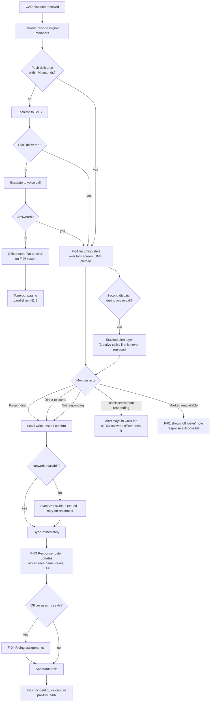
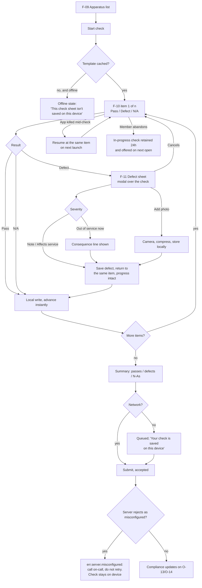
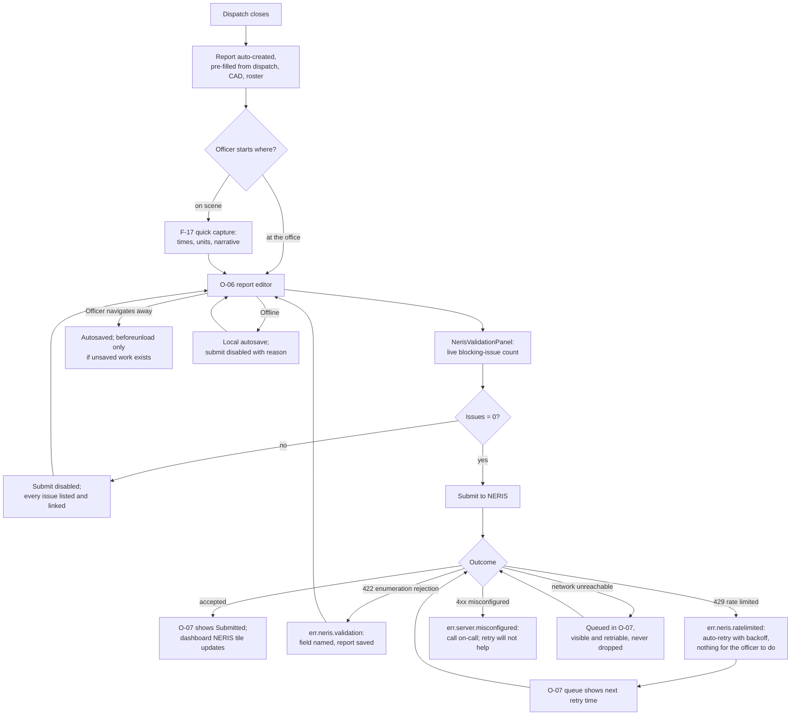
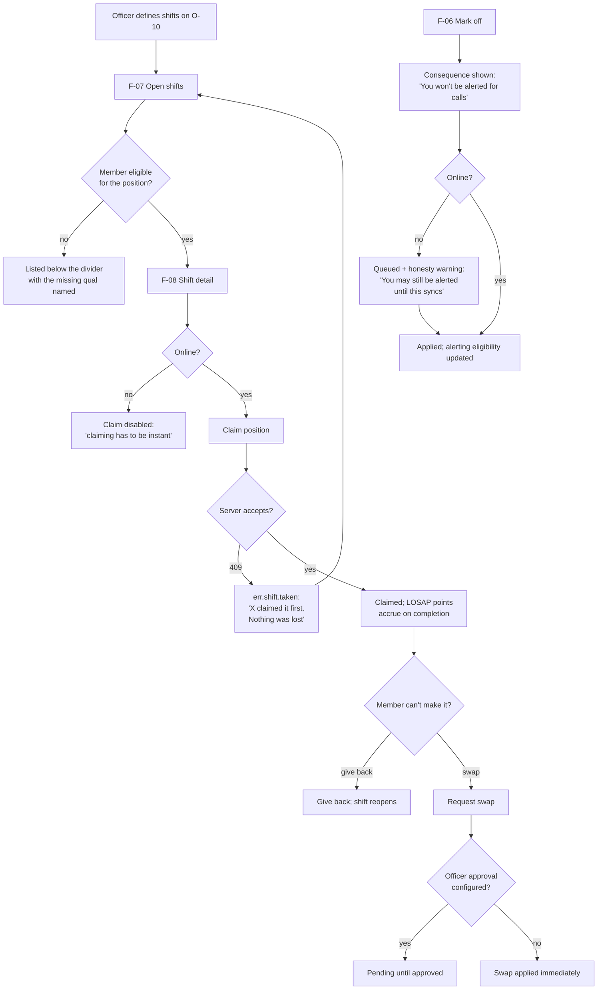
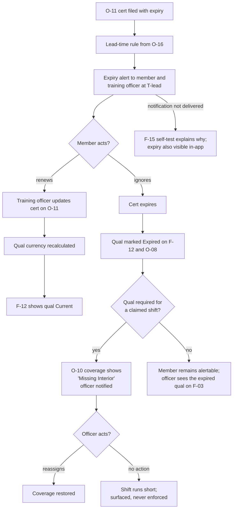
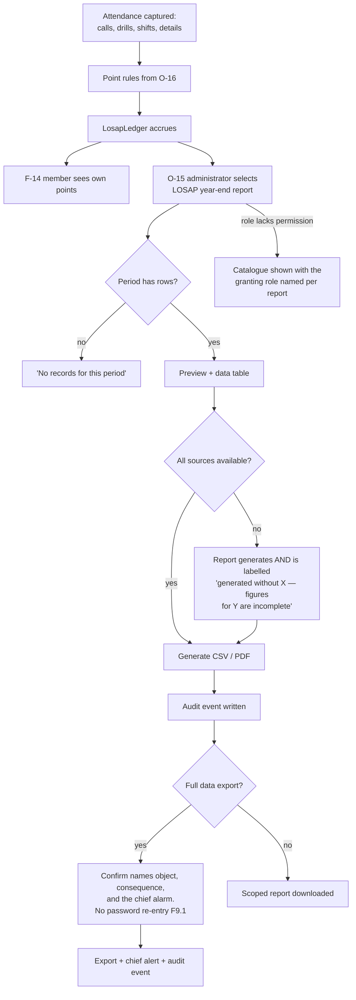
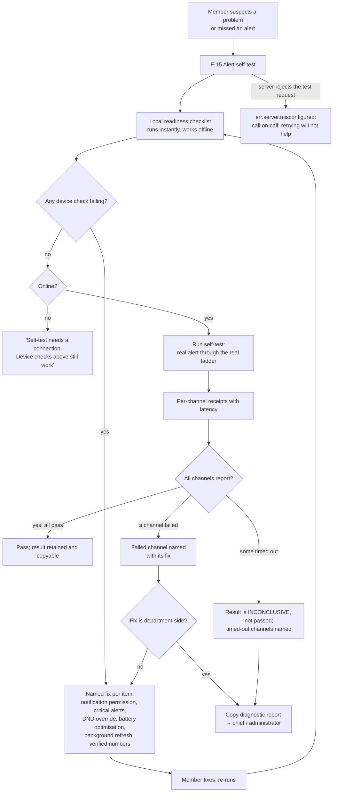
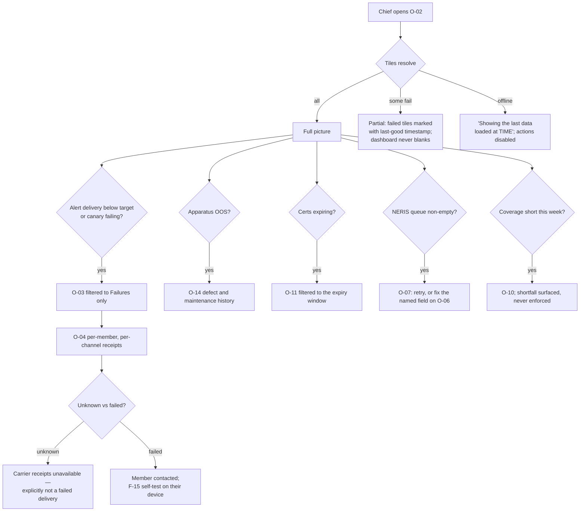

# Boxalarm — Experience Design (draft)

**Status:** draft for review · **Date:** 2026-09-06 · **Source:** PRD v0.2 + confirmed UX discovery brief (2026-09-06)
**Implementation target:** `react-vite` (`apps/web`) for the office surface; React Native (`apps/mobile`, not yet scaffolded) for the field surface.
**Visual direction:** "Command console" — selected by the user in discovery Round 5.

This document defines one design system, two layout systems, 34 screens, and the full seven-state
matrix for each. It is the input to `ux-prd.md` and to roughly 88 remaining UI stories.

Life-safety framing, applied throughout: **the app replaces radio tone-out as the alerting path of
record.** Any design decision that adds a step, a prompt, or a wait to the alert path is a defect.

---

## 0. Design principles (the tie-breakers)

These resolve disagreements between sections. They are ordered; the higher rule wins.

1. **The alert path never blocks.** No login, no re-authentication, no consent sheet, no onboarding,
   no update-required wall, no animation, and no network dependency stands between a dispatch and
   the member seeing what and where. If a screen on the alert path cannot render from cache, it
   renders from the push payload.
2. **Legible before pretty.** Contrast, target size, and type size beat density and elegance on the
   field surface, every time.
3. **Offline is the normal case in the field.** Every field write is a local write first. The network
   is a background sync, never a gate on the user's hands.
4. **Status has three channels: colour, glyph, and word.** Colour alone is never the carrier
   (N7.1). A status chip that loses its colour must still be readable.
5. **Say what happened and what to do.** Especially the difference between *we cannot reach the
   server* and *the server rejected us as misconfigured* — at 03:00 those demand opposite actions.
6. **Volunteers are unpaid.** A workflow harder than the paper it replaces will not be used. When a
   step can be removed, remove it; when it cannot, pre-fill it.
7. **Fire-service words, used correctly.** Tone-out, turnout, riding assignment, quals, interior,
   mutual aid, LOSAP, OOS. No marketing voice, no exclamation marks, no encouragement.

---

## 1. The two postures

The user's decision was "Balanced — two systems sharing one token set." That resolves concretely as:

| | **Field** (native, iOS + Android) | **Office** (web, `apps/web`) |
|---|---|---|
| Device | Phone, one hand, gloves, night, moving vehicle | Desktop / laptop, mouse + keyboard, two hands |
| Posture | Urgent, interruptive, seconds matter | Deliberate, data-dense, minutes are fine |
| Grid | Single column, full-bleed, no side-by-side | 12-column, `lg`+ two-pane, tables |
| Min touch/click target | **56 × 56 dp** (`size.target.field`) | **44 × 44 px** (`size.target.office`) |
| Spacing rhythm | 8dp base, generous (`lg`/`xl` between blocks) | 4px base, tight (`sm`/`md` between blocks) |
| Type scale | `field.*` — body 17, address 32 | `office.*` — body 15, dense 13 |
| Density modes | **comfortable only** — compact is forbidden | comfortable (56px rows) and compact (44px rows) |
| Default palette | `cab` (dark), auto-switches to `day` by ambient/OS | `day` (light), user-switchable to `cab` |
| Navigation | 5-stack bottom tab bar + modal alert layer | Persistent left sidebar + route content |
| Data on screen | One decision per screen | Many rows, filters, sort, bulk actions |
| Text input | Avoided; tap, toggle, and camera preferred | Expected; keyboard-first |
| Network assumption | Offline-first, sync in background | Online, with a degraded read-only mode |

**Shared:** the token set, the component primitives (same names, same props, two renderers), the
status vocabulary, the string catalogue, the error taxonomy, and the seven-state contract.

---

## 2. Design system — "Command console"

No design system, component library, or Storybook exists in `boxalarm-ui` (codebase-context §3).
The only existing tokens are `palette.day`/`palette.cab` (background + foreground) and a five-step
`spacing` scale (§4). **This design extends those two exports rather than replacing them** — existing
names `day`, `cab`, `xs…xl` keep their current values so the one existing component and its test do
not break.

Everything else in this section is net-new and is justified once, here: there is nothing in the
repository to compose from or extend. Per-component justification in §6 names only what is
*additionally* true (why a domain component is not just a composition of primitives).

### 2.1 Token delivery

| Surface | Mechanism |
|---|---|
| Web (`apps/web`, prototype `react-vite`) | `packages/design-tokens/src/tokens.css` → CSS custom properties on `:root`, consumed by CSS Modules. Palette switch = `data-palette="day"\|"cab"` on `<html>`. |
| Native (`apps/mobile`) | `packages/design-tokens/src/index.ts` → typed TS objects consumed through a `ThemeProvider` context. No inline literals. |
| Both | Generated from one source of truth in `packages/design-tokens`. A value used in code that is not in that package is a defect. |

Naming: `--bx-<category>-<role>-<variant>` in CSS, `tokens.<category>.<role>.<variant>` in TS.

### 2.2 Colour — palette-scoped

Two palettes, both mandatory (N7.3). Every semantic token is defined **in both**. The `cab` palette
is the design default for field; `day` is the default for office.

**Ground and surface**

| Token | `cab` | `day` | Use |
|---|---|---|---|
| `color.bg.ground` | `#0B0B0D` * | `#FFFFFF` * | Page ground |
| `color.bg.surface1` | `#141519` | `#F5F6F8` | Cards, list rows, sheets |
| `color.bg.surface2` | `#1D1F25` | `#EBEDF1` | Raised, headers, sticky bars |
| `color.bg.surface3` | `#282B33` | `#DFE2E8` | Input fields, pressed rows |
| `color.bg.scrim` | `rgba(0,0,0,0.72)` | `rgba(16,17,20,0.55)` | Behind modals and sheets |

\* existing values in `packages/design-tokens` — unchanged.

**Text**

| Token | `cab` | `day` | Ratio vs `bg.ground` |
|---|---|---|---|
| `color.text.primary` | `#D6D8DD` * | `#101114` * | 12.0 : 1 / 18.6 : 1 |
| `color.text.secondary` | `#A2A7B0` | `#3C4149` | 6.9 : 1 / 9.7 : 1 |
| `color.text.muted` | `#767C87` | `#5E646D` | 4.6 : 1 / 6.1 : 1 |
| `color.text.inverse` | `#0B0B0D` | `#FFFFFF` | on filled status fills |
| `color.text.link` | `#7FB8FF` | `#0B4FA8` | 8.6 : 1 / 8.0 : 1 |

`color.text.muted` is the floor — nothing below it exists. There is no "disabled grey" that falls
under 4.5 : 1; disabled state is carried by opacity of the *container*, never by unreadable text
(see §2.9).

**Status — the only place safety orange/red appears**

Each status has a **foreground** (text/icon on ground), a **fill** (chip/badge background), and an
`on-fill` text colour. Every status also carries a mandatory glyph and word (§2.3).

| Token | Meaning | `cab` fg | `day` fg | Ratio (cab / day) |
|---|---|---|---|---|
| `color.status.alarm` | Active dispatch, out of service, failed submission, delivery failure | `#FF6B35` | `#C21F0F` | 7.0 : 1 / 6.0 : 1 |
| `color.status.ok` | Responding, in service, delivered, passed, current | `#3DDC84` | `#12703A` | 11.0 : 1 / 6.1 : 1 |
| `color.status.warn` | Expiring, short coverage, overdue soon, degraded | `#FFB020` | `#8A5A00` | 10.7 : 1 / 5.9 : 1 |
| `color.status.info` | Queued, syncing, pending, scheduled | `#5AA9FF` | `#0B5FBF` | 7.9 : 1 / 6.2 : 1 |
| `color.status.neutral` | Not responding, unavailable, retired, N/A | `#9BA1AB` | `#52565C` | 6.0 : 1 / 7.4 : 1 |

Fill variants (`color.status.<role>.fill`) are the foreground at 16% alpha over `bg.surface1` in
`cab`, and at 12% in `day`; `on-fill` is the same foreground token, so filled chips inherit the
verified ratio. A **solid** fill exists for exactly one component — `AlertBanner` in the
`alarm` role — where `on-fill` is `color.text.inverse` at ≥ 8 : 1.

Ratios above are computed against `color.bg.ground` for each palette and are **design intent
pending machine verification** — `audit-accessibility` re-measures against the shipped tokens,
including against `bg.surface1`/`surface2` where chips actually sit. Any pair that measures below
4.5 : 1 (3 : 1 for ≥ 24px text, icons, and borders) is corrected by darkening/lightening the
foreground, never by dropping the requirement.

**Border**

| Token | `cab` | `day` | Use |
|---|---|---|---|
| `color.border.subtle` | `#252831` | `#E1E4EA` | Row separators |
| `color.border.default` | `#3A3F4A` | `#C4C9D2` | Card and input edges (3.0 : 1) |
| `color.border.strong` | `#5D6474` | `#8B919C` | Emphasis, selected |
| `color.border.focus` | `#7FB8FF` | `#0B4FA8` | Focus ring only |

**Forbidden colour uses** (brand rule, not a preference):
- `status.alarm` on any decorative surface — no orange headers, no orange dividers, no orange
  brand marks, no orange "primary" button that is not a genuinely alarming action.
- Gradients anywhere. Command console is flat.
- Any hue not in the tables above. There is no accent colour, no tertiary palette, no chart palette
  beyond the five status roles plus `text.secondary` (charts use pattern + label, see §6.6).

### 2.3 Status vocabulary — colour, glyph, word

This table is normative for the whole product. A status rendered without all three channels is a
defect (N7.1).

| Status | Colour role | Glyph | Word (`en`) |
|---|---|---|---|
| Active dispatch | alarm | filled triangle `▲` | Dispatched |
| Responding — to station | ok | filled circle `●` | Responding |
| Responding — direct to scene | ok | filled circle with rule `◉` | Direct to scene |
| Not responding | neutral | hollow circle `○` | Not responding |
| No answer yet | neutral | dash `–` | No answer |
| Unavailable / marked off | neutral | slash `⊘` | Unavailable |
| In service | ok | filled square `■` | In service |
| Out of service | alarm | hollow square with slash `⊠` | Out of service |
| Check passed | ok | check `✓` | Pass |
| Check failed / defect | alarm | cross `✕` | Defect |
| Not applicable | neutral | dash `–` | N/A |
| Current (cert, test) | ok | check `✓` | Current |
| Expiring | warn | half-filled `◐` | Expires in {n} days |
| Expired | alarm | cross `✕` | Expired |
| Queued / not yet synced | info | up-arrow in circle `⬆` | Queued |
| Syncing | info | up-arrow `⬆` (animated, see §7) | Syncing |
| Synced | ok | check `✓` | Synced |
| Delivery: sent | info | dot | Sent |
| Delivery: delivered | ok | check | Delivered |
| Delivery: opened | ok | double check | Opened |
| Delivery: failed | alarm | cross | Failed |
| Coverage short | warn | half-filled | Short {n} |
| Coverage missing a qual | alarm | triangle | Missing {qual} |

Glyphs ship as an inline SVG icon set in `packages/design-tokens` (no remote font, no icon CDN).
Characters above describe the shape, they are not the implementation.

### 2.4 Typography

Font stacks — system only, no webfont, no remote asset:

```
font.family.ui   = -apple-system, "SF Pro Text", Roboto, "Segoe UI", system-ui, sans-serif
font.family.mono = ui-monospace, SFMono-Regular, "Roboto Mono", Menlo, monospace
```

`font.family.mono` is required for: unit IDs, cylinder and asset serials, timestamps, NERIS incident
IDs, and dispatch numbers — anything read aloud over a radio or compared character-by-character.

**Field scale** (dp; line-height in parentheses)

| Token | Size | Weight | Use |
|---|---|---|---|
| `font.field.address` | 32 (38) | 700 | The address on an active call. Nothing else. |
| `font.field.display` | 28 (34) | 700 | Incident type on the alert screen |
| `font.field.title` | 24 (30) | 600 | Screen titles, call type in list |
| `font.field.heading` | 20 (26) | 600 | Section headings, checklist item text |
| `font.field.body` | 17 (24) | 400 | Body, list primary text |
| `font.field.label` | 15 (20) | 600 | Field labels, button text |
| `font.field.caption` | 13 (18) | 400 | Metadata, timestamps |

**Office scale** (px)

| Token | Size | Weight | Use |
|---|---|---|---|
| `font.office.display` | 28 (34) | 700 | Dashboard KPI value |
| `font.office.title` | 20 (28) | 600 | Page `h1` |
| `font.office.heading` | 17 (24) | 600 | Section `h2`/`h3`, table caption |
| `font.office.body` | 15 (22) | 400 | Body, comfortable table cell |
| `font.office.dense` | 13 (18) | 400 | Compact table cell, column header |
| `font.office.caption` | 12 (16) | 400 | Metadata, helper text |

Rules: no size below 12px anywhere; no ALL CAPS (column headers use `font.office.dense` weight 600,
sentence case); `letter-spacing` is `0` everywhere except `font.office.dense` column headers at
`0.02em`. Layouts tolerate **+40%** string expansion (§9).

### 2.5 Spacing, sizing, radius

`spacing` extends the existing five steps without changing them:

| Token | Value |
|---|---|
| `space.2xs` | 2 |
| `space.xs` | 4 * |
| `space.sm` | 8 * |
| `space.md` | 16 * |
| `space.lg` | 24 * |
| `space.xl` | 40 * |
| `space.2xl` | 64 |
| `space.3xl` | 96 |

\* existing values, unchanged.

| Token | Value | Note |
|---|---|---|
| `size.target.field` | 56 | Minimum interactive target, field |
| `size.target.office` | 44 | Minimum interactive target, office |
| `size.target.gap` | 8 | Minimum gap between adjacent targets, both |
| `size.row.field` | 72 | Field list row |
| `size.row.office.comfortable` | 56 | |
| `size.row.office.compact` | 44 | **Floor.** Compact reduces padding and type, never height below 44. |
| `size.hitslop.field` | 8 | Invisible expansion around small field glyphs |
| `size.readingWidth` | 68ch | Cap for prose (narrative, help, error detail) |
| `size.sidebar` | 248 | Office left nav, `lg`+ |

Radius — command console is nearly square:

| Token | Value | Use |
|---|---|---|
| `radius.none` | 0 | Tables, full-bleed bars, alert banner |
| `radius.sm` | 2 | Chips, badges, inputs |
| `radius.md` | 4 | Cards, buttons, sheets |
| `radius.lg` | 8 | Modals, photo thumbnails |
| `radius.pill` | 999 | Segmented control thumb only |

### 2.6 Elevation

In `cab`, shadows are invisible on near-black; elevation is carried by **surface step + border**. In
`day`, elevation is carried by shadow. One token, two renderings:

| Token | `cab` | `day` |
|---|---|---|
| `elevation.flat` | `bg.surface1`, no border | `bg.surface1`, no shadow |
| `elevation.raised` | `bg.surface2` + `1px border.subtle` | `bg.ground` + `0 1px 2px rgba(16,17,20,.10)` |
| `elevation.overlay` | `bg.surface2` + `1px border.default` | `bg.ground` + `0 8px 24px rgba(16,17,20,.18)` |
| `elevation.alarm` | `2px border` in `status.alarm` | same |

### 2.7 Breakpoints (office surface only)

Standard Moonaan scale. The field surface does not use breakpoints; it uses one column at every
phone width, with a `md`-and-up tablet layout deferred (§10, A-11).

| Token | Min width | Office behaviour |
|---|---|---|
| `xs` | 0 | Sidebar collapses to a top drawer; tables become stacked ListRows |
| `sm` | 480 | Same as `xs`, wider gutters |
| `md` | 768 | Sidebar as icon rail; tables scroll horizontally in their own container |
| `lg` | 1024 | Full sidebar; primary two-pane layouts (list + detail) unlock |
| `xl` | 1440 | Two-pane becomes three-pane on incident editor; dashboard goes 3-up |
| `2xl` | 1920 | Max content width `1680`, centred; dashboard 4-up (station wall display) |

200% browser zoom at `lg` must produce no horizontal page scroll and no clipped content; tables
scroll inside their own `overflow-x` container, the page body never does.

### 2.8 Motion

| Token | Value |
|---|---|
| `motion.duration.instant` | 0ms |
| `motion.duration.fast` | 120ms |
| `motion.duration.base` | 200ms |
| `motion.duration.slow` | 320ms |
| `motion.easing.standard` | `cubic-bezier(0.2, 0, 0, 1)` |
| `motion.easing.decelerate` | `cubic-bezier(0, 0, 0, 1)` |
| `motion.easing.accelerate` | `cubic-bezier(0.3, 0, 1, 1)` |

Policy: no animation exceeds `slow`; nothing on the alert path animates at all (rule 0.1); no
animation blocks input; no information is carried by motion alone. Every animation's
`prefers-reduced-motion: reduce` alternative is specified in §7.

### 2.9 Interaction states

Every interactive component defines five: rest, hover (office only), focus-visible, pressed,
disabled.

- **Focus-visible:** `2px` solid `color.border.focus` with a `2px` offset, on *every* focusable
  element, both surfaces. Never removed. On `status.alarm` fills the ring switches to
  `color.text.inverse` to keep 3 : 1.
- **Hover (office):** background steps one surface level. Never a colour change alone.
- **Pressed:** background steps one surface level *and* the label shifts to weight 600 for one
  frame-free instant change (no transition) so gloved taps register visibly with no latency.
- **Disabled:** container at 40% opacity **and** an appended reason in the accessible name
  (`aria-disabled` + `aria-describedby`), never a bare grey. Text inside a disabled container keeps
  its own contrast because the whole container fades together against `bg.ground`; where that drops
  below 4.5 : 1 the control is not disabled — it is removed or replaced with the no-permission
  affordance (§4.7).

---

## 3. Information architecture

### 3.1 Content model

Nine top-level entities. Every one is scoped by `deptId` (F9.6) — invisible in v1 UI, present in
every URL-independent identifier.

| Entity | Key attributes surfaced in UI | Related |
|---|---|---|
| **Member** | name, rank, status (active/probationary/LOA/retired), agency ID, contact, quals, availability | Certification, Attendance, Shift, Response, LosapLedger |
| **Qualification** | code (INT, DO, OFF, …), name, currency (derived from Certification) | Member, Certification, ShiftPosition |
| **Certification** | type, issuing authority, issued, expires, attachments, status | Member, Qualification |
| **Dispatch / Alert** | dispatch number, type, address, cross streets, narrative, received-at, channel receipts | Response, Incident, PrePlan, Hydrant |
| **Response** | member, choice (responding / direct / not), ETA, riding assignment | Dispatch, Member, Apparatus |
| **Incident (NERIS)** | NERIS incident ID, type, times, units, personnel, narrative, exposures, submission status | Dispatch, Member, Apparatus |
| **Apparatus** | unit ID, type, in/out of service + reason, station, checklist template, compartments | Check, Defect, SCBA, TestSchedule, Response |
| **Check** | template, apparatus, performed-by, performed-at, per-item result, sync state | Apparatus, Defect |
| **Shift** | window, required positions + quals, claims, coverage state | Member, Apparatus, LosapLedger |

Cross-cutting: **Occupancy / PrePlan / Hydrant** (retrievable from an active alert, F6.2/F1.8),
**AuditEvent**, **LosapLedger**, **DeliveryReceipt**.

### 3.2 One term, one meaning

Enforced vocabulary — a term used two ways is a defect (`audit-content-ia`):

| Use | Never use |
|---|---|
| **Dispatch** (the CAD event) | call-out, page, job |
| **Alert** (what we send to a member for a dispatch) | notification, push, tone |
| **Tone-out** (the legacy radio page, parallel-run only) | alert |
| **Response** (a member's answer) | acknowledgement, ack, RSVP |
| **Riding assignment** (seat on an apparatus) | crew, assignment |
| **Check** (apparatus check sheet) | inspection *(reserved for F6 occupancy inspections)* |
| **Defect** (a failed check item) | issue, problem, fault |
| **Out of service / OOS** | down, broken, unavailable *(unavailable is a member state)* |
| **Unavailable / marked off** (member) | off duty, out |
| **Quals** (qualifications) | certs *(certs are the documents; quals are the derived eligibility)* |
| **Shift** (claimable duty period) | schedule, standby *(standby is a shift type)* |
| **Incident report** (the NERIS record) | run report, NFIRS |
| **Member** | user, personnel, employee *(volunteers are not employees)* |

### 3.3 Navigation — field (native)

Five bottom tabs, fixed, always visible except during the alert layer. Tab bar height is
`size.target.field` + safe area; labels always shown (never icon-only).

| Tab | Stack | Screens |
|---|---|---|
| **Calls** | Alert | F-02 Call detail · F-03 Response roster · F-04 Riding assignments · F-05 Call history · F-17 Incident quick capture |
| **Duty** | Duty | F-06 My status · F-07 Open shifts · F-08 Shift detail |
| **Apparatus** | Apparatus | F-09 Apparatus list · F-10 Truck check · F-11 Defect report |
| **Me** | Records | F-12 Profile & quals · F-13 My certifications · F-14 LOSAP & attendance |
| **System** | System | F-15 Alert self-test · F-16 Sign in (first run only) |

**The alert layer sits above the tab bar and above everything else.** F-01 Incoming alert is not in
a stack; it is presented full-screen over whatever is on screen, from a cold start, from the lock
screen, or from a critical alert. Dismissing it returns to F-02, never to a blank state. Maximum
depth in any stack is **3**; nothing on the alert path is deeper than **1** tap from F-01.

### 3.4 Navigation — office (web)

Persistent left sidebar, five groups. Route model (`react-router-dom` 7, `BrowserRouter`):

| Group | Route | Screen |
|---|---|---|
| — | `/signin` | O-01 Sign in |
| Overview | `/` | O-02 Chief dashboard |
| Response | `/alerts` | O-03 Alert log |
| | `/alerts/:dispatchId` | O-04 Alert detail & delivery receipts |
| | `/incidents` | O-05 Incident list |
| | `/incidents/:incidentId` | O-06 Incident report editor (NERIS) |
| | `/incidents/submissions` | O-07 NERIS submission queue |
| People | `/members` | O-08 Member roster |
| | `/members/:memberId` | O-09 Member detail |
| | `/shifts` | O-10 Shift coverage |
| | `/training/certifications` | O-11 Certifications |
| | `/training/drills` | O-12 Drills & attendance |
| Apparatus | `/apparatus` | O-13 Apparatus registry |
| | `/apparatus/:unitId` | O-14 Apparatus detail |
| Admin | `/reports` | O-15 Reports & exports |
| | `/settings` | O-16 Department settings |
| | `/settings/audit` | O-17 Audit log |

Sidebar items the current role cannot access are **hidden, not disabled** — except `Reports` and
`Settings`, which are shown-and-explained to any member so the boundary is legible rather than
invisible (see §4.7 and the no-permission state throughout §5).

Breadcrumbs appear only on `:id` detail routes, one level (`Incidents / 2026-0417`). Route depth
never exceeds 3 segments.

### 3.5 URL and deep-link model

- Every list route accepts `?q=`, `?status=`, `?from=`/`?to=`, `?sort=`, `?page=`, `?density=`.
  Filter state is in the URL so a chief can paste a filtered view into an email.
- Detail routes use the human-facing identifier where one exists (`/incidents/2026-0417`,
  `/apparatus/E1`), not an opaque UUID.
- Native deep links: `boxalarm://dispatch/{dispatchId}` (alert layer), `boxalarm://check/{unitId}`,
  `boxalarm://shift/{shiftId}`. A push notification's tap target is always
  `boxalarm://dispatch/{dispatchId}` and always resolves offline from the push payload.
- No route requires a query parameter to render meaningfully.

---

## 4. Cross-cutting behaviour

### 4.1 The seven states — how they are produced

Every screen wraps its content in a `StateBoundary` (§6.4) that resolves exactly one of the seven
canonical ids: `default`, `loading`, `empty`, `error`, `partial`, `offline`, `no-permission`.
Resolution order is fixed, and this order is itself a design decision:

1. `no-permission` — authorization is server-side and known before data; never show a shell the
   user cannot use.
2. `offline` — if the device has no connectivity **and** the screen has no usable cache.
3. `error` — a request failed outright.
4. `partial` — the primary payload loaded but a named secondary one failed.
5. `loading` — first paint with no cache.
6. `empty` — the request succeeded and returned nothing.
7. `default`.

**Offline outranks error** deliberately: at 03:00 in an apparatus bay, "you have no signal" is the
true and actionable message; "something went wrong" is neither.

### 4.2 Offline model

| Concern | Decision |
|---|---|
| Cached for offline read | Active dispatch + full alert payload; my responses; today's and tomorrow's shifts; the full apparatus list with check templates; my profile, quals, certs; the last 30 days of call history (metadata only); pre-plans and hydrants for the active dispatch's address (pre-fetched at alert receipt). |
| Writable offline (queued) | Response choice + ETA; check results and defects incl. photos; attendance check-in; availability changes; shift give-back requests; incident narrative drafts. |
| **Not** available offline | Live roster of *other* members, delivery receipts, shift *claiming* (atomicity, F2.9), NERIS submission, exports, any settings mutation, audit log. |
| Queue visibility | A persistent `SyncStatusChip` in the field header shows `Queued {n}` / `Syncing` / `Synced {relative time}`. Tapping it opens the queue list with per-item status and a `Retry now`. |
| Conflict policy | Last-write-wins on member-owned records (my response, my availability). **Never** on shift claims (server-authoritative, the offline claim is rejected with `err.shift.taken`) and never on check results already accepted (a second submission creates a new check, not an overwrite). |
| Data loss | Never. A queued write survives app kill and device restart. Clearing the queue requires an explicit `Discard {n} queued items` with a named consequence. |
| Photos | Compressed and stored locally at capture; uploaded on reconnect. The check is complete and syncable without the photo; the photo backfills. |

### 4.3 Alert-path guarantees

- F-01 renders from the **push payload alone** — incident type, address, cross streets, narrative,
  dispatch time. No network call is required to show it, and no network call is awaited before the
  response buttons are live.
- The three response buttons are enabled at first paint. Tapping one writes locally, confirms
  visually within one frame, and syncs in the background. **Never** disable a response button to
  wait for the network.
- No login screen, no re-authentication, no session-expiry screen, no "verify it's you" ever
  appears — anywhere in the product, not just the alert path (F9.1, N5.2). If the token refresh
  fails, the app keeps working from cache and shows a **non-blocking** `InlineAlert` in the System
  tab: `err.session.refresh` — it does not interrupt, and it never gates the alert path.
- A second dispatch arriving during an active call presents as a **stacked** alert layer with an
  explicit `2 active calls` control; it never replaces or dismisses the first.
- Silence and DND are overridden by the platform critical-alert channel (F1.9); the in-app design
  adds nothing that could suppress it.

### 4.4 Authorization surfaces (six roles)

| Role | Field surface | Office surface |
|---|---|---|
| Member | All 5 tabs; read-only on roster; own records only | `/` (own summary), `/shifts`, `/training/*` read-only, `/members/:self` |
| Officer | + riding assignments, delivery receipts, incident quick capture | + `/alerts/*`, `/incidents/*`, `/members` read, `/shifts` write |
| Apparatus officer | + apparatus OOS toggle, defect triage | + `/apparatus/*` write, `/reports` (apparatus scope) |
| Training officer | member view only | + `/training/*` write, `/members` read, `/reports` (training scope) |
| Administrator | member view only | + `/members` write, `/reports` (all), `/settings` (config), `/settings/audit` read |
| Chief | all officer capabilities | all routes, incl. export and destructive actions |

Authorization is evaluated **server-side on a valid session, by role alone** (F9.1/F9.2). There is
no client-side secret and no step-up. The client hides what it knows is denied and renders
`no-permission` when the server says so.

### 4.5 Destructive and export actions

No confirmation-by-password, ever (F9.1). The pattern instead:

| Reversibility | Pattern |
|---|---|
| Reversible (unassign a riding position, remove a shift claim, un-mark a defect) | **Do it, then offer undo** for 10s via `UndoSnackbar`. No dialog. |
| Irreversible but low blast radius (delete a draft, discard a photo) | Single `ConfirmDialog` naming the object: `Discard the photo on step 4 of the Engine 1 check?` |
| Irreversible and high blast radius (retire a member, delete an apparatus, export the full dataset) | `ConfirmDialog` naming the object **and** the consequence **and** stating the detective control: `Exporting sends an alert to the chief and writes an audit event.` Confirm button names the outcome (`Export all department data`). |

The chief-alarm and audit-event language is **required copy**, not optional — it is the only visible
representation of the accepted security trade in N5.2, and hiding it would misrepresent the system.

### 4.6 Error taxonomy

Every failure resolves to exactly one of these. The distinction the brief demands —
*unreachable* vs *misconfigured* — is structural here, not a wording tweak.

| Key | Trigger | Message | Primary action |
|---|---|---|---|
| `err.net.offline` | No connectivity | "You're offline. {n} items are saved on this device and will sync when you have signal." | `View queued items` |
| `err.net.unreachable` | Device online, request timed out or DNS/connection failed | "Can't reach Boxalarm. Your device has signal but the server isn't answering. Tone-out paging is still running." | `Try again` |
| `err.server.down` | 5xx | "Boxalarm's server returned an error. This is on our side, not yours." | `Try again` + `Report this` (copies reference) |
| `err.server.misconfigured` | 4xx that is not 401/403/404/409/422 — bad request shape, missing header, unknown route | "Boxalarm reached the server and the server rejected the request as misconfigured. **Retrying will not fix this.** Call the on-call number and quote reference {ref}." | `Copy reference` |
| `err.auth.denied` | 403 | "You don't have access to {thing}. {role} can grant it." | `Who can grant this` |
| `err.validation` | 422, field-level | Field-specific, inline. | — |
| `err.neris.validation` | NERIS enumeration rejection | "NERIS rejected {field}: {reason}. Fix it here and resubmit — the report is saved." | `Go to {field}` |
| `err.neris.ratelimited` | 429 | "NERIS is rate-limiting submissions. Boxalarm will keep retrying in the background — you don't need to do anything." | `View queue` |
| `err.shift.taken` | 409 on claim | "{name} claimed this shift first. Nothing was lost — pick another open shift." | `Back to open shifts` |
| `err.session.refresh` | Token refresh failed | "Boxalarm couldn't refresh its connection to your account. You are still signed in and alerts still work. Open the app on Wi-Fi when you can." | `Try again` |
| `err.photo.upload` | Photo upload failed, check accepted | "The check was saved. The photo hasn't uploaded yet and will retry automatically." | `Retry photo` |

Rules: the error **code** is never the headline (it lives in a `Details` disclosure); the message
never blames the user; in-progress work is never discarded by an error; and any error on a field
write states where the work went.

### 4.7 The no-permission state

Never a blank screen, never a raw 403. Every `no-permission` state states three things: **what is
restricted, why (role), and who grants it.** The department's roles are small and the people are
known to each other, so the copy names the role, not an abstract permission:

> **Reports are limited to the chief, administrator, and training officer.**
> You're signed in as a member. Ask the chief or the department administrator to change your role.
> [ View my role and quals ]

### 4.8 Forms

- Persistent visible label on every input. Placeholders are never labels.
- Validate on blur; re-validate on change only after a field has already errored.
- Most fields required → mark the **optional** ones (`Cross streets (optional)`). Consistent per form.
- Forms over five fields get an error summary at the top, `role="alert"`, linking to each field.
- User input is never cleared by a failed submit.
- Multi-step forms (incident report, truck check) persist progress across navigation, refresh, app
  kill, and network loss.
- Field-surface forms avoid free text: pass/fail/NA toggles, numeric steppers, camera, and
  pick-from-list. The only free-text field in the field posture is the defect note and the incident
  narrative, both optional at capture and both dictation-friendly.

---

## 5. Screen inventory

34 screens. Every screen lists purpose, entry points, exits, and all seven states. String keys
resolve in §8. "Cannot occur" appears only with a stated reason.

Heading hierarchy on web: `AppShell` owns `<h1>` per route (the page title); sections start at
`<h2>`. There is no MFE shell, so no `<h2>`-start rule applies.

---

### 5.1 Field — Alert stack

#### F-01 Incoming alert

**Purpose:** the whole product's reason to exist. Show what and where, take a response in one tap.
**Entry:** critical push notification (locked or unlocked), `boxalarm://dispatch/{id}`, cold start
during an active dispatch, second dispatch stacking over an existing alert layer.
**Exit:** response tap → F-02 Call detail (auto, no intermediate confirm screen). `Dismiss` → F-02.
Never exits to a blank state or to the tab bar root.

**Layout:** full-bleed, no tab bar, no back chevron. Top to bottom: alarm-role `AlertBanner` with
incident type at `font.field.display`; **address at `font.field.address` (32dp)**; cross streets at
`font.field.body`; dispatch narrative capped at 3 lines with `More`; then three stacked
`ResponseChoice` buttons at `size.target.field` × 2 (112dp tall) with `space.sm` between; then a
secondary row: `Map`, `Pre-plan`, `Hydrants`, `Roster`.

| State | Behaviour |
|---|---|
| `default` | As above, rendered from the push payload. Response buttons live at first paint. |
| `loading` | **Cannot occur as a blocking state** — the payload arrives with the notification, so there is nothing to wait for. Secondary enrichments (map thumbnail, pre-plan availability, hydrant count) render as inline skeleton chips that resolve or fall back; the address and buttons never wait. |
| `empty` | **Cannot occur** — an alert exists because a dispatch exists; there is no empty dispatch. If the payload is malformed (no address), the screen shows the incident type, the dispatch number, and `msg.alert.partialPayload` with `Call dispatch` and the response buttons still live. |
| `error` | Response failed to sync: the choice stays visibly selected, a `SyncStatusChip` shows `Queued`, and `err.net.unreachable` or `err.server.misconfigured` appears as a non-blocking inline strip. The response is never lost and never silently retried into invisibility. |
| `partial` | Map, pre-plan, or hydrant enrichment failed. Those three chips render disabled with `msg.alert.enrichUnavailable`; everything else is normal. Marked, not hidden. |
| `offline` | Identical to `default` — this is the designed-for case. `SyncStatusChip` reads `Queued 1`. Map opens the device's offline map with the address string; `Pre-plan` opens the cached pre-plan if pre-fetched, otherwise shows `msg.preplan.notCached`. |
| `no-permission` | **Cannot occur** — every member with an active status is eligible for the alert; if they were not eligible they would not have received it. A retired or LOA member who somehow receives one sees `msg.alert.notEligible` above still-live buttons (respond anyway; the officer sees the response flagged `Off roster`). |

#### F-02 Call detail

**Purpose:** everything about the active call after the response is given — full narrative, map,
pre-plan, hydrants, my response, and a link to the roster.
**Entry:** F-01 response or dismiss; Calls tab; F-05 history row.
**Exit:** F-03 Roster · F-04 Riding assignments (officer) · F-17 Incident quick capture (officer) ·
external map app · Calls tab root.

| State | Behaviour |
|---|---|
| `default` | Header: type, address (`font.field.address`), elapsed time since dispatch (`mono`). My response chip with `Change response`. Sections: narrative, map card, pre-plan, hydrants, units dispatched. |
| `loading` | Header renders instantly from cache. Narrative/map/pre-plan/hydrant sections are `Skeleton` blocks. No full-page spinner. |
| `empty` | No active call: `msg.calls.none` — "No active call. Your last call was {type} on {date}." with `View call history`. Not apologetic, not a dead end. |
| `error` | Detail fetch failed after cache render: header stays, body shows `ErrorState` with `err.net.unreachable` or `err.server.down` and `Try again`; the cached narrative from the alert payload remains visible above it. |
| `partial` | Pre-plan or hydrant section failed: that section shows `msg.section.unavailable` with `Retry section`; the rest is normal. |
| `offline` | Everything cached renders; live sections (units currently responding) show `msg.section.offlineLive` — "Live unit status needs a connection." My response change is queued. |
| `no-permission` | Members see the call; the *narrative* is visible to all (it is the dispatch narrative, not PII). No sub-state needed for members. **Officer-only** controls (`Riding assignments`, `Incident quick capture`) are hidden for members, not disabled. |

#### F-03 Response roster

**Purpose:** who is coming, with what quals and ETA — the officer's staffing picture before the
apparatus rolls (F1.7).
**Entry:** F-01 `Roster` · F-02 · push "roster changed" (officer, non-critical).
**Exit:** F-04 Riding assignments (officer) · member row → F-12-read-only.

| State | Behaviour |
|---|---|
| `default` | Sticky summary bar: `{n} responding · {n} direct · {n} unavailable · {n} no answer`, with qual coverage chips (`Interior 4 · Driver 2 · Officer 1`). List grouped by response type, sorted by ETA. Each row: name, rank, ETA (`mono`), qual badges, status glyph+word. Live-updating via `aria-live="polite"` on the summary bar only (not on each row — row-level announcement would flood a screen reader during a callout). |
| `loading` | Summary bar skeleton + 6 skeleton rows. |
| `empty` | Nobody has responded yet: `msg.roster.noneYet` — "No responses yet. Alerts went out {n} seconds ago." with a live elapsed counter. This is *information*, not an error — an empty roster 8 seconds after dispatch is normal. |
| `error` | `err.net.unreachable`; the last-known roster stays on screen behind a `partial`-style banner reading `msg.roster.stale` with the timestamp of the last good update. Officers must never see a blank roster during a call. |
| `partial` | Roster loaded, qual data failed: rows render without qual badges and the summary shows `msg.roster.qualsUnavailable` — "Qual coverage unavailable. Names and ETAs are current." |
| `offline` | Last-known roster with `msg.roster.frozen` — "Offline. This roster was last updated {time} and is not live." Timestamp is prominent; a stale roster presented as live is a safety defect. |
| `no-permission` | Members see the roster (it is operationally necessary — you need to know who's coming). No restriction. Delivery *receipts* (F1.3) are officer-only and live on F-03's `Receipts` tab, which is hidden for members. |

#### F-04 Riding assignments

**Purpose:** officer assigns responding members to apparatus seats.
**Entry:** F-02 · F-03 (officer only). **Exit:** back to F-03.

| State | Behaviour |
|---|---|
| `default` | One card per responding apparatus; seats as rows (Officer, Driver/Operator, Nozzle, Backup, …). Tap a seat → sheet listing responding members, **eligible members first**, ineligible ones shown below a divider with the missing qual named. Assignment is instant with `UndoSnackbar`. |
| `loading` | Apparatus cards render from cache; seat occupancy skeletons. |
| `empty` | No responding members yet: `msg.riding.noResponders` — "No one has responded yet. Seats open as members respond." Apparatus cards still render so the officer can see the shape of the assignment. |
| `error` | Assignment failed to sync: seat shows the assignment with a `Queued` chip and `err.net.unreachable`. Assignment is never rolled back on the officer's screen without telling them; if the server rejects it (`err.shift.taken`-style conflict, someone else assigned the seat), the seat shows both names and `msg.riding.conflict` with `Keep mine` / `Keep theirs`. |
| `partial` | Apparatus list loaded, qual eligibility failed: all members show in one list with `msg.riding.qualsUnavailable` — "Qual checking is unavailable. Verify quals yourself before assigning." |
| `offline` | Assignments are queued and shown as `Queued`. `msg.riding.offlineWarning` — "Offline. Other officers can't see these assignments yet." |
| `no-permission` | Members reaching this by deep link: `no-permission` state naming officer/chief as the grantors, with `View roster` as the alternative. |

#### F-05 Call history

**Purpose:** what I've responded to; the entry point to a report for officers.
**Entry:** Calls tab. **Exit:** F-02 (past call) · F-17.

| State | Behaviour |
|---|---|
| `default` | Reverse-chronological list, grouped by month. Row: date + time (`mono`), type, address, my response glyph+word, report status chip for officers. Infinite scroll, 30 per page. |
| `loading` | 8 skeleton rows. |
| `empty` | `msg.history.empty` — "No calls yet. Calls appear here after you're toned out." |
| `error` | `ErrorState` + `Try again`; any already-loaded pages stay. |
| `partial` | Report status failed to load: rows render without the report chip, with `msg.history.reportStatusUnavailable`. |
| `offline` | Last 30 days from cache with `msg.list.offlineCached` — "Offline. Showing calls saved on this device through {date}." Older pages are unavailable, stated, not silently absent. |
| `no-permission` | Members see only their own calls — enforced server-side, so the list is simply scoped; no denied state. Officers requesting department-wide history without the role get the `no-permission` state on the `All calls` filter, not on the screen. |

#### F-17 Incident quick capture

**Purpose:** officer captures on-scene facts while they are fresh — times, units, narrative, exposures
— which pre-fill the full NERIS report on O-06 (F7.2).
**Entry:** F-02 · F-05 (officer). **Exit:** back to F-02; the report continues on the web.

| State | Behaviour |
|---|---|
| `default` | Pre-filled from dispatch + roster: type, address, dispatch/arrival times, units, personnel. Officer confirms or corrects. Narrative is a large dictation-friendly textarea. `Save to report` writes a draft. Progress persists across app kill. |
| `loading` | Pre-fill sources still resolving: fields render with skeleton values and are editable immediately — pre-fill overwrites only fields the officer has not touched. |
| `empty` | **Cannot occur** — the screen always opens against a specific dispatch, which supplies at minimum type, address, and time. |
| `error` | Draft save failed: `err.net.unreachable`; the draft is on the device, the banner says so explicitly (`msg.report.draftLocal`). Never a lost narrative. |
| `partial` | Roster or CAD times failed to pre-fill: those fields are empty and flagged `msg.form.notPrefilled` — "Not pre-filled — enter manually." Distinguished from a field that pre-filled with a wrong value. |
| `offline` | Full capture works offline; queued. Banner: `msg.report.offlineDraft`. |
| `no-permission` | Members: `no-permission` naming officer/chief. |

---

### 5.2 Field — Duty stack

#### F-06 My status / availability

**Purpose:** mark off, come back on, and see what my marking-off affects (F2.5).
**Entry:** Duty tab. **Exit:** F-07.

| State | Behaviour |
|---|---|
| `default` | Big current-state card: `Available` / `Unavailable until {date}`, with a single primary action to flip it. Below: reason (optional picker), a plain statement of consequence (`msg.availability.consequence` — "You won't be alerted for calls while you're marked off. You'll still get drill and shift reminders."), and my next claimed shifts. |
| `loading` | Status card renders from cache (it is member-owned and always cached); next-shifts list skeletons. |
| `empty` | No upcoming shifts: `msg.shifts.noneClaimed` — "You haven't claimed any shifts." with `Browse open shifts`. |
| `error` | Status change failed to sync: shown as `Queued`, with `msg.availability.queuedWarning` — "Saved on this device. You may still be alerted until this syncs." This is a safety-relevant honesty requirement. |
| `partial` | Status current, shift list failed: `msg.section.unavailable` on that section only. |
| `offline` | Flip works, queued, with the same honesty warning as `error`. |
| `no-permission` | **Cannot occur** — every member controls their own availability by definition. |

#### F-07 Open shifts

**Purpose:** browse and claim open duty shifts (F2.9).
**Entry:** Duty tab · F-06. **Exit:** F-08.

| State | Behaviour |
|---|---|
| `default` | Grouped by day. Row: window (`mono`, `18:00–06:00`), station/apparatus, required positions with qual badges, coverage chip (`Short 2` / `Missing Driver`). Rows I'm eligible for are listed first; ineligible ones below a divider labelled with the missing qual. |
| `loading` | Day headers + 6 skeleton rows. |
| `empty` | `msg.shifts.noOpen` — "No open shifts right now. Officers post shifts as they're scheduled." |
| `error` | `ErrorState`, `Try again`. |
| `partial` | Coverage/qual data failed: shifts list with `msg.shifts.coverageUnavailable` — "Coverage detail unavailable. You can still see and claim shifts." |
| `offline` | **Browse is cached, claiming is disabled** — claiming must be atomic (F2.9) and cannot be queued. `msg.shifts.claimNeedsSignal` — "You need a connection to claim a shift — claiming has to be instant so two people can't take the same one." Disabled claim buttons carry that reason in their accessible name. |
| `no-permission` | **Cannot occur** for active members. Probationary/LOA members whose status blocks claiming see the list with claim disabled and `msg.shifts.statusBlocks` naming the status and who changes it. |

#### F-08 Shift detail

**Purpose:** the specifics of one shift; claim, give back, or request a swap (F2.11).
**Entry:** F-07 · F-06. **Exit:** back.

| State | Behaviour |
|---|---|
| `default` | Window, station, apparatus, required positions with who has claimed each, my eligibility per position, LOSAP points earned (F2.12). Primary action: `Claim {position}` or `Give back this shift`. |
| `loading` | Header from the list cache; claim table skeletons. |
| `empty` | **Cannot occur** — the screen is always about one existing shift. A shift deleted while open shows `msg.shift.removed` — "This shift was removed by {role}." with `Back to open shifts`. |
| `error` | Claim failed: `err.shift.taken` (someone claimed first — named, non-blaming) or `err.net.unreachable`. Nothing is half-claimed. |
| `partial` | Claimant names failed to load: positions show `Claimed` without a name, marked `msg.shift.namesUnavailable`. |
| `offline` | Read-only from cache; claim/give-back disabled with `msg.shifts.claimNeedsSignal`. |
| `no-permission` | Swap approval controls are officer-only and hidden for members; a member deep-linking to an approval action gets `no-permission` naming the officer. |

---

### 5.3 Field — Apparatus stack

#### F-09 Apparatus list

**Purpose:** what's in service, what's not, what's due for a check (F4.1).
**Entry:** Apparatus tab. **Exit:** F-10 · F-11 · apparatus detail (read-only mirror of O-14).

| State | Behaviour |
|---|---|
| `default` | One row per unit: unit ID (`mono`, large), type, status glyph+word (`In service` / `Out of service`), check status (`Checked {relative}` / `Due today` / `Overdue {n} days`), open defect count. Primary action on each row: `Start check`. |
| `loading` | 5 skeleton rows. |
| `empty` | `msg.apparatus.none` — "No apparatus is set up yet. The department administrator adds apparatus in settings." (Realistic only at first deployment.) |
| `error` | `ErrorState` + `Try again`; cached list stays if present. |
| `partial` | Status loaded, defect counts failed: rows render without defect counts, flagged `msg.apparatus.defectsUnavailable`. |
| `offline` | Full list and check templates are cached by design — this is the designed-for case for the apparatus bay. Banner: `msg.list.offlineCached`. OOS toggling is queued with `msg.apparatus.oosQueued` — "Saved on this device. Other members won't see this until it syncs." |
| `no-permission` | All members can view and perform checks. **OOS toggle** is apparatus-officer/chief only — hidden for others; a member deep-linking gets `no-permission` naming the apparatus officer. |

#### F-10 Truck check runner

**Purpose:** complete a full apparatus check in **under 90 seconds median** (N4.2), gloved, offline
(F4.2). This is the most performance-constrained screen in the product.
**Entry:** F-09 `Start check` · `boxalarm://check/{unitId}` · a resumed in-progress check.
**Exit:** completion summary → F-09; `Report defect` → F-11 (returns without losing progress).

**Design decisions that buy the 90 seconds:**
- **One item per screen, auto-advancing.** No scrolling list, no thumb travel between items.
- Two primary targets only: `Pass` and `Defect`, each a **half-width, 96dp-tall** button —
  far above `size.target.field`, reachable with a gloved thumb without looking precisely.
- `Pass` advances instantly (no transition — see §7) and is the left/dominant target.
- `N/A` is a smaller tertiary control below, at `size.target.field`.
- A thin `ProgressBar` plus `{i} of {n}` in `mono` — position is always known.
- **Swipe is an accelerator, never the only way** (swipe right = pass, left = defect); every swipe
  action has an equal button. Gloves defeat swipe; buttons are the contract.
- Back one item is always available; a completed item can be changed until submit.
- The check is written locally after **every item**, so app kill at item 23 of 40 loses nothing.

| State | Behaviour |
|---|---|
| `default` | As above. Final screen: summary of passes/defects/N-As, defect list, and `Submit check` (or `Submit check — {n} items queued` when offline). |
| `loading` | **Cannot occur after the first launch** — templates are cached with the apparatus list. On a genuinely cold first launch with no cache, a single skeleton item renders for at most one paint; if the template is unavailable, the screen shows the offline state rather than blocking. |
| `empty` | Template has zero items: `msg.check.templateEmpty` — "This apparatus has no check sheet yet. The apparatus officer sets one up in settings." with `Back to apparatus`. |
| `error` | Submit failed: the completed check stays intact on the device, `err.net.unreachable` or `err.server.misconfigured` is shown with `msg.check.savedLocally` — "Your check is saved on this device. Nothing was lost." `Try again` + `Done` (leaves it queued). |
| `partial` | Template loaded, previous defect history for this unit failed: items render without the "known defect" flag, marked `msg.check.historyUnavailable` — "Existing defects for this unit couldn't be loaded." |
| `offline` | The designed-for case. Full check runs; submit queues; the summary states `Queued — will sync when you have signal.` No functionality is removed. |
| `no-permission` | **Cannot occur** — any active member may perform a check (F4.2 is explicitly a member workflow). Probationary members whose department config restricts checks see `no-permission` naming the apparatus officer, configured per department (F9.3). |

#### F-11 Defect report

**Purpose:** report a failed item with a photo, routed to the apparatus officer (F4.3), **without
losing check progress**.
**Entry:** F-10 `Defect` (modal over the check) · F-09 · F-14. **Exit:** returns exactly to the
check item it came from.

| State | Behaviour |
|---|---|
| `default` | Item name pre-filled and not editable. Severity: three large segmented options — `Note` / `Affects service` / `Out of service now`. Optional note (dictation-friendly). `Add photo` opens the camera directly, not a picker. `Save defect` returns to the check. Selecting `Out of service now` shows an inline consequence line before saving: `msg.defect.oosConsequence` — "This takes {unit} out of service and alerts the apparatus officer." |
| `loading` | **Cannot occur** — the form is local and needs no data to render. |
| `empty` | **Cannot occur** — a defect is always created against a known item. |
| `error` | Photo upload failed: `err.photo.upload`. The defect itself is saved; the photo retries. The two are never coupled. |
| `partial` | Defect saved, apparatus-officer routing lookup failed: `msg.defect.routingUnknown` — "Defect saved. We couldn't confirm who it was routed to; it will route when this syncs." |
| `offline` | Full capture including photo, all queued. Photo compressed and stored locally. |
| `no-permission` | **Cannot occur** — anyone performing a check can report a defect; that is the point. Marking OOS is a *consequence*, not a separate permission, and is deliberately available to every member (a firefighter who finds a failed brake must be able to stop the rig). |

---

### 5.4 Field — Me stack

#### F-12 Profile & quals

**Purpose:** my contact details, rank, status, and the quals I hold (F2.6, F2.2).
**Entry:** Me tab · roster row (read-only, other member). **Exit:** F-13.

| State | Behaviour |
|---|---|
| `default` | Header: name, rank, agency ID (`mono`), status chip. Editable contact block (phone, email, address). Quals section: each qual with currency status glyph+word and the certification backing it (F3.7). |
| `loading` | Header from cache; contact and quals skeleton. |
| `empty` | No quals recorded: `msg.quals.none` — "No quals recorded. The training officer adds quals as your certifications are filed." |
| `error` | Contact save failed: input preserved, `err.net.unreachable`, `Try again`. |
| `partial` | Profile loaded, qual currency failed: quals listed without currency, marked `msg.quals.currencyUnavailable` — "Currency couldn't be checked. Quals shown may be out of date." |
| `offline` | Read from cache; edits queued. |
| `no-permission` | Viewing another member: contact details are limited to what the roster exposes (name, rank, quals); personal phone/email/address are hidden with `msg.profile.contactRestricted` — "Personal contact details are visible to officers and the administrator." No blank screen. |

#### F-13 My certifications

**Purpose:** what I hold, when it expires, what I need to do (F3.1, F3.2).
**Entry:** F-12 · expiry notification. **Exit:** attachment viewer.

| State | Behaviour |
|---|---|
| `default` | Sorted expiring-soonest-first. Row: cert name, issuing authority, expiry (`mono`), status glyph+word (`Current` / `Expires in {n} days` / `Expired`), attachment count. |
| `loading` | 5 skeleton rows. |
| `empty` | `msg.certs.none` — "No certifications on file. The training officer files certifications for you." |
| `error` | `ErrorState`, `Try again`. |
| `partial` | Certs loaded, attachments failed: rows render with `msg.certs.attachmentsUnavailable`. |
| `offline` | Cached list; attachments unavailable unless previously opened, stated per row. |
| `no-permission` | **Cannot occur** for my own certs. Another member's certs are training-officer/chief only and are not linked from the roster at all. |

#### F-14 LOSAP & attendance

**Purpose:** my points and the attendance behind them — visible to the member, not just the
administrator (F2.4).
**Entry:** Me tab. **Exit:** attendance detail rows.

| State | Behaviour |
|---|---|
| `default` | Big current-year point total with the threshold marked (`{n} of {threshold} points`) as a labelled `CoverageMeter` — value, threshold, and remaining all in text, not only in the bar. Below: ledger grouped by activity type (calls, drills, meetings, work details, standby) with point value and date. |
| `loading` | Total renders from cache; ledger skeleton. |
| `empty` | `msg.losap.noPoints` — "No points yet this year. Points post after calls, drills, and shifts are recorded." |
| `error` | `ErrorState`, `Try again`. |
| `partial` | Total loaded, ledger failed: total shown with `msg.losap.ledgerUnavailable` — "Point detail couldn't load. The total is current as of {time}." |
| `offline` | Cached total and ledger with `msg.list.offlineCached`. |
| `no-permission` | **Cannot occur** for my own points (F2.4 requires per-member visibility). Other members' points are administrator/chief only, on O-09. |

---

### 5.5 Field — System stack

#### F-15 Alert self-test & diagnostics

**Purpose:** F1.10 and N8.3 — a member proves their own alert path works, end to end, without a
real call, and can answer "why didn't I get the page" without vendor support.
**Entry:** System tab · a prompt after any missed alert. **Exit:** back.

| State | Behaviour |
|---|---|
| `default` | Two blocks. **(1) Readiness checklist** — device-side conditions with pass/fail glyph+word and a fix action each: notification permission, critical-alert permission, Do Not Disturb override, battery optimization exemption (Android), background refresh, SMS number verified, voice number verified, app version current. **(2) Run self-test** — sends a real test alert through the real ladder (push → SMS → voice) and shows a per-channel receipt timeline with latency in `mono`. The test alert is unmistakably labelled `TEST — not a real call` on the device. Result is retained and shareable (`Copy diagnostic report`). |
| `loading` | Checklist evaluates locally and instantly. Self-test shows a per-channel progress list, each channel resolving independently — never one spinner for the whole ladder. |
| `empty` | Never run before: `msg.selftest.neverRun` — "You haven't run a self-test. It takes about 30 seconds and sends a test alert to this device." with `Run self-test`. |
| `error` | Self-test could not be started: `err.net.unreachable` vs `err.server.misconfigured` matters most here — the second tells the member to call the on-call number rather than retry forever. A *failed channel* is not an error state: it is a `default` result showing `Failed` on that channel with a named fix. |
| `partial` | Some channels reported, others timed out: each channel shows its own result; unreported channels show `No result — timed out after {n}s` with `msg.selftest.channelTimeout`. The overall result is explicitly **inconclusive**, never "passed". |
| `offline` | Device-side checklist still runs fully (it is local). Self-test is unavailable: `msg.selftest.needsSignal` — "You need a connection to run a self-test. The device checks above still work." |
| `no-permission` | **Cannot occur** — F1.10 grants self-test to every member and admin explicitly. Department-wide diagnostics (all members' readiness) are chief/admin only and live on O-16. |

#### F-16 Sign in

**Purpose:** the **only** authentication screen in the product. Seen once per device install, plus
self-service credential recovery (F9.1).
**Entry:** first launch on a device; explicit sign-out; account revoked server-side.
**Exit:** F-02 (or the alert layer if a dispatch is active).

**Design decisions:** email + password, both fields visible, a persistent `Show password` toggle
(gloves and darkness make blind typing fail), a large `Sign in`, and `Forgot password` given equal
visual weight to `Sign in` — credential recovery being unreliable is a documented Chief360 failure.
**No MFA field, no code entry, no biometric gate, no "remember me" checkbox** (it is always
remembered; a checkbox implies it might not be). After sign-in the session never expires and this
screen is never shown again unless the member signs out.

| State | Behaviour |
|---|---|
| `default` | As above. Below the fold: the on-call number and `msg.signin.paperFallback` — "Can't get in? Tone-out paging is still running. Call {oncall}." |
| `loading` | `Sign in` shows an inline spinner inside the button, stays the same size, and the fields stay filled and readable. Never a full-screen blocker. |
| `empty` | **Cannot occur** — a sign-in form has no data to be empty of. |
| `error` | Wrong credentials: `err.auth.credentials` — "That email and password don't match an account. Check both, or reset your password." **Input is never cleared.** Server unreachable vs misconfigured are distinguished per §4.6 — critical here, since "the server rejected our client configuration" means the member should call, not retype. |
| `partial` | **Cannot occur** — sign-in is a single atomic operation with no secondary payload. |
| `offline` | `err.net.offline` with `msg.signin.offline` — "You're offline and can't sign in for the first time on this device. Sign in on Wi-Fi at the station." A member already signed in never reaches this screen offline, because the session does not expire. |
| `no-permission` | Account revoked or member status set to retired: `msg.signin.revoked` — "This account is no longer active. The department administrator can reactivate it." Named human, not a code. |

---

### 5.6 Office — Sign in and overview

#### O-01 Sign in (`/signin`)

Same contract as F-16, in the office layout: centred card at `max-width 420px`, `day` palette
default. Same seven states, same copy keys, same no-MFA rule. The web session likewise never
expires (N5.2); this route is reached only on a new browser profile or explicit sign-out.

| State | Behaviour |
|---|---|
| `default` | Email, password, `Show password`, `Sign in`, `Forgot password` at equal weight. |
| `loading` | In-button spinner; fields stay filled and enabled-looking (submit disabled only). |
| `empty` | Cannot occur — no data to be empty of. |
| `error` | `err.auth.credentials`; input preserved; unreachable vs misconfigured distinguished. |
| `partial` | Cannot occur — atomic operation. |
| `offline` | `err.net.offline`; `msg.signin.offline` adapted for desktop ("Check your network connection"). |
| `no-permission` | `msg.signin.revoked`. |

#### O-02 Chief dashboard (`/`)

**Purpose:** F8.1 — staffing reality, response performance, OOS apparatus, expiring certs, NERIS
compliance, in one screen a chief checks each morning.
**Entry:** sign-in, logo, sidebar. **Exit:** every KPI tile links to its source list.

**Layout:** `lg` 3-up grid, `xl` 3-up + wide response chart, `2xl` 4-up (usable as a station wall
display in the `cab` palette). Density: comfortable, fixed — a dashboard is not a table.

| State | Behaviour |
|---|---|
| `default` | Tiles: *Alert delivery (7 days)* — delivery %, failures, last canary result; *Response performance* — median turnout/travel/total; *Staffing* — members available now, quals covered/uncovered; *Apparatus* — in service / OOS with unit IDs; *Certifications* — expired / expiring in 30/60/90; *NERIS* — submitted / queued / failed. Each tile shows a value, a status glyph+word, and a trend as text (`↑ 3 from last week`), never a bare sparkline. |
| `loading` | Per-tile skeletons; each tile resolves independently. No full-page spinner — the chief should see the alert-delivery tile the moment it is ready. |
| `empty` | New deployment with no data: each tile shows its own instructive empty (`msg.dash.noAlertsYet` — "No dispatches yet. Alert delivery appears here after the first call."). The dashboard is never a single "no data" page. |
| `error` | Per-tile `ErrorState` with `Retry tile`. One failed tile never blanks the dashboard. |
| `partial` | **The normal degraded shape here** — some tiles resolved, some failed. Failed tiles are marked `msg.tile.unavailable` — "Couldn't load. Other tiles are current." with the last-good timestamp. |
| `offline` | Whole-dashboard banner `msg.web.offline` — "You're offline. Showing the last data loaded at {time}." Tiles render from the last response; all actions disabled with the reason in their accessible names. |
| `no-permission` | A member signed into the web sees a **reduced dashboard**, not a denial: their own points, their own certs, their next shifts, and `msg.dash.memberScope` — "This is your summary. Department-wide figures are visible to the chief, administrator, and training officer." |

---

### 5.7 Office — Response group

#### O-03 Alert log (`/alerts`)

**Purpose:** F1.11 — the evidence base for "did it work". Every dispatch, every fan-out, every
outcome, queryable.
**Entry:** sidebar · dashboard alert tile. **Exit:** O-04.

| State | Behaviour |
|---|---|
| `default` | Table, density switchable (comfortable / compact), columns: dispatch number (`mono`), received (`mono`), type, address, eligible / sent / delivered / opened / responded, worst-channel outcome chip. Filters: date range, type, outcome, `Failures only`. Sortable. |
| `loading` | Table header renders; 10 skeleton rows. Filter controls are live immediately. |
| `empty` | No dispatches in range: `msg.alerts.emptyRange` — "No dispatches between {from} and {to}. Widen the date range." with `Clear filters` — distinguishing "no data" from "your filter excluded it" is the whole job of this empty state. |
| `error` | `ErrorState` above the table, filters preserved, `Try again`. |
| `partial` | Dispatches loaded, per-channel receipt aggregation failed: counts show `—` with `msg.alerts.receiptsUnavailable` — "Delivery counts couldn't load. Dispatch records are current." |
| `offline` | `msg.web.offline`; last-loaded page readable, pagination and filters disabled with reasons. |
| `no-permission` | Members and training officers: `no-permission` naming officer/chief/administrator. |

#### O-04 Alert detail & delivery receipts (`/alerts/:dispatchId`)

**Purpose:** F1.3 + N8.3 — per-member, per-channel sent/delivered/opened/failed with timings, and
the escalation ladder as it actually ran.
**Entry:** O-03 row · dashboard failure tile. **Exit:** O-06 (the incident), O-09 (a member).

| State | Behaviour |
|---|---|
| `default` | Header: dispatch number, type, address, received-at, fan-out latency (`mono`, against the 5s p99 target with pass/fail glyph). Two panes at `lg`: left = timeline of the escalation ladder (push at T+0, SMS at T+{n}, voice at T+{n}); right = per-member table (member, push, SMS, voice, response, ETA) with a status glyph+word per cell. `Failures only` toggle. |
| `loading` | Header from the list cache; timeline and table skeleton. |
| `empty` | **Cannot occur** — a dispatch always has at least one eligible member and one attempted channel. A dispatch with zero eligible members renders `msg.alerts.noEligible` — "No members were eligible for this dispatch. {n} were marked unavailable." which is an *operationally alarming fact*, presented as a warn-status result, not as an empty state. |
| `error` | `ErrorState`, `Try again`; header stays. |
| `partial` | Push receipts loaded, SMS/voice vendor receipts failed: those columns show `msg.receipts.channelUnavailable` — "{channel} receipts unavailable from the carrier." Never rendered as "not sent" — the distinction between *unknown* and *failed* is load-bearing evidence. |
| `offline` | `msg.web.offline`; last-loaded detail readable. |
| `no-permission` | Members/training: `no-permission` naming officer/chief. |

#### O-05 Incident list (`/incidents`)

| State | Behaviour |
|---|---|
| `default` | Table: NERIS incident ID (`mono`), date, type, address, officer, report status (`Draft` / `Complete` / `Queued` / `Submitted` / `Rejected`), submission status glyph+word. Filters: date range, status, officer, `Needs attention`. |
| `loading` | Header + 10 skeleton rows. |
| `empty` | `msg.incidents.empty` — "No incident reports in this range." + `Clear filters`; on a genuinely new deployment, "Reports are created from dispatches. Your first one appears after your first call." |
| `error` | `ErrorState`, filters preserved. |
| `partial` | Reports loaded, NERIS submission status failed: status column shows `—` with `msg.incidents.submissionStatusUnavailable`. **Critical distinction:** unknown status is never rendered as `Submitted`. |
| `offline` | `msg.web.offline`, read-only. |
| `no-permission` | Members: `no-permission` naming officer/chief. |

#### O-06 Incident report editor (`/incidents/:incidentId`)

**Purpose:** F7.1–F7.5, F7.8 — the NERIS-native report that starts mostly written and validates
before submission. The single densest screen in the product.
**Entry:** O-05 · O-04 · F-17 draft. **Exit:** O-07 on submit.

**Layout:** `lg` two-pane (section nav + form); `xl` three-pane (section nav + form + validation
panel). Density: comfortable. Sections mirror the NERIS Core entity model, not a NFIRS form order:
Incident · Location · Times & units · Personnel · Actions taken · Fire/structure detail · Exposure &
responder safety · Narrative · Attachments.

**Design decisions:** every pre-filled field is visibly marked `From dispatch` / `From roster` /
`From CAD` so the officer knows what to trust; touching a field clears the mark and pins the value
against later pre-fill. Validation against NERIS enumerations runs continuously in the validation
panel with a live count (`{n} issues before you can submit`), and `Submit to NERIS` is enabled only
at zero — with every blocking issue listed and linked, never a disabled button with no explanation.
Autosave every 10s and on blur; the save state is always visible (`Saved {relative}` / `Saving` /
`Not saved — {reason}`).

| State | Behaviour |
|---|---|
| `default` | As above. |
| `loading` | Section nav and field labels render immediately; values skeleton per section, resolving section by section. The officer can start typing in a resolved section while others load. |
| `empty` | **Cannot occur** — a report is always created against a dispatch, which supplies at minimum type, address, and time. A report whose *dispatch* has been deleted shows `msg.incident.orphaned` — "The dispatch behind this report was removed. The report is intact; some pre-filled fields can't be re-checked." |
| `error` | Autosave failed: prominent, persistent `Not saved — can't reach the server. Your work is in this browser and will save when the connection returns.` Navigation away triggers a browser `beforeunload` warning **only** when unsaved work exists. Submit failed: `err.neris.validation` (fix and resubmit, report saved), `err.neris.ratelimited` (nothing for the officer to do), `err.server.misconfigured` (call the on-call number, do not retry) — three genuinely different messages for three genuinely different situations. |
| `partial` | Some pre-fill sources failed: those fields are empty and flagged `msg.form.notPrefilled`; a summary at the top names which source failed (`Response roster couldn't be loaded — Personnel is empty`). |
| `offline` | Full editing continues against local state; autosave becomes local-only with `msg.report.offlineDraft` — "You're offline. Your edits are in this browser and will save when you reconnect. Don't clear browsing data." `Submit to NERIS` is disabled with that reason in its accessible name. |
| `no-permission` | Members and training officers: `no-permission` naming officer/chief, with `View the incident summary` as the read-only alternative where one exists. |

#### O-07 NERIS submission queue (`/incidents/submissions`)

**Purpose:** F7.7 — failed submissions are visible and retriable, never silently dropped.
**Entry:** sidebar · dashboard NERIS tile · O-06 after submit. **Exit:** O-06.

| State | Behaviour |
|---|---|
| `default` | Table: incident ID (`mono`), submitted-at, attempt count, outcome glyph+word, next retry time, and — for failures — the NERIS error, in full, in a `Details` disclosure. Actions: `Retry now`, `Open report`. Rejected submissions surface the offending field with a direct link. |
| `loading` | Header + 6 skeleton rows. |
| `empty` | `msg.neris.queueEmpty` — "Nothing waiting. All reports have been accepted by NERIS." — a good empty state, and it should read like one. |
| `error` | Queue itself failed to load: `ErrorState`, `Try again`. Distinguished in copy from *submissions* failing, which is `default` content. |
| `partial` | Queue loaded, NERIS status polling failed: rows show `msg.neris.statusStale` — "Status last checked {time}. NERIS isn't responding to status checks." Never optimistically shown as accepted. |
| `offline` | `msg.web.offline`; `Retry now` disabled with reason. |
| `no-permission` | Members/training/apparatus: `no-permission` naming officer/chief. |

---

### 5.8 Office — People group

#### O-08 Member roster (`/members`)

| State | Behaviour |
|---|---|
| `default` | Table, density switchable. Columns: name, rank, status glyph+word, agency ID (`mono`), quals (badges), availability now, LOSAP points YTD, cert status. Filters: status, rank, qual, availability. Bulk actions (admin): `Export selected`, `Set status`. |
| `loading` | Header + 12 skeleton rows; filters live. |
| `empty` | Filtered to nothing: `msg.members.emptyFilter` + `Clear filters`. First deployment: `msg.members.emptyNew` — "No members yet. Add your first member or import the roster." with `Add member`. |
| `error` | `ErrorState`, filters preserved. |
| `partial` | Members loaded, cert/qual currency failed: those columns show `—` with `msg.members.qualsUnavailable`. |
| `offline` | `msg.web.offline`, read-only, bulk actions disabled with reasons. |
| `no-permission` | Members: `no-permission` naming officer/administrator/chief, with `View my profile` as the alternative. |

#### O-09 Member detail (`/members/:memberId`)

| State | Behaviour |
|---|---|
| `default` | Header: name, rank, status, agency ID, join date, contact. Tabs: Quals & certifications · Attendance · LOSAP ledger · Shifts · Response history · Availability. Admin actions: change role, change status, retire (with the §4.5 high-blast-radius confirm). |
| `loading` | Header from the list cache; active tab skeleton. |
| `empty` | Per-tab: `msg.member.noAttendance`, `msg.member.noCerts`, `msg.member.noShifts` — each instructive, each naming who adds the data. |
| `error` | Per-tab `ErrorState`; the header always stays. |
| `partial` | Header + some tabs loaded: failed tabs show `msg.section.unavailable` on selection, others work. |
| `offline` | `msg.web.offline`, read-only. |
| `no-permission` | Own record: full self-service view (F2.6). Another member's record without the role: `no-permission` naming officer/administrator/chief. |

#### O-10 Shift coverage (`/shifts`)

**Purpose:** F2.8, F2.10 — define shifts, see what is covered, short, or missing a required qual.

| State | Behaviour |
|---|---|
| `default` | Week grid at `lg`+ (days × shift windows), list at `md` and below. Each cell: coverage state glyph+word + `{claimed}/{required}` + missing-qual chip. Click → shift editor sheet. Officer/chief can create, edit, and approve swaps. |
| `loading` | Grid renders with skeleton cells; the week header and navigation are live immediately. |
| `empty` | No shifts defined for the week: `msg.shifts.weekEmpty` — "No shifts scheduled for this week." with `Add shift` (officer) or `msg.shifts.weekEmptyMember` — "No shifts scheduled for this week. Officers post shifts as they're scheduled." (member). |
| `error` | `ErrorState`, week navigation preserved. |
| `partial` | Shifts loaded, qual coverage failed: cells show claim counts without qual chips, marked `msg.shifts.coverageUnavailable`. |
| `offline` | `msg.web.offline`, read-only; creating and approving disabled with reasons. |
| `no-permission` | Members see the grid read-only with their own claims highlighted and `msg.shifts.memberScope` — "You can claim open shifts in the Boxalarm app. Editing shifts is limited to officers and the chief." Claiming from web is deliberately available too; the note explains what is *not* available. |

#### O-11 Certifications (`/training/certifications`)

| State | Behaviour |
|---|---|
| `default` | Table: member, certification, issuing authority, issued, expires (`mono`), status glyph+word, attachments, affected quals (F3.7). Default sort: expiring soonest. Filters: status, certification type, member, expiry window. Training officer can add, edit, attach, and set expiry lead time (F3.2). |
| `loading` | Header + 12 skeleton rows. |
| `empty` | `msg.certs.emptyFilter` + `Clear filters`; new deployment: `msg.certs.emptyNew` — "No certifications on file. Add one, or import your existing records." |
| `error` | `ErrorState`, filters preserved. |
| `partial` | Certs loaded, qual-impact resolution failed: `Affected quals` shows `—` with `msg.certs.qualImpactUnavailable` — "Qual impact couldn't be calculated. Expiry dates are current." |
| `offline` | `msg.web.offline`, read-only. |
| `no-permission` | Members: `no-permission` naming the training officer, with `View my certifications` as the alternative. |

#### O-12 Drills & attendance (`/training/drills`)

| State | Behaviour |
|---|---|
| `default` | Two panes at `lg`: upcoming drills (date, topic, hours, signed-up count, required quals) and a selected drill's attendance sheet (present / absent / excused, hours credited, LOSAP points). Training officer marks attendance in bulk; members sign up. |
| `loading` | Drill list skeleton; attendance pane shows `msg.drills.selectPrompt` — "Select a drill to see attendance." (a prompt, not a spinner). |
| `empty` | `msg.drills.none` — "No drills scheduled. Schedule a drill to start recording training hours." |
| `error` | Per-pane `ErrorState`. |
| `partial` | Drills loaded, attendance failed for the selected drill: `msg.section.unavailable` in the right pane only. |
| `offline` | `msg.web.offline`, read-only; attendance marking disabled with reason. |
| `no-permission` | Members: read-only list with sign-up, and `msg.drills.memberScope` — "Recording attendance is limited to the training officer and the chief." |

---

### 5.9 Office — Apparatus group

#### O-13 Apparatus registry (`/apparatus`)

| State | Behaviour |
|---|---|
| `default` | Table: unit ID (`mono`), type, station, service status glyph+word (+ OOS reason and duration), last check, check compliance % (F4.9), open defects, next test due (hose/ladder/pump/aerial, F4.7), SCBA status (F4.6). Filters: status, station, `Overdue only`. |
| `loading` | Header + 6 skeleton rows. |
| `empty` | `msg.apparatus.emptyNew` — "No apparatus yet. Add your first unit to start recording checks." |
| `error` | `ErrorState`, `Try again`. |
| `partial` | Registry loaded, test schedules or SCBA failed: those columns show `—` with `msg.apparatus.schedulesUnavailable`. |
| `offline` | `msg.web.offline`, read-only. |
| `no-permission` | Members: read-only registry (they need to know what's OOS) with edit controls hidden and `msg.apparatus.memberScope` — "Changing service status is limited to the apparatus officer and the chief." |

#### O-14 Apparatus detail (`/apparatus/:unitId`)

| State | Behaviour |
|---|---|
| `default` | Header: unit ID, type, station, service status with reason and elapsed OOS duration (F4.4). Tabs: Check history & compliance · Defects · Maintenance (F4.5) · SCBA (F4.6) · Testing schedules (F4.7) · Compartment inventory (F4.8) · Check sheet template (F4.2, editable by apparatus officer). |
| `loading` | Header from list cache; active tab skeleton. |
| `empty` | Per-tab instructive empties: `msg.apparatus.noChecks` — "No checks recorded for {unit}. Checks are recorded in the Boxalarm app at the rig."; `msg.apparatus.noDefects` — "No open defects."; `msg.apparatus.noTemplate` — "No check sheet yet. Build one so members can check this unit." |
| `error` | Per-tab `ErrorState`; header stays. |
| `partial` | Header + some tabs loaded; failed tabs marked on selection. |
| `offline` | `msg.web.offline`, read-only. |
| `no-permission` | Members: read tabs for status, defects, and check history; template editing and OOS controls hidden, with the apparatus officer named. |

---

### 5.10 Office — Admin group

#### O-15 Reports & exports (`/reports`)

**Purpose:** F8.2–F8.7 and F9.5 — LOSAP year-end, ISO, grant support, response-time analytics,
membership trends, CSV/PDF, and the full-dataset export.

| State | Behaviour |
|---|---|
| `default` | Left: report catalogue grouped (LOSAP · ISO · Grant · Response performance · Membership & attendance · Full data export). Right: the selected report's parameters (period, scope, format) and a preview. Charts use the five status roles plus pattern fills and always carry a data table beneath them (`Show data table`), never colour-only encoding. `Generate` produces a download; a completed export shows the file, its row count, and the audit note. |
| `loading` | Catalogue is static and instant; the preview pane skeletons. Long generations show a determinate `ProgressBar` with `{n} of {m} records` and stay cancellable. |
| `empty` | Report has no rows for the period: `msg.reports.noRows` — "No records for {period}. Try a different period." Not an error. |
| `error` | Generation failed: `err.server.down` or `err.server.misconfigured` (the latter tells them retrying won't help). Parameters are preserved. |
| `partial` | Report generated with a source omitted: the file downloads **and** the screen states `msg.reports.partialSource` — "This report was generated without {source}. Figures for {section} are incomplete." A partially-sourced report leaving the building unlabelled is a compliance defect. |
| `offline` | `msg.web.offline`; generation disabled with reason; previously downloaded files are the browser's, not ours. |
| `no-permission` | Members and officers: the catalogue is **shown**, each item marked with the role that can run it, plus the §4.7 no-permission block. Making the boundary legible beats hiding the page. |

**Full data export** (F9.5) is the §4.5 high-blast-radius pattern: names the object (`all department
data`), the consequence (`a CSV archive of every member, incident, check, and certification`), and
the detective control (`this sends an alert to the chief and writes an audit event`). No password
re-entry, ever (F9.1).

#### O-16 Department settings (`/settings`)

**Purpose:** F9.3 — apparatus, stations, ranks, roles, LOSAP point rules, check sheet templates,
alert rules and escalation ladder timings, expiry lead times, on-call number, NERIS credentials
status, and department-wide alert readiness (the aggregate of F-15).

| State | Behaviour |
|---|---|
| `default` | Left sub-nav by domain; right the editor. Every setting shows its current value, its effect in a sentence, and its last-changed-by/when. **Alert rules** get the strongest treatment: changing an escalation interval shows `msg.settings.alertRuleConsequence` — "This changes how long Boxalarm waits before escalating to SMS for every member." **NERIS credentials** show connection status and environment (`Dev` / `Production`) as a prominent, unmissable chip — N6.4 forbids testing against production. |
| `loading` | Sub-nav instant; the selected section skeletons. |
| `empty` | Per-section: `msg.settings.noRanks`, `msg.settings.noPointRules`, `msg.settings.noTemplates` — each with the single action that fills it and a `Use the standard set` starter where one exists. |
| `error` | Save failed: input preserved, `err.net.unreachable` vs `err.server.misconfigured` distinguished, `Try again`. |
| `partial` | Settings loaded, NERIS connection check failed: that chip shows `msg.settings.nerisStatusUnknown` — "Couldn't check the NERIS connection. Submissions may still be working." Never shown as connected. |
| `offline` | `msg.web.offline`; all editing disabled with reasons; values readable. |
| `no-permission` | Everyone below administrator: `no-permission` naming the administrator and chief. Officers get a read-only view of **alert rules only**, because "why did escalation take 90 seconds" is an officer question they should be able to answer without asking. |

#### O-17 Audit log (`/settings/audit`)

**Purpose:** F9.4, N5.5 — every record mutation, plus the export and destructive-action alarms that
are the *only* detective control on privileged actions (N5.2).

| State | Behaviour |
|---|---|
| `default` | Table: timestamp (`mono`), actor, role at the time, action, entity, before → after summary, source (web/app/system). Filters: actor, entity type, action, date range, `Privileged actions only`. Every export and every destructive action is visually marked with an `alarm`-role glyph+word so the accepted-risk surface is legible at a glance. |
| `loading` | Header + 20 skeleton rows. |
| `empty` | `msg.audit.emptyFilter` + `Clear filters`. A genuinely empty audit log on a live system is a fault, not an empty state: `msg.audit.emptySuspect` — "No audit events at all. This is unexpected on a running system — call the on-call number." |
| `error` | `ErrorState`, filters preserved. |
| `partial` | Events loaded, actor name resolution failed: rows show the actor ID (`mono`) with `msg.audit.actorsUnavailable` — "Member names couldn't be resolved. IDs are shown instead." Never omitted. |
| `offline` | `msg.web.offline`, read-only. |
| `no-permission` | Everyone below administrator: `no-permission` naming administrator and chief. |

---

## 6. Component specification

**System-level justification (applies to every component below):** `boxalarm-ui` contains no design
system, no component library, and no Storybook — the entire UI is one inline `Placeholder`
(codebase-context §3). There is nothing to compose from and nothing to extend. Per Moonaan
design-system-first rules, composition and extension were checked and are impossible; every
component here is therefore net-new by necessity, not by preference. The per-component
justifications below add only what is *additionally* true — specifically, why domain components
(§6.6) are not adequately served by composing primitives.

**Two renderers, one API.** Each component has one name, one prop contract, one accessibility
contract, and two implementations (web CSS Modules, native StyleSheet). A component whose *behaviour*
differs between surfaces is two components with two names, not one with a flag. Posture-driven size
differences are a `posture` context value, not a prop.

**Count: 54 components** — 11 primitives, 11 form, 8 layout, 8 data & state, 5 feedback, 11 domain
composites. Full listing follows.

### 6.1 Primitives (11)

| Component | Spec | Additional justification |
|---|---|---|
| `Text` | Renders a type token by name (`variant="field.address"`). Never accepts a raw size. Enforces token discipline at the type level. | Prevents the literal-size defect class structurally. |
| `Icon` | Inline SVG from the local set; `size` from a 3-step scale; `aria-hidden` unless it is the only label. | No icon font, no CDN (rule 3 of the prototype contract, and a privacy requirement for stakeholders). |
| `Button` | `variant`: primary / secondary / tertiary / danger. `size`: field (56) / office (44) / large (96, checks only). Loading state is in-button and does not resize. | — |
| `IconButton` | Icon-only; `accessibilityLabel` required by the type signature (not optional). | Enforces the label at compile time. |
| `Surface` | Applies an `elevation` token; renders as surface-step + border in `cab`, shadow in `day`. | Encapsulates the dual-palette elevation rule so no screen re-implements it. |
| `Divider` | `color.border.subtle`, 1px/1dp. | — |
| `StatusChip` | **Takes a status id from §2.3 and renders colour + glyph + word together.** Cannot render colour alone; there is no prop to suppress the glyph or the word. | This is the structural enforcement of N7.1. A generic `Badge` would allow the defect; this component makes it unrepresentable. |
| `Tag` | Neutral, non-status metadata (station, apparatus type). Visually distinct from `StatusChip` so status is never confused with metadata. | — |
| `QualBadge` | A qual code with its currency status. Composed of `Tag` + `StatusChip` semantics, but with fixed abbreviation rules (INT, DO, OFF) and an accessible name that expands the abbreviation. | Abbreviation expansion is a screen-reader requirement that neither parent provides. |
| `Skeleton` | Shape placeholder; static in reduced motion (§7). | — |
| `ProgressBar` | Determinate only. Indeterminate progress is not offered — it communicates nothing and invites full-page spinners. | Deliberate omission. |

### 6.2 Form (11)

| Component | Spec |
|---|---|
| `Field` | Wrapper providing persistent visible label, optional-marker, help text, error text, and the `label`/`describedby`/`invalid` wiring. Every input below is used **inside** it; none renders its own label. |
| `TextInput` | Single line. `inputMode` set per content type. Never cleared on error. |
| `TextArea` | Auto-growing to 8 lines then scrolling. Dictation-friendly on native. |
| `Select` | Native `<select>` on web, native picker on RN. No custom dropdown — native is keyboard- and screen-reader-correct for free and works with gloves. |
| `SearchSelect` | Only where the option count exceeds ~25 (members, NERIS enumerations). Filtered listbox with full keyboard support. |
| `Checkbox` | With label; target meets the posture minimum via padding, not by inflating the box. |
| `RadioGroup` | Grouped with a legend; arrow-key navigation. |
| `Switch` | Only for a setting that takes effect immediately. Never for a form field that needs a save. |
| `SegmentedControl` | 2–4 exclusive options, shown together. Used for defect severity and density mode. |
| `NumberStepper` | −/+ with a typable value. Used for hose lengths, cylinder counts, ETA minutes. Avoids the keyboard in the field. |
| `PhotoCapture` | Opens the camera directly (not a picker), compresses, stores locally, shows upload state per photo, allows delete before save. |

### 6.3 Layout (8)

| Component | Spec |
|---|---|
| `AppShell` (web) | Skip link → sidebar (`<nav>`) → `<main>` with the route's `<h1>` → offline banner slot → toast region. Owns landmarks and document title. |
| `SidebarNav` (web) | Grouped route list, current-route `aria-current="page"`, collapses to icon rail at `md` and to a drawer at `xs`. |
| `TabBar` (native) | Five tabs, labels always visible, `size.target.field` height + safe area, `accessibilityRole="tab"`. |
| `ScreenHeader` (native) | Title, optional back, optional action, `SyncStatusChip` slot. |
| `Page` | Title, description, actions, and the `StateBoundary`. Every route body is a `Page`. |
| `Section` | Heading (correct level, enforced by a level context — no skipped levels), optional action, body. |
| `SplitView` (web) | Two- or three-pane at `lg`/`xl`, stacking below. Pane widths from tokens. |
| `Toolbar` | Filters, search, density switch, bulk actions. Sticky; keyboard-reachable before the table. |

### 6.4 Data & state (8)

| Component | Spec | Additional justification |
|---|---|---|
| `StateBoundary` | **The mandatory state matrix, as a component.** Takes the seven canonical ids and per-screen content for each; resolves per §4.1. A screen that does not use it has no way to render a state, which is the point. | The single highest-value component in the system: it converts the most common generated-UI defect (undefined states) into a compile-time obligation. |
| `DataTable` (web) | Sortable, density-switchable (44px floor), horizontally scrollable **inside its own container**, `<caption>`, `<th scope>`, sortable headers as buttons with `aria-sort`. Stacks into `ListRow`s at `xs`/`sm`. | — |
| `ListRow` | Primary text, secondary text, status slot, trailing action. Whole row is one target at the posture minimum. | — |
| `DefinitionList` | Label/value pairs for detail headers. `<dl>` on web. | — |
| `EmptyState` | Icon, heading, one instructive sentence, one primary action. Has **no** "no results" default — the copy is required. | Prevents the "No results" non-answer structurally. |
| `ErrorState` | Takes an error key from §4.6; renders headline, next step, retry, and a `Details` disclosure for the code. Cannot render a raw code as the headline. | Enforces the error taxonomy, including the unreachable/misconfigured split. |
| `PermissionDeniedState` | Requires `what`, `whoCanGrant`, and an `alternative` action. All three are required props. | Makes §4.7's three obligations unrepresentable to omit. |
| `CoverageMeter` | A bar with value, threshold, and remainder all rendered as text alongside. | Colour- and length-independent; satisfies N7.1 for the one meter-shaped visual in the product. |

### 6.5 Feedback (5)

| Component | Spec |
|---|---|
| `InlineAlert` | Non-blocking, in-flow, `info`/`warn`/`alarm` roles with glyph+word. Used for degraded and offline notices. |
| `Toast` | Transient confirmation, 4s, `aria-live="polite"`, never carrying information available nowhere else. |
| `UndoSnackbar` | 10s undo for reversible destructive actions (§4.5). Dismissal is not the same as confirmation; the action already happened. |
| `ConfirmDialog` | Names the object and consequence; confirm button names the outcome. Focus trapped, `Escape` cancels, focus returns to the trigger. |
| `Sheet` / `Modal` | Native sheet / web modal. Same focus contract. Used for the seat picker, shift editor, defect form. |

### 6.6 Domain composites (11)

Each of these composes primitives but encodes a rule that would otherwise be re-implemented (and
re-broken) per screen — which is the justification for each existing as a component rather than a
composition performed at each call site.

| Component | Spec | Additional justification |
|---|---|---|
| `AlertBanner` | The only solid-`alarm` fill in the system. Incident type + elapsed time. Static, no motion. | The one place the safety colour is allowed at full strength; centralising it is how "orange stays reserved" is enforced. |
| `DispatchCard` | Type, address at `font.field.address`, cross streets, narrative, map/pre-plan/hydrant affordances. Renders from a push payload with no network. | The no-network render contract (§4.3) lives here and must not be re-derived per screen. |
| `ResponseChoice` | Three 112dp buttons (`Responding` / `Direct to scene` / `Not responding`) that write locally and confirm within one frame. Never disabled for network reasons. | Encodes the single most safety-critical interaction rule in the product. |
| `RosterRow` | Name, rank, ETA, quals, response status. Stale-aware: renders its own age when the roster is not live. | Staleness display is a safety requirement, not a nicety. |
| `ChecklistItem` | One item, `Pass`/`Defect` at 96dp, `N/A` tertiary, swipe as accelerator only, local write after every item. | The 90-second budget is a property of this component; it is where the budget is met or lost. |
| `DefectSheet` | Item (locked), severity segmented control, note, photo, OOS consequence line. | The OOS consequence copy is mandatory and must not be droppable. |
| `SyncStatusChip` | `Queued {n}` / `Syncing` / `Synced {relative}` / `Offline`. Tappable → queue list with per-item retry. | The single visible representation of the offline model (§4.2). |
| `DeliveryReceiptGrid` | Per-member × per-channel receipts, with a distinct rendering for **unknown** vs **failed**. | That distinction is evidentiary (F1.11) and is exactly what a generic table would flatten. |
| `PrefillMark` | `From dispatch` / `From roster` / `From CAD` marker that clears and pins on user edit. | Trust provenance in the NERIS report is a F7.2 requirement with no primitive equivalent. |
| `NerisValidationPanel` | Live blocking-issue list with links; owns the `Submit to NERIS` enablement rule. | F7.3 requires validation *before* submission; centralising the gate prevents a screen shipping a submit button that bypasses it. |
| `ApparatusStatusChip` | Service status + OOS reason + elapsed duration in one accessible name. | Reason and duration are required by F4.4 and must not be separable from the status. |

**Total: 54 net-new components.** Deliberately *not* built (the laziness ledger): no carousel, no
drag-and-drop, no rich-text editor (narratives are plain text; NERIS takes plain text), no custom
date picker (native date inputs), no chart library beyond bar/line rendered from the same tokens
with a mandatory data table, no avatar/photo component (initials in `Text`), no tooltip (helper text
is persistent; tooltips fail on touch and on gloves), no indeterminate spinner component.

---

## 7. Interaction and motion

Per interactive element: trigger, feedback, latency expectation, reduced-motion alternative.

| Element | Trigger | Feedback | Latency expectation | `prefers-reduced-motion: reduce` |
|---|---|---|---|---|
| `ResponseChoice` tap | Tap | Instant fill + glyph change + haptic (native). **No transition** — `motion.duration.instant`. | < 16ms visual; sync is background | Identical — there is no animation to remove. |
| `ChecklistItem` advance | `Pass` / `Defect` / swipe | Next item replaces current with **no transition**. Progress text updates. | < 16ms | Identical. |
| `ChecklistItem` swipe | Horizontal drag | Item follows the finger (direct manipulation, not an animation). | Real-time | Swipe still works; the accompanying colour wash is removed, the glyph and buttons remain. |
| Alert layer entrance | Push received | Appears immediately, no entrance animation. | Instant | Identical. |
| Tab switch (native) | Tab tap | Cross-fade `motion.duration.fast`. | < 120ms | Instant swap, no fade. |
| Stack push (native) | Row tap | Slide from end, `fast`, `easing.standard`. | < 120ms | Instant swap. |
| Sheet / modal open | Button | Slide up (native) / fade + 4px rise (web), `base`. Focus moves to the sheet on the first frame — **input is never blocked by the animation**. | < 200ms | Instant appearance; focus behaviour unchanged. |
| Route change (web) | Nav click | No page animation. Content skeletons in place; the `<h1>` and focus move immediately. | < 200ms to first paint | Identical. |
| `Skeleton` | Loading | Subtle opacity pulse, 1.4s loop. | — | **Static** at the mid opacity. No pulse. |
| `SyncStatusChip` syncing | Sync starts | Arrow glyph rotates once per 1.2s. | — | **Static** arrow; the word `Syncing` carries the state (this is why the word is mandatory — motion never carries information alone). |
| `Toast` | Action completes | Fade + 8px rise, `fast`; dismiss fade `fast`. | — | Instant appear and disappear; duration unchanged. |
| `UndoSnackbar` countdown | Destructive action | A determinate 10s bar. | — | Bar is replaced by a text countdown (`Undo (7s)`); no animation. |
| Table sort | Header click | Rows reorder with no animation; `aria-sort` updates; a live region announces `Sorted by {column}, {direction}`. | < 200ms | Identical. |
| Filter apply | Blur / Enter | Table shows a skeleton overlay at 60% opacity; the previous rows stay legible beneath. | < 500ms | Overlay is a static tint, no fade. |
| Button press | Press | Surface step + weight change, no transition. | < 16ms | Identical. |
| Focus move | Keyboard | Focus ring appears instantly, no transition. | < 16ms | Identical. |
| Live roster update | Server push | New rows insert with a 200ms background tint fade in `status.info`, then settle. The summary bar's `aria-live="polite"` announces the count change. | — | No tint; the row appears and the live region still announces. |
| `ProgressBar` (export) | Generate | Width transitions `base`, `easing.standard`. | — | Width jumps; the `{n} of {m}` text is authoritative either way. |
| Palette switch (day ↔ cab) | Setting or ambient | Colour cross-fade, `base`. | — | Instant switch. |

Nothing in this table exceeds `motion.duration.slow`. Nothing on the alert path animates at all.

---

## 8. Microcopy

Full sentences per key, named interpolation, no concatenation (§9). Sentence case throughout.
Keys below are the canonical strings; the state matrices in §5 reference them by key.

### 8.1 Voice rules

- Second person, active, present tense. "You're offline," not "The user is offline."
- Buttons name the outcome: `Start check`, `Submit to NERIS`, `Claim 18:00 shift`, `Export all
  department data`. Never `OK`, `Submit`, `Save` alone, or `Yes`.
- No exclamation marks. No "Oops", "Uh oh", "Great!", "Awesome". A volunteer at 03:00 is not
  entertained by chirpiness and is actively annoyed by it.
- Never blame: "That email and password don't match an account", not "Invalid credentials".
- Time is absolute where it matters (`18:04:22`) and relative where it doesn't (`3 minutes ago`).
  Never relative for a dispatch or receipt timestamp — those are evidence.
- Fire-service terms are used, not explained. The audience knows them; explaining them is
  condescending. Boxalarm-specific concepts (self-test, queued, coverage) are explained once, inline.

### 8.2 Navigation and headings

| Key | String |
|---|---|
| `nav.calls` | Calls |
| `nav.duty` | Duty |
| `nav.apparatus` | Apparatus |
| `nav.me` | Me |
| `nav.system` | System |
| `nav.overview` | Overview |
| `nav.response` | Response |
| `nav.people` | People |
| `nav.admin` | Admin |
| `page.dashboard` | Department overview |
| `page.alerts` | Alert log |
| `page.alertDetail` | Dispatch {dispatchNumber} |
| `page.incidents` | Incident reports |
| `page.submissions` | NERIS submissions |
| `page.members` | Members |
| `page.shifts` | Shift coverage |
| `page.certifications` | Certifications |
| `page.drills` | Drills and attendance |
| `page.apparatus` | Apparatus |
| `page.reports` | Reports and exports |
| `page.settings` | Department settings |
| `page.audit` | Audit log |
| `page.selftest` | Alert self-test |

### 8.3 Alert path

| Key | String |
|---|---|
| `alert.respond` | Responding |
| `alert.respondDirect` | Direct to scene |
| `alert.notResponding` | Not responding |
| `alert.eta` | ETA {minutes} min |
| `alert.changeResponse` | Change response |
| `alert.viewRoster` | Who's responding |
| `alert.openMap` | Open map |
| `alert.prePlan` | Pre-plan |
| `alert.hydrants` | Hydrants |
| `alert.dispatchedAt` | Dispatched {time} |
| `alert.elapsed` | {minutes}:{seconds} since dispatch |
| `alert.secondCall` | 2 active calls |
| `msg.alert.partialPayload` | The dispatch arrived without an address. Call dispatch for the location. |
| `msg.alert.enrichUnavailable` | Map, pre-plan, and hydrant data need a connection. |
| `msg.alert.notEligible` | Your status is {status}, so you're off the response roster. You can still respond — the officer will see it flagged. |
| `msg.preplan.notCached` | The pre-plan for this address isn't saved on this device. |
| `msg.calls.none` | No active call. Your last call was {type} on {date}. |
| `msg.roster.noneYet` | No responses yet. Alerts went out {seconds} seconds ago. |
| `msg.roster.stale` | Roster last updated {time}. Trying to reconnect. |
| `msg.roster.frozen` | Offline. This roster was last updated {time} and is not live. |
| `msg.roster.qualsUnavailable` | Qual coverage unavailable. Names and ETAs are current. |
| `msg.riding.noResponders` | No one has responded yet. Seats open as members respond. |
| `msg.riding.conflict` | {name} assigned this seat at {time}. Keep yours or keep theirs. |
| `msg.riding.qualsUnavailable` | Qual checking is unavailable. Verify quals yourself before assigning. |
| `msg.riding.offlineWarning` | Offline. Other officers can't see these assignments yet. |
| `msg.history.empty` | No calls yet. Calls appear here after you're toned out. |
| `msg.history.reportStatusUnavailable` | Report status couldn't load. |

### 8.4 Truck check and apparatus

| Key | String |
|---|---|
| `check.start` | Start check |
| `check.pass` | Pass |
| `check.defect` | Defect |
| `check.na` | N/A |
| `check.progress` | {current} of {total} |
| `check.back` | Previous item |
| `check.submit` | Submit check |
| `check.submitQueued` | Submit check — will sync when you have signal |
| `check.summary` | {passed} passed · {defects} defects · {na} N/A |
| `msg.check.savedLocally` | Your check is saved on this device. Nothing was lost. |
| `msg.check.templateEmpty` | This apparatus has no check sheet yet. The apparatus officer sets one up in settings. |
| `msg.check.historyUnavailable` | Existing defects for this unit couldn't be loaded. |
| `defect.severity.note` | Note |
| `defect.severity.affects` | Affects service |
| `defect.severity.oos` | Out of service now |
| `defect.addPhoto` | Add photo |
| `defect.save` | Save defect |
| `msg.defect.oosConsequence` | This takes {unit} out of service and alerts the apparatus officer. |
| `msg.defect.routingUnknown` | Defect saved. We couldn't confirm who it was routed to; it will route when this syncs. |
| `msg.apparatus.none` | No apparatus is set up yet. The department administrator adds apparatus in settings. |
| `msg.apparatus.emptyNew` | No apparatus yet. Add your first unit to start recording checks. |
| `msg.apparatus.noChecks` | No checks recorded for {unit}. Checks are recorded in the Boxalarm app at the rig. |
| `msg.apparatus.noDefects` | No open defects. |
| `msg.apparatus.noTemplate` | No check sheet yet. Build one so members can check this unit. |
| `msg.apparatus.oosQueued` | Saved on this device. Other members won't see this until it syncs. |
| `msg.apparatus.defectsUnavailable` | Defect counts couldn't load. |
| `msg.apparatus.schedulesUnavailable` | Testing schedules and SCBA records couldn't load. |
| `msg.apparatus.memberScope` | Changing service status is limited to the apparatus officer and the chief. |

### 8.5 Duty, people, training

| Key | String |
|---|---|
| `availability.available` | Available |
| `availability.unavailable` | Unavailable until {date} |
| `availability.markOff` | Mark off |
| `availability.markOn` | Mark available |
| `msg.availability.consequence` | You won't be alerted for calls while you're marked off. You'll still get drill and shift reminders. |
| `msg.availability.queuedWarning` | Saved on this device. You may still be alerted until this syncs. |
| `shift.claim` | Claim {position} |
| `shift.giveBack` | Give back this shift |
| `shift.requestSwap` | Request a swap |
| `msg.shifts.noOpen` | No open shifts right now. Officers post shifts as they're scheduled. |
| `msg.shifts.noneClaimed` | You haven't claimed any shifts. |
| `msg.shifts.claimNeedsSignal` | You need a connection to claim a shift — claiming has to be instant so two people can't take the same one. |
| `msg.shifts.coverageUnavailable` | Coverage detail unavailable. You can still see and claim shifts. |
| `msg.shifts.statusBlocks` | Your status is {status}, so you can't claim shifts yet. The chief or an officer can change this. |
| `msg.shifts.weekEmpty` | No shifts scheduled for this week. |
| `msg.shifts.weekEmptyMember` | No shifts scheduled for this week. Officers post shifts as they're scheduled. |
| `msg.shifts.memberScope` | You can claim open shifts here and in the app. Editing shifts is limited to officers and the chief. |
| `msg.shift.removed` | This shift was removed by {role}. |
| `msg.shift.namesUnavailable` | Member names couldn't load. Claimed positions are current. |
| `msg.quals.none` | No quals recorded. The training officer adds quals as your certifications are filed. |
| `msg.quals.currencyUnavailable` | Currency couldn't be checked. Quals shown may be out of date. |
| `msg.certs.none` | No certifications on file. The training officer files certifications for you. |
| `msg.certs.emptyNew` | No certifications on file. Add one, or import your existing records. |
| `msg.certs.emptyFilter` | No certifications match these filters. |
| `msg.certs.attachmentsUnavailable` | Attachments couldn't load. |
| `msg.certs.qualImpactUnavailable` | Qual impact couldn't be calculated. Expiry dates are current. |
| `msg.losap.noPoints` | No points yet this year. Points post after calls, drills, and shifts are recorded. |
| `msg.losap.ledgerUnavailable` | Point detail couldn't load. The total is current as of {time}. |
| `msg.losap.progress` | {points} of {threshold} points · {remaining} to go |
| `msg.members.emptyNew` | No members yet. Add your first member or import the roster. |
| `msg.members.emptyFilter` | No members match these filters. |
| `msg.members.qualsUnavailable` | Qual and certification status couldn't load. |
| `msg.member.noAttendance` | No attendance recorded. Attendance posts after calls, drills, and shifts. |
| `msg.member.noCerts` | No certifications on file for {name}. |
| `msg.member.noShifts` | No shifts claimed. |
| `msg.profile.contactRestricted` | Personal contact details are visible to officers and the administrator. |
| `msg.drills.none` | No drills scheduled. Schedule a drill to start recording training hours. |
| `msg.drills.selectPrompt` | Select a drill to see attendance. |
| `msg.drills.memberScope` | Recording attendance is limited to the training officer and the chief. |

### 8.6 Incidents, NERIS, reporting, admin

| Key | String |
|---|---|
| `report.saveDraft` | Save to report |
| `report.submit` | Submit to NERIS |
| `report.issues` | {count} issues before you can submit |
| `report.noIssues` | Ready to submit |
| `report.savedAt` | Saved {relative} |
| `report.saving` | Saving |
| `report.notSaved` | Not saved — {reason} |
| `msg.report.draftLocal` | Your draft is saved on this device. |
| `msg.report.offlineDraft` | You're offline. Your edits are in this browser and will save when you reconnect. Don't clear browsing data. |
| `msg.form.notPrefilled` | Not pre-filled — enter manually. |
| `prefill.fromDispatch` | From dispatch |
| `prefill.fromRoster` | From roster |
| `prefill.fromCad` | From CAD |
| `msg.incidents.empty` | No incident reports in this range. |
| `msg.incidents.emptyNew` | No incident reports yet. Reports are created from dispatches — your first one appears after your first call. |
| `msg.incidents.submissionStatusUnavailable` | Submission status couldn't load. These reports may or may not have reached NERIS. |
| `msg.incident.orphaned` | The dispatch behind this report was removed. The report is intact; some pre-filled fields can't be re-checked. |
| `msg.neris.queueEmpty` | Nothing waiting. All reports have been accepted by NERIS. |
| `msg.neris.statusStale` | Status last checked {time}. NERIS isn't responding to status checks. |
| `msg.alerts.emptyRange` | No dispatches between {from} and {to}. Widen the date range. |
| `msg.alerts.receiptsUnavailable` | Delivery counts couldn't load. Dispatch records are current. |
| `msg.alerts.noEligible` | No members were eligible for this dispatch. {count} were marked unavailable. |
| `msg.receipts.channelUnavailable` | {channel} receipts unavailable from the carrier. This is not the same as a failed delivery. |
| `msg.dash.noAlertsYet` | No dispatches yet. Alert delivery appears here after the first call. |
| `msg.dash.memberScope` | This is your summary. Department-wide figures are visible to the chief, administrator, and training officer. |
| `msg.tile.unavailable` | Couldn't load. Other tiles are current. |
| `msg.reports.noRows` | No records for {period}. Try a different period. |
| `msg.reports.partialSource` | This report was generated without {source}. Figures for {section} are incomplete. |
| `export.all` | Export all department data |
| `msg.export.consequence` | This creates a file containing every member, incident, check, and certification in the department. It sends an alert to the chief and writes an audit event. |
| `msg.settings.alertRuleConsequence` | This changes how long Boxalarm waits before escalating to SMS for every member. |
| `msg.settings.nerisStatusUnknown` | Couldn't check the NERIS connection. Submissions may still be working. |
| `msg.settings.noRanks` | No ranks set up. Add the ranks your department uses. |
| `msg.settings.noPointRules` | No LOSAP point rules. Add a rule so activities start earning points. |
| `msg.settings.noTemplates` | No check sheets. Build one so members can check apparatus. |
| `msg.audit.emptyFilter` | No audit events match these filters. |
| `msg.audit.emptySuspect` | No audit events at all. This is unexpected on a running system — call the on-call number. |
| `msg.audit.actorsUnavailable` | Member names couldn't be resolved. IDs are shown instead. |

### 8.7 Self-test, sign-in, shared

| Key | String |
|---|---|
| `selftest.run` | Run self-test |
| `selftest.testLabel` | TEST — not a real call |
| `selftest.copyReport` | Copy diagnostic report |
| `msg.selftest.neverRun` | You haven't run a self-test. It takes about 30 seconds and sends a test alert to this device. |
| `msg.selftest.needsSignal` | You need a connection to run a self-test. The device checks above still work. |
| `msg.selftest.channelTimeout` | No result — {channel} timed out after {seconds} seconds. This test is inconclusive, not a pass. |
| `signin.title` | Sign in to Boxalarm |
| `signin.submit` | Sign in |
| `signin.forgot` | Reset your password |
| `signin.showPassword` | Show password |
| `err.auth.credentials` | That email and password don't match an account. Check both, or reset your password. |
| `msg.signin.paperFallback` | Can't get in? Tone-out paging is still running. Call {oncall}. |
| `msg.signin.offline` | You're offline and can't sign in for the first time on this device. Sign in on Wi-Fi at the station. |
| `msg.signin.revoked` | This account is no longer active. The department administrator can reactivate it. |
| `msg.web.offline` | You're offline. Showing the last data loaded at {time}. |
| `msg.list.offlineCached` | Offline. Showing records saved on this device through {date}. |
| `msg.section.unavailable` | This section couldn't load. |
| `msg.section.offlineLive` | Live status needs a connection. |
| `sync.queued` | Queued {count} |
| `sync.syncing` | Syncing |
| `sync.synced` | Synced {relative} |
| `sync.retry` | Retry now |
| `sync.discard` | Discard {count} queued items |
| `action.tryAgain` | Try again |
| `action.clearFilters` | Clear filters |
| `action.showDetails` | Details |
| `action.copyReference` | Copy reference |
| `action.whoCanGrant` | Who can grant this |
| `action.undo` | Undo |

All `err.*` keys are defined in §4.6 and are not repeated here.

---

## 9. Internationalization readiness

English is the only locale at launch, but the structure is built for expansion now because
retrofitting it across 88 stories is not affordable.

- Every string above is a full sentence under one key with **named** interpolation
  (`{minutes}`, `{unit}`, `{oncall}`). No concatenation, no sentence fragments assembled in code.
- Plurals use ICU plural rules per key (`{count, plural, one {# item} other {# items}}`), never
  `s`-appending.
- Dates, times, numbers, and durations go through `Intl` formatters. **Exception, deliberate:**
  dispatch and receipt timestamps render in the department's configured timezone in 24-hour
  `HH:mm:ss` regardless of locale, because they are radio-spoken evidence — this is recorded as
  assumption A-06.
- No text baked into icons or images. The glyph set in §2.3 carries no letters.
- Layouts tolerate **+40%** string expansion: status chips wrap rather than truncate; buttons grow
  vertically rather than ellipsing; table columns have min-widths, not fixed widths. The only
  permitted truncation is a member's name in a dense table cell, with the full name in the
  accessible name and in a `title`.
- Logical properties (`padding-inline-start`, `margin-inline-end`) everywhere; no `left`/`right`.
  Native uses `start`/`end` in flex and padding. RTL works from day one even though no RTL locale
  ships.
- Fire-service terminology is **not** translated speculatively; if a second locale is ever added, the
  terminology list in §3.2 goes to a subject-matter expert, not a generic translator.

---

## 10. Accessibility floor (design-time)

`accessibility-designer` owns the per-screen specification; this is the design-time floor that the
design already satisfies and that the prototype must not lose.

- **Contrast:** every pair in §2.2 is designed at ≥ 4.5 : 1 for body text, ≥ 3 : 1 for ≥ 24px text,
  icons, borders, and focus rings, in **both** palettes. Verified by `audit-accessibility` against
  shipped tokens; a failure is fixed by changing the token, never by waiving the rule.
- **Never colour alone:** structurally enforced by `StatusChip` (§6.1) — the component has no prop
  that can suppress the glyph or the word.
- **Focus:** visible on every interactive element, never removed. Focus moves to the `<h1>` on route
  change (web) and to the screen title on stack push (native). Modals trap focus and return it.
- **Keyboard:** every hover- and swipe-only interaction has a keyboard/button equivalent — the
  checklist swipe (§6.6), the roster row actions, the table sort, the density switch, and the
  seat-assignment sheet.
- **Headings:** one `<h1>` per web route (owned by `AppShell`), sections at `<h2>`+, no skipped
  levels — enforced by `Section`'s level context. There is no MFE shell, so the shell-owns-`h1` MFE
  rule does not apply.
- **Landmarks:** `AppShell` provides skip link, `<nav>`, `<main>`, and a toast region.
- **Live regions:** `polite` on the roster summary bar, sync status, and validation issue count;
  `assertive` reserved for exactly one case — a **second dispatch arriving during an active call**.
  Nothing else is allowed to interrupt a screen-reader user.
- **Targets:** 56dp field, 44px office, 8px minimum gap, both enforced by the `Button` size scale.
- **Zoom and reflow:** 200% at `lg` with no horizontal page scroll; tables scroll inside their own
  containers.
- **Reduced motion:** every animation in §7 has a specified alternative; the two that carry
  information (`SyncStatusChip`, `UndoSnackbar`) fall back to text, not to nothing.
- **Screen reader on primary workflows** (N7.2): alert → respond, truck check, shift claim,
  incident report, and sign-in are the five flows that must be fully narratable; each is specified
  with an accessible name for every control above.

**Brand vs AA:** no conflict was found. The command-console direction's high-contrast, near-black
ground is *aligned* with N7.3 rather than in tension with it. The one place a conflict was possible
— reserving safety orange for status while also needing a primary action colour — was resolved in
AA's favour and in the brand's favour simultaneously: the primary button uses `bg.surface3` with
`text.primary` and a `border.strong` edge, not a colour fill. There is no coloured primary button in
this product except the `danger` variant, which uses `status.alarm`.

---

## 11. User flows

One diagram per declared job, each including failure and abandonment branches.

### 11.1 Alert → respond → roster (firefighter + officer) — the flagship



### 11.2 Truck check under 90 seconds, with a defect



### 11.3 Incident report → NERIS submission



### 11.4 Shift signup and marking off



### 11.5 Certification expiry → eligibility



### 11.6 LOSAP and municipal reporting



### 11.7 Alert self-test (F1.10) and "why didn't I get the page" (N8.3)



### 11.8 Chief morning readiness check



---

## 12. Open questions and assumptions

Everything here was inferred rather than stated. It becomes PRD section 10.

### 12.1 Assumptions (inferred; each needs confirmation)

| # | Assumption | Basis | If wrong |
|---|---|---|---|
| **A-01** | The extended colour ramps (`surface1–3`, `text.secondary/muted`, the five status roles in both palettes) are correct as designed. They are **inferred** — only four hex values existed. | Derived from the two existing `day`/`cab` pairs to hit AA at every step. | Ratios recomputed; hues adjusted. Structure holds. |
| **A-02** | Contrast ratios in §2.2 are **computed design intent, not measured output**. | Calculated per WCAG relative-luminance formula against `bg.ground` only. | Any pair measuring < 4.5 : 1 (< 3 : 1 for large/non-text) against the surface it actually sits on is corrected by changing the token. |
| **A-03** | Type scale, radius, elevation, and motion tokens are all inferred — none exist in the repo. | Derived from the command-console direction, the 32px address and 56px target constraints, and Moonaan motion policy. | Scales adjust; component specs are written against token names, not values, so nothing downstream breaks. |
| **A-04** | The glyph vocabulary in §2.3 is inferred; there is no icon set in the repo and none was specified. | Chosen for shape-distinguishability at small size and under glare. | Glyphs swap; the three-channel rule is unaffected. |
| **A-05** | Escalation ladder timings (`N` seconds push → SMS → voice) are department-configurable (O-16) with a default that is **not specified anywhere in the PRD**. | F1.4 says "within N seconds" without fixing N. | Default set in configuration; no design change. |
| **A-06** | Dispatch and receipt timestamps render 24-hour `HH:mm:ss` in the department timezone regardless of locale, because they are radio-spoken evidence. | Operational inference, deliberately overriding locale formatting. | Reverts to `Intl` formatting. |
| **A-07** | LOSAP has a single annual point threshold worth displaying as a target (`CoverageMeter` on F-14). | CT statutory rules are PRD open question §12.3. | The meter becomes a plain running total with no threshold. |
| **A-08** | Field palette switches `cab` ↔ `day` automatically from OS appearance / ambient light, with a manual override in the System tab. | N7.3 requires both; nothing specifies the switch mechanism. | Becomes manual-only, or time-of-day based. |
| **A-09** | Six roles map to exactly one role per member (not a role set). | F2.7 lists six roles; multiplicity is unstated. | The `no-permission` copy pattern generalises; role-scoped nav needs a union rule. |
| **A-10** | Members can also claim shifts from the web (O-10), not only from the app. | F2.9 says "from mobile"; forbidding web claiming would be gratuitous. | O-10 becomes read-only for members; `msg.shifts.memberScope` changes. |
| **A-11** | The field surface targets phones only. Tablet layouts (an apparatus MDT) are **out of scope for this design**. | PRD §2.1 notes Chief360 has an apparatus MDT; the PRD does not require one. | A `md`+ field layout is a net-new design pass, not a reflow. |
| **A-12** | Pre-plans and hydrants for a dispatch address are pre-fetched at alert receipt so F6.2 works offline on scene. | F6.2 requires retrieval from within an active alert; offline is the norm (N3.4). | Pre-plan retrieval becomes online-only, which materially weakens F6.2. |
| **A-13** | Photos in defect reports are the only binary the field surface captures. | F4.3 names photos; F6.5 names field photo capture for inspections, which is P1/wave 4. | An inspection stack is added later; the `PhotoCapture` component already covers it. |
| **A-14** | 30 days of call history is the right offline cache window. | Chosen as a balance of device storage against usefulness. | Window becomes configurable. |
| **A-15** | The "on-call number" referenced in error copy exists and is department-configured. | N8.3 and the §8 fallback copy require a human to call; PRD open question §12 item 4 ("who carries the pager at 03:00") is unresolved. | Every `err.server.misconfigured` and sign-in fallback string loses its action. **This is the highest-impact open assumption in the document.** |

### 12.2 Open questions

| # | Question | Blocks | Why it matters to the design |
|---|---|---|---|
| **Q-01** | What is the on-call contact, and does it exist at launch? (PRD §12 item 4, unresolved.) | §8 error copy | Multiple error states end in "call the on-call number." Without one, the misconfigured-server path has no next step and the whole unreachable/misconfigured distinction loses its payoff. |
| **Q-02** | What are the CT LOSAP point rules and the annual threshold? (PRD §12 item 3.) | F-14, O-15 | Determines whether `CoverageMeter` shows a threshold and whether the year-end report has a pass/fail column. |
| **Q-03** | Does the department want a member-visible **department-wide** roster (contact details), or is contact detail officer-only? | F-12 `no-permission` | Currently designed as officer-only. A volunteer department may well expect the opposite. |
| **Q-04** | Which check-sheet item types exist beyond pass/fail/N-A — numeric readings (pressure, level), quantities, expiry dates? | F-10, `ChecklistItem` | The 90-second budget assumes ~90% binary items. A template that is 50% numeric entry will not meet N4.2 and the interaction model needs rework. |
| **Q-05** | Is there a station-wall display use case for O-02 at `2xl` in the `cab` palette? | O-02 | Designed as if yes (it is nearly free). If no, the `2xl` 4-up layout is dead weight. |
| **Q-06** | Mutual aid — do responders from other Trumbull companies appear on F-03? (PRD §12 item 5.) | F-03, F-04 | Would add a company column, a cross-department qual-trust question, and a new `no-permission` boundary. |
| **Q-07** | Is there existing station alerting hardware whose state should be reflected in the app? (PRD §12 item 6.) | F-02, O-02 | Would add a status surface that does not currently exist anywhere in this design. |
| **Q-08** | Does the member need to see *why* an alert failed for **them** in the app, or only via F-15? | F-05, F-15 | Currently only F-15. A per-call "your alert path" view may be warranted given N8.3. |
| **Q-09** | What is the retention window for queued offline writes before the app asks the member to discard? | §4.2 | Designed as indefinite retention with an explicit discard. A device that accumulates 200 queued items has a problem the design does not currently surface. |
| **Q-10** | Does the department want incident narratives to support attachments beyond photos (audio, PDF)? | O-06 | `PhotoCapture` covers images only; audio dictation is transcribed to text, not stored. |

### 12.3 Deliberate omissions (things not designed, and why)

- **No onboarding, tour, or empty-state illustration.** Volunteers will not read them, and rule 0.6
  says a workflow harder than the paper it replaces will not be used.
- **No notification-preferences screen.** Alert channels are not member-configurable — a member
  turning off SMS fallback is an N1 defect. Channel *verification* lives on F-15; channel *choice*
  does not exist.
- **No dark/light toggle on the field surface beyond A-08's override.** Two palettes exist for
  legibility, not personalisation.
- **No search across the whole product.** Each list has its own filters; a global search is a
  wave-4 question, not a wave-1 one.
- **No in-app messaging or chat.** Out of PRD scope, and it would compete with the alert channel
  for attention.
- **No public-facing surface** (PRD §4.1 non-goal).
- **No tablet or MDT layout** (A-11).
